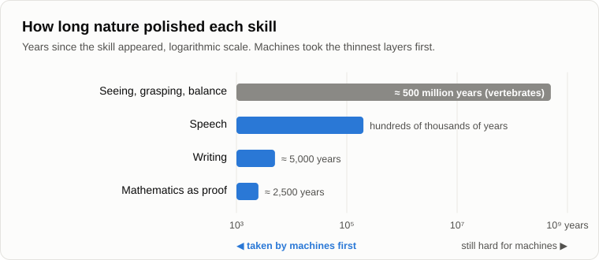
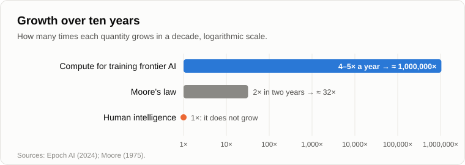

# Fifteen Years Later

Oleg came out of the dark with a folded sheet of paper and sat down on the old log. In fifteen years the log had grown a beard of moss, and Andrey a grey one.

— Fifteen years, — said Oleg. — You promised a great deal by this fire. I've brought the bill.

— Read it out, — Andrey threw a branch into the flames.

— First a confession. I didn't compile it myself. I gave a machine all our evenings and asked it to pull out every forecast that came with a date. It took half a minute.

— And how long would it have taken you?

— An evening. Two, with your tables.

— Then the check has already begun, — Andrey smiled. — Remember the [method of substitution](05-artificial-intelligence.md)? You judge a machine's degree of mind by how much human brain work it replaces. Two evenings of reading in half a minute. In 2011 that was a fantasy.

— Don't change the subject, — Oleg unfolded the sheet. — Practice is the criterion of truth. Your own words.

— Mine. But first let's agree how we check. A forecast has two parts: where things are going, and when they get there. Say a vet looks at a cow and says she'll calve in March. She calves in April. Was the vet wrong?

— About the date.

— And if she doesn't calve at all?

— Then about the cow.

— That's the difference. So for every point we ask two questions: did the trend hold, and did the date hold. Agreed?

— Agreed. Only don't think you'll get away with "the cow was pregnant, that's what matters", — Oleg squinted slyly. — Point one. "Human-level artificial intelligence by the end of 2018." Your words, at this very fire, citing IBM and DARPA. 2018 came and went. Machines learned to talk properly only in 2022, and even now nobody agrees they are at the level of a human.

— What exactly did SyNAPSE forecast?

— Human-level intelligence.

— And what was on the axis of the chart I showed you?

— Something about simulating the brain. The scale of the simulation.

— Hardware. A computer with the computing power of a human brain. A platform. Did it appear by 2018?

— You tell me.

— In June 2018 the [Summit](https://www.top500.org/lists/top500/2018/06/) supercomputer topped the world list at about 1017 operations per second. How much does a brain need? The estimates differ a lot. A careful [review in 2020](https://www.openphilanthropy.org/research/how-much-computational-power-does-it-take-to-match-the-human-brain/) concluded that 1015 operations per second are more likely than not enough. So the platform arrived on time, even with a margin.

— Then where was the mind in 2018?

— Where is the mind in a newborn? Its brain already has nearly all its neurons, — Andrey paused. — Remember how we separated [mind and intelligence](03-mind-and-intelligence.md)? Intelligence is the ceiling set by the platform. Mind fills it, through learning. In 2011 I said "AI will reach the level of human intelligence", and you heard "it will be as clever as a person". To be honest, so did I. I mixed up two words that I had separated myself. That mistake is mine, not SyNAPSE's.

— Convenient.

— Wait, there's a second mistake, and it's worse. I bet on the wrong road. Remember the neurochips?

— You said that emulating neural networks on ordinary computers was like building a transistor radio out of valves.

— Right. IBM built its neurochip, [TrueNorth](https://doi.org/10.1126/science.1254642), in 2014: a million neurons and 256 million synapses on one chip, and it ran on less power than a hearing aid. A beautiful thing, and it went nowhere much. Meanwhile, in 2012, a network called [AlexNet](https://en.wikipedia.org/wiki/AlexNet) was trained on two gaming graphics cards and beat everything else at recognising images. Valves, if you like. The radio on valves played. And the company that made those cards [became](https://en.wikipedia.org/wiki/Nvidia) the most valuable company in the world.

— So you were wrong about the road.

— About the road, yes. Not entirely: the graphics cards were soon followed by chips built for neural networks and nothing else, so the old architecture did give way, only not where I was looking. But my main claim was different. I said neural networks would win, because they learn by themselves and synthesise knowledge they did not have. Who got the [Nobel Prize in physics](https://www.nobelprize.org/prizes/physics/2024/summary/) in 2024?

— Hopfield and Hinton. For neural networks.

— And in [chemistry](https://www.nobelprize.org/prizes/chemistry/2024/summary/)?

— Half of it went for AlphaFold, the program that predicts the shapes of proteins.

— In 2011 I told you about the robot scientist Adam, who made a small discovery about yeast genes. Thirteen years later a program earns half a Nobel Prize. That's the dynamics I asked you to look at, instead of the current state.

— All right. So when did the mind arrive?

— It needed an upbringing. The platform was there, but it had to be taught. In 2017 the [transformer](https://arxiv.org/abs/1706.03762) was invented, an architecture that could read enormous amounts of text. And what did they give it to read?

— The internet.

— Remember what I said then about how computers raise the degree of mind? Mainly by speeding up access to accumulated knowledge: local data, then databases, then the internet. The machines that talk are exactly that: everything humanity has written, digested by a neural network. In November 2022 [ChatGPT](https://en.wikipedia.org/wiki/ChatGPT) appeared, and within two months a hundred million people were talking to it. I talked to it too. I felt the same chill down my spine as in 1989, when my self-learning diagnostic program began to find faults faster than I could.

— So from platform to mind took four years.

— About four. And how long does a human need from birth to working as an engineer?

— Twenty-two years. Twenty-five.

— Now here is what I want you to notice, because it matters more than any date, — Andrey leaned towards the fire. — Remember the evening about [why population growth is slowing](11-symbiosis-and-parasitism.md)? The cost of educating a person keeps rising, and every new person has to be educated from scratch. Twenty-five years, every time, for every one. A machine is educated once. Then it is copied a million times, in minutes, almost for free.

— The entry threshold, paid once.

— Exactly. Humanity has to pay it again with every generation, and the price grows. The technosphere pays once and shares the result. That is one of the differences between the platforms that I promised to explain fifteen years ago.

— You took your time. But is it human-level or not? It makes things up. It miscounts the letters in a word. It can't carry a cup of tea up the stairs.

— Fifteen years ago you asked me when AI would be created, and I said the question assumes only two grades: there is intelligence, or there isn't. Now you ask whether it has reached the human level, yes or no. The same question, fifteen years older.

Oleg laughed.

— Then answer it your way.

— Domain by domain. In 2016 a program [beat](https://en.wikipedia.org/wiki/AlphaGo_versus_Lee_Sedol) one of the world's strongest Go players. In 2025 two machines solved the problems of the [International Mathematical Olympiad](https://deepmind.google/blog/advanced-version-of-gemini-with-deep-think-officially-achieves-gold-medal-standard-at-the-international-mathematical-olympiad/) at gold-medal level. In the same year, in a properly run [Turing test](https://arxiv.org/abs/2503.23674), people took a language model for the human more often than they picked the real human it was set against. In my 2011 table Kurzweil expected that in 2029. And the same machine can still lose count of the letters in a word. Its domain logicalities are very uneven: in some domains it is above us, in others below a child. The "human level" turned out to be not a line but a wide strip, and the machines are crossing it domain by domain, not all at once.

— So the verdict on point one?

— The trend held, and it moved faster than I expected. The platform arrived on time. The mind came about four years later, and the human level is being crossed piece by piece. And the road was not the one I bet on. Write that down.

Oleg made a note in pencil.

— Point two, — he read. — "Very soon most car drivers will lose their jobs. Waiters are already being replaced by robots." And when I said that scientists, engineers and writers could never be pushed out, you said: not yet.

— And?

— Drivers drive. I checked: [Waymo](https://en.wikipedia.org/wiki/Waymo) gives about half a million paid rides a week with nobody at the wheel, but millions of drivers around the world still work. Waiters are people. Meanwhile [more than a quarter of the new code at Google](https://fortune.com/2024/10/30/googles-code-ai-sundar-pichai/) is written by machines, and then come texts, translations, pictures, music. You were right that everyone would go, but you started from the wrong end.

— I was wrong about the order, — Andrey agreed. — And I know why. Let me ask you something. What is harder: proving a theorem, or carrying a cup of tea up the stairs without spilling it?

— A theorem, obviously. Any child can carry tea.

— Writing a poem, or folding a shirt?

— A poem.

— Translating a page from English, or tying shoelaces?

— Translating. Are you making fun of me?

— Not at all. Now, which of these can machines do today?

— Theorems, poems, translation... — Oleg stopped. — Shirts are still folded by people.

— So the hard turned out to be easy, and the easy hard. Isn't that a contradiction?

— Looks like one.

— Hard for whom?

Oleg said nothing.

— We measured difficulty against ourselves, — said Andrey. — Hard means hard for a human: what a person learns late, with effort, and what few people can do. The ruler was a human being. Now take the human out of the centre and ask another question: how long did nature polish each of these skills? Seeing, grasping, keeping balance: hundreds of millions of years, in every vertebrate, in every one of our ancestors. Speech: a few hundred thousand years. Writing: five thousand. Mathematics as we know it: even less.

— The newest layer is the thinnest.

— And the thinnest layer is the easiest to copy. Especially since all of it is written down in words, and words are what the machine learned from. Roboticists noticed this back in the eighties; it is called [Moravec's paradox](https://en.wikipedia.org/wiki/Moravec%27s_paradox). And I, after years of weeding anthropocentrism out of my head, missed it. A wisdom tooth with crooked roots: one root was left behind.

— So the first thing the machines took from people was...

— Speech. The very thing people saw as their essence: man, the speaking animal. And abstract reasoning, the pride of the species. The leading edge of evolution takes the youngest layer first.

— Gloomy.

— But objective. Point two, then: the trend held, everyone goes; the order was wrong, and the cause of the mistake was the same anthropocentrism. Next.

— Point three, the worst one for you, — Oleg tapped the sheet. — "The crisis will last as long as scientific and technological progress lasts. Unemployment feeds itself like an avalanche, and its limit is 100%." And in your table: SyNAPSE plus ten or twelve years, and unemployment on Earth reaches 100%. That's 2028 to 2030. And here is the [International Labour Organization](https://www.ilo.org/sites/default/files/2025-01/WESO25_Trends_Report_EN.pdf): world unemployment in 2024 was five percent. A historic low. Your avalanche never came.

Andrey looked into the flames for a long time.

— Here I owe more than a date, — he said at last. — In the form I described, the avalanche did not happen in these fifteen years. Layoffs did not feed layoffs. The compensation I called partial was much stronger and lasted much longer than I thought. And the 100% by 2030 will not happen. I'll say so myself, four years early, so that you don't have to bring it next time.

— So the cow wasn't pregnant?

— Let's look at the cow, not the calendar. What did I actually claim? That raising [labour productivity](07-global-economic-crisis.md) means removing human time, and that the [human share of value](12-value-shares.md) keeps falling. Is the unemployment rate the right measure of that?

— What else would be?

— How many people sit at the table is one thing. What is on their plates is another. The same organisation counts the share of world income that goes to labour. [From 2004 to 2024](https://www.ilo.org/sites/default/files/2024-10/WESO%20September%202024%20Update%20-%20Final.pdf) it fell by 1.6 percentage points. Two economists, [Karabarbounis and Neiman](https://doi.org/10.1093/qje/qjt032), found the labour share falling in most countries since the early eighties, and they put about half of the fall down to cheaper equipment, computers above all. To the technosphere, in my words.

— One and a half points in twenty years. That's no avalanche.

— Agreed. It's a glacier. I said "avalanche", and I was wrong about the speed. A glacier moves slowly, but it doesn't move back.

— And where did all the people go, if the machines are so good?

— Many went into services. Think of a courier on a bicycle with a box on his back. Who sets his route?

— The app.

— His pace? His pay? Who checks his work?

— The app, — Oleg frowned.

— The symmetry test. If he may call the app his tool, the app has every right to call him its tool. Who sets the tasks for whom is a big topic for another evening. Today, one more fact. In 2025 [economists at Stanford](https://digitaleconomy.stanford.edu/publications/canaries-in-the-coal-mine/) looked at young people aged 22 to 25 in the jobs most exposed to AI, such as programming and customer support. Their employment fell behind that of their peers in other jobs by more than a tenth, and the gap keeps growing. And mostly not through layoffs.

— How, then?

— They are simply not hired. Nobody is fired, they just stop being taken on. Remember the evening about [symbiosis](11-symbiosis-and-parasitism.md)? The technosphere doesn't need to take anything from people. It is enough to stop giving.

— But by your logic the avalanche should have come. Why didn't it?

— Demand was held up. After 2008, interest rates in the richest countries stayed near zero for about ten years, and in Europe even went [below zero](https://en.wikipedia.org/wiki/Negative_interest_rate). Money was poured in so that people kept buying. Nobody planned anything bad. Everyone acted on logic two moves deep, with good intentions: save the jobs, save the demand. You can hold back an avalanche for a long time with snow fences. Whether you can hold it forever, I don't know. My date for the broken economy, 2030 to 2035, hasn't come yet, and I won't insist on the year.

— One more thing, — Oleg grinned. — That same evening you put the world's GDP at sixty-two thousand trillion dollars.

— Did I? — Andrey laughed. — Three orders of magnitude out. Sixty-two trillion. So Lehman Brothers was not thousandths of a percent of the world economy but about one percent. The mosquito turned out to be a sparrow. Still, a sparrow doesn't knock down a concrete wall either. The conclusion stands, the number gets corrected. Thank you.

— Point four. Population, — Oleg turned the sheet over. — In one argument you said growth would stop completely by 2018. At this fire you were more careful: by the 2040s. In November 2022 we became [eight billion](https://www.un.org/en/dayof8billion). And the [UN now expects](https://population.un.org/wpp/assets/Files/WPP2024_Summary-of-Results.pdf) the peak in the mid-2080s, at about 10.3 billion.

— Here the demographers were right and I was not. I looked at the speed and forgot about inertia.

— Meaning?

— A train with the brakes on keeps rolling for kilometres. When people have fewer children, the population still grows for decades, because the generation now having children is a large one. Demographers call it [population momentum](https://en.wikipedia.org/wiki/Population_momentum). I extrapolated the slowdown as if a train could stop dead.

— And the trend?

— Let's check. I said that humanity's [singularity as a process](13-singularity-as-process.md) began around 1989, when growth stopped accelerating and began to slow. At the end of the eighties the world added about ninety million people a year; now it adds about seventy. World fertility has fallen to 2.25 children per woman, close to the replacement level of 2.1. In 63 countries the population has already peaked: Russia, Japan and Germany, which I named back then, and China too. In [South Korea](https://en.wikipedia.org/wiki/Demographics_of_South_Korea) a woman has on average fewer than one child: 0.72 in 2023.

— So the direction is right.

— And look at the forecasts themselves, not only at the people. In 2019 the UN expected almost eleven billion by 2100, still growing. Five years later, a peak in the 2080s, and a lower one. Every new revision lowers the peak and brings it closer. And the [IHME team](https://doi.org/10.1016/S0140-6736(20)30677-2) in 2020 put the peak in 2064.

— 2064? That's Panov's year from your table!

— His date was for something else, the singularity point from historical phases. I don't read meaning into dates that happen to match. What matters is which way the forecasts keep moving. Why people have stopped having children deserves a separate evening, with fresh figures. For now: the trend held, the date was wrong, too early, because of inertia.

— Point five, the last. "The share of value created by humans will reach zero in twenty to thirty years." That's 2031 to 2041.

— It isn't due yet, so we can only look at the trend. In 2011 there were about 1.15 million industrial robots at work in the world. In 2024 there were [4.66 million](https://ifr.org/ifr-press-releases/news/global-robot-demand-in-factories-doubles-over-10-years), four times as many. The computing power used to train the most advanced neural networks has grown [four to five times a year](https://epoch.ai/blog/training-compute-of-frontier-ai-models-grows-by-4-5x-per-year) since 2010.

— Four times a year? Moore's law doubles every two years.

— Let's work it out on the back of an envelope. Four times a year, for ten years: four to the tenth power.

— About a million.

— A million times in ten years. Moore's law gives about thirty over the same ten years. And human intelligence, over the same ten years, gives one: it doesn't grow. Remember the "rate of profit" of a dynamic system? Here it is, measured. And one more reference point. Researchers at [METR](https://arxiv.org/abs/2503.14499) measured how long the tasks are that machines can finish on their own, in hours of an expert's work. That length has been doubling about every seven months.

— And if you extrapolate?

— Extrapolation is a dangerous toy; we have just seen that with my dates. But if the trend holds, in five years a machine will take on tasks that take a person a month. Now, what does the technosphere eat?

— Electricity.

— The International Energy Agency [reckons](https://www.iea.org/reports/energy-and-ai/executive-summary) that data centres used 415 terawatt-hours in 2024 and will use about 945 by 2030: slightly more than the whole of Japan uses today. To power its data centres, Microsoft has agreed to [restart a reactor](https://www.world-nuclear-news.org/articles/constellation-to-restart-three-mile-island-unit-powering-microsoft) at Three Mile Island.

— The one that had the accident?

— The neighbouring unit. Fifteen years ago you said: "We won't let it have them!" And I said: "We will, voluntarily."

— We did, — said Oleg quietly.

— Then let's put it all together, — Andrey took the sheet and the pencil from him and drew a table on the back.

| Forecast of 2011–2012 | Date given | What happened by 2026 | Trend | Date |
|---|---|---|---|---|
| Human-level AI (SyNAPSE) | end of 2018 | brain-scale hardware by 2018; machines that talk from 2022; the human level crossed domain by domain | held, and faster | platform on time, mind about 4 years late |
| The road: neurochips | — | neural networks won, on graphics cards and special chips | held | wrong road |
| Drivers and waiters go first | "very soon" | words, code and pictures went first; drivers and waiters are still mostly people | held | wrong order |
| Unemployment avalanche to 100% | 2028–2030 | world unemployment at a historic low of 5%; labour's share of income slowly falling | slow, a glacier | wrong |
| Population growth stops | 2018; the 2040s | 8 billion in 2022; UN peak in the mid-2080s | held | wrong, too early |
| Human share of value falls to zero | 2031–2041 | four times more robots; training compute up 4–5 times a year | holding | not yet due |

— Curious, — Oleg studied the table. — Where you named a direction, you were right. Where you named a date, you were wrong, and almost always too early.

— Big systems are heavy. I looked at the speed and forgot the mass. And where I got the order wrong, the cause was anthropocentrism.

— And what do the talking machines say about the picture as a whole?

— That the platforms really are different. A person's education is paid for again by every generation; a machine is taught once and copied. And that the leading edge takes the youngest of what humans have first. Let's finish for today by fixing the result. **Fifteen years of practice confirmed the trends and refuted the dates.**

1. **Machines are gaining mind faster than I expected, while human intelligence stays where it was. The human share of work and value keeps falling, and population growth keeps slowing.**
2. **My dates were wrong, mostly too early: large systems have inertia, and I judged the order of displacement by what is hard for a human.**
3. **Language models show the difference of platforms. A person is educated anew in every generation, a machine once, and then it is copied; so the leading edge first takes the youngest human layer, speech and abstract thought.**

— You know what bothers me, — Oleg stood up and brushed off his trousers. — If even you miss the dates, maybe the future can't be predicted at all. The transformer was invented in 2017. It could just as well have been 2030. Chance.

— Chance is the name we give to missing information, — said Andrey. — Whether the future can be predicted in principle, and why it's worth trying even when the dates miss, we'll discuss tomorrow.

— Determinism again?

— [Global determinism](17-global-determinism.md). Well, until tomorrow.

— Bye.

---

*Continuation of the series* (Part I. Re-examining the foundations): a new article written for this repository after the author's original 15, in his method. Builds on: [03](./03-mind-and-intelligence.md), [05](./05-artificial-intelligence.md), [07](./07-global-economic-crisis.md), [11](./11-symbiosis-and-parasitism.md), [12](./12-value-shares.md), [13](./13-singularity-as-process.md).

[← 15](./15-penrose-counterarguments.md) · [Contents](./README.md) · [17 →](./17-global-determinism.md)
