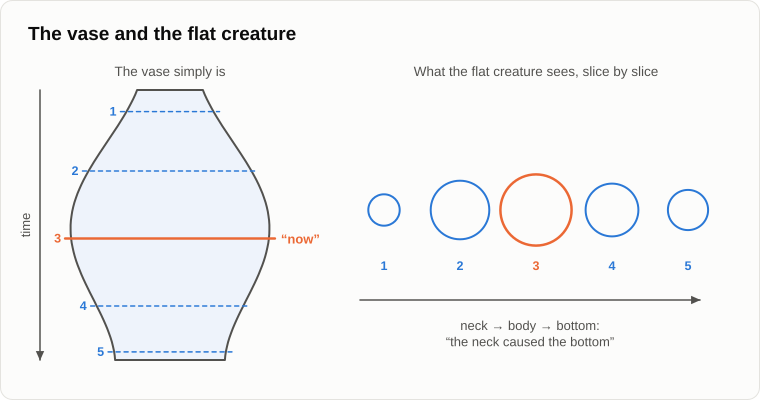
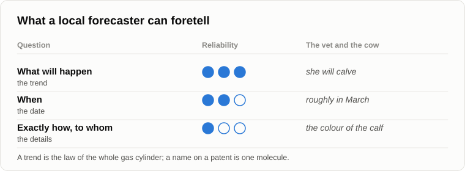

# Global Determinism

Oleg came up flipping a coin, caught it, slapped it onto his wrist and only then sat down.

— Yesterday you got away with "chance is missing information", — he said. — Today I won't let you. The transformer was invented in 2017 by eight people at Google. If one of them had fallen ill, the machines would have started talking in 2030.

— Who invented the telephone?

— Bell.

— On 14 February 1876 Alexander Graham Bell filed his patent application in Washington. On the same day, a few hours apart, Elisha Gray filed his, for the same thing. Darwin sat on natural selection for twenty years until Wallace sent him a letter with the same theory, and in 1858 they presented it together. In 1922 two sociologists, Ogburn and Thomas, [counted](https://en.wikipedia.org/wiki/Multiple_discovery) 148 discoveries and inventions made independently by several people: calculus, oxygen, the telegraph, photography.

— So?

— When the time comes, the discovery is made, if not by one person then by another. The name on the patent is what nobody can foretell. The year can be foretold roughly. And that the discovery will be made at all, almost for certain. The idea of "attention", the heart of the transformer, had been around since 2014. If not those eight in 2017, then others a year or two later.

— And who is this "time" that comes? You're putting the initiative outside people again.

— As we did [fifteen years ago](04-source-of-initiative.md). But you came with a coin, not with Bell. Toss it.

Oleg tossed the coin, caught it and slapped it onto his wrist.

— Heads.

— Was that random?

— Of course. Fifty-fifty.

— And if I knew exactly how hard your thumb pushed it, at what angle, how high it flew, how the air moved?

— Then in theory you could calculate it.

— So where is the randomness: in the coin, or in our heads?

— In our heads, — Oleg admitted. — In theory. In practice nobody calculates it.

— The statistician Persi Diaconis [built a machine](https://doi.org/10.1137/S0036144504446436) that tosses a coin so that it lands the same way up every time. A coin is a piece of metal, and it obeys Newton. In 2023 a group of researchers [tossed coins by hand](https://arxiv.org/abs/2310.04153) 350,757 times. A coin lands on the side it started from in about 51 tosses out of a hundred. Even your thumb leaves a trace.

— One percent.

— One percent of order in what you called pure chance. And the random numbers in your computer?

— Made by a program, — Oleg grinned. — Pseudo-random, I know. A deterministic algorithm. Fine, the coin and the computer. But the weather? Nobody can forecast it more than a week or two ahead.

— In the early sixties the meteorologist Edward Lorenz ran a weather model on a computer. He restarted a calculation from the middle and typed in a number rounded to three decimal places. A couple of months of model time later he had completely different weather. That is the [butterfly effect](https://en.wikipedia.org/wiki/Butterfly_effect). Were his equations random?

— No. They're equations.

— Deterministic, and still unpredictable for anyone who doesn't know the starting conditions down to the last digit. Laplace imagined a [demon](https://en.wikipedia.org/wiki/Laplace%27s_demon) that knows the position of every atom and computes the whole future. Lorenz showed that the demon would need infinite precision. A local system, you or me or a weather service, never has it. Do you remember how I defined randomness when we argued about [Penrose](15-penrose-counterarguments.md)?

— Lack of information.

— In a local system. Nature cannot lack information about itself.

— Now the heavy artillery, — Oleg put the coin in his pocket. — Quantum mechanics. A radioactive atom decays when it decays, and no information will tell you when. And don't tell me about hidden variables. In 2022 the [Nobel Prize in physics](https://www.nobelprize.org/prizes/physics/2022/summary/) went to Aspect, Clauser and Zeilinger for experiments showing that Bell's inequalities are violated. Local hidden variables are ruled out. Physics itself says that chance is real.

Andrey nodded slowly.

— That is the strongest objection there is, and I won't wave it away. What exactly did the experiments rule out?

— Local hidden variables.

— Local. Remember that word. Physicists see more than one way out. The first: the randomness is real. That is how the Copenhagen school reads it. The second is Everett's [many worlds](https://en.wikipedia.org/wiki/Many-worlds_interpretation). The wave function of the whole universe evolves strictly by its equation, with no chance at all. But an observer inside it finds himself in one branch and does not know in advance which one. For the whole, everything is determined. For a local observer, it looks like chance.

— Lack of information in a local system...

— Word for word. The third way out is called [superdeterminism](https://doi.org/10.3389/fphy.2020.00139): the settings of the experiment and the particles are not independent, because everything in the universe has been connected from the start. Most physicists don't like it, but a few serious ones defend it.

— And which is true?

— Experiments can't tell yet: all three give the same results in the laboratory. So this is where my proof ends and my axiom begins. Remember Gödel? A worldview is deeper when its holder knows where the provable ends and faith begins. I believe that nature does not lack information about itself. I can't prove it. I'm telling you honestly where the border lies.

— At least you admit it.

— Now a question for you. Why do people want chance so badly?

— Want it? That's simply how things are.

— Look at who it pleases. If everything is determined, there is no room left for free will. If somewhere at the bottom there is pure chance, a small gap opens in the laws of nature, and people want to squeeze their freedom through that gap. Randomness is the free will of particles. Belief in true chance and belief in free will are two sides of one coin.

— Of your coin, I'd say.

— Yet freedom won't get through that gap either. Suppose your decision is caused by your wants and your knowledge. Is it free from the laws of nature?

— No.

— Now suppose it is caused by nothing: a quantum coin tossed somewhere in your head. Is that decision yours?

Oleg thought.

— Not mine either. It's the coin's.

— Either it has causes, and then it isn't free, or it has none, and then it isn't yours. Is there a third option?

— I don't see one.

— Neither do I. That's why "is the will free or not?" is a badly posed question, like asking whether green is round or soft. We said so on the evening about initiative.

— All right, — Oleg would not give up. — But at least the future doesn't exist yet. The past is, the present is, and the future isn't written. That's why it's open.

— You remember Penrose?

— You argued with him for a whole evening.

— In "The Emperor's New Mind" Penrose himself gave an example, now known as the Andromeda paradox; philosophers call the argument the [Rietdijk–Putnam argument](https://en.wikipedia.org/wiki/Rietdijk%E2%80%93Putnam_argument). Two people walk past each other in the street. By relativity, the "now" of each of them in the distant Andromeda galaxy is different, because they move relative to each other. For one of them, an Andromedan fleet has already set off to invade the Earth. For the other, the Andromedan council is still debating whether to send it. One moment in the street, and a difference of days over there.

— And?

— So an event that is in the future for one of them is already in the past for the other. Where is the open, unwritten future, then? If for someone it has already happened, it already is. Physicists argue about this conclusion too, I'll say that honestly. But relativity has been confirmed by practice many times over, and this is where it leads. Two and a half thousand years ago [Parmenides](https://en.wikipedia.org/wiki/Parmenides) put it simply: being is, and non-being is not.

— That dislocates the brain.

— I warned you fifteen years ago that it would. Take a flower vase. Is its neck the cause of its bottom?

— What nonsense. They're two parts of one vase.

— Now imagine a flat creature that can see only one slice across the vase, and slides from the neck to the bottom. Let the axis of time run along the vase. The creature sees a circle that changes, narrows and widens. It says: the neck caused the bottom. Cause and effect, dynamics, history. And the vase simply is.

— And we are that flat creature.

— We see one slice at a time, "now", and we call the sliding of our point of attention along the axis "time".

— Then everything is pointless, — Oleg threw a branch into the fire harder than he needed to. — Why do anything, if the film has already been shot? I'll lie on the sofa, and whatever is written will happen.

— The Greeks had that argument too. It is called the [lazy argument](https://en.wikipedia.org/wiki/Lazy_argument): if you are fated to recover, you'll recover whether you call the doctor or not, so why call him? And Chrysippus answered: the recovery and the call to the doctor are fated together. Your call is part of the picture, one of the causes. Fatalism says the outcome is the same whatever you do. Determinism says that what you do is part of the outcome.

— And if I lie on the sofa anyway?

— How long would you last?

— Till dinner, — Oleg smiled.

— Hunger would get you up. The film has been shot, but you are in it, and in it you get up off the sofa.

— And choice? Right now I am choosing whether to agree with you.

— You are. That is a real process: your wants, your knowledge and your doubts are weighed against each other in your head, and the result is a decision. Does a chess program choose its move?

— It computes it.

— And you?

— I... — Oleg paused. — You'd say I compute too.

— The symmetry test. If we say the program doesn't choose because its move is determined, then we don't choose either. If we say that we choose, the program chooses too. Choice exists; it just isn't free from the laws of nature. Neuroscientists try to catch the moment of decision. In [Libet's experiments](https://en.wikipedia.org/wiki/Benjamin_Libet) the brain's readiness to act appeared before the person reported deciding to act. In 2008 [researchers](https://doi.org/10.1038/nn.2112) could guess which hand a person would choose several seconds before he knew it himself, a little better than chance. These experiments are argued over, and I don't lean on them. Logic is enough here.

— Then what about responsibility? If the thief couldn't have acted otherwise, why put him in prison?

— Remember the wallet? Two wants pulled him in opposite directions: to get the money, and to think well of himself. Add a third: the fear of prison. Now the resultant has one more force in it. Society punishes the thief not because he could have acted otherwise, but so that the next one acts otherwise. A prison term is a weight on the scales, an aversion written into the law.

— That's cynical.

— That's engineering. You don't blame a thermostat, you adjust it, and the feedback does its work. The court is society's feedback loop. And the judge is no freer than the thief: they are both parts of the same picture. Determinism doesn't abolish the court. It explains why the court works.

— And meaning? If the ending is already written...

— Do you know how a detective story ends?

— Sometimes I peek at the last page.

— And you still read it?

— I do.

— The ending was printed before you opened the book, and that never stopped anyone reading. Tea doesn't taste worse because I know about taste buds. Knowing where wants come from doesn't take them away.

— Fine. Now the main thing you promised: forecasts.

— It's simpler than it looks. Imagine the world really were random. What would a forecast be worth?

— Nothing. Guesswork.

— Every law that works is a small piece of evidence against chance. In 1846 Le Verrier worked out with pen and paper where an unknown planet must be, the one pulling Uranus off its path. He sent the coordinates to Berlin, and Galle [found Neptune](https://en.wikipedia.org/wiki/Discovery_of_Neptune) on the first night of searching, about a degree from the predicted spot. The Antikythera mechanism I told you about predicted eclipses two thousand years ago. A forecast is possible only because the future is tied to the present by laws. Without them there would be nothing to compute.

— Then why did your dates miss yesterday?

— Because I am a local system, not Laplace's demon. Here is what I learned from those fifteen years. A local forecaster can foretell three things, with different reliability. What will happen, the trend: best of all. When it will happen: worse. Exactly how, and to whom: hardly at all.

— Like the cow. That she'll calve, roughly when, and what colour the calf will be.

— Exactly. Remember the gas cylinder with a hole in it? Each molecule flies about chaotically, and nobody can say which one will come out next. But how much gas escapes per second, any engineer will calculate. An insurance company doesn't know which of its clients will die this year, but it knows how many, and it doesn't go bust. The more particles, the steadier the law. Humanity, the technosphere and the economy are systems of billions of particles.

— That's why your trends hold and your dates miss.

— That's why. A trend is the law of the whole cylinder. A date depends on the exact inertia, and I misjudged it. The name on the patent is a single molecule.

— One last objection. A forecast can change the future. Before 2000 everyone was told that computers would fail at midnight because of two-digit years. They spent a fortune fixing it, and [nothing happened](https://en.wikipedia.org/wiki/Year_2000_problem). So was the forecast wrong?

— Neither wrong nor right. It became one of the causes. The warning, the money and the corrected programs are all in the picture too. A good forecaster counts his own forecast among the causes.

— Then your forecast can change the outcome too. You warn people about the technosphere, and they take measures.

— It can, if the warning outweighs the wants. With the millennium bug it did: fixing it cost less than the damage, and no want pushed the other way. With the technosphere every want pushes the other way: comfort, profit, the freebie. People read a warning and go on handing control to the technosphere, because each step pays. Logic only two moves deep. That's why I don't sell remedies.

— Then why tell anyone?

— Because the telling is in the picture too, — Andrey smiled. — And because someone who understands can at least prepare himself and his family. That isn't a way to change the outcome. It's a way to meet it calmly. Let's finish for today by fixing the result.

1. **Randomness is a lack of information in a local system. Belief in true chance and belief in free will are two sides of the same anthropocentrism: both leave a gap in the laws of nature exactly where the human stands.**
2. **Determinism abolishes neither choice, nor responsibility, nor meaning. Choice is the work of wants and mind, responsibility is society's feedback loop, and the outcome needs our actions as its causes.**
3. **Determinism is what makes the future predictable in principle. A local system forecasts trends best, dates worse, and details hardly at all. That is how far any forecast can be trusted, mine included.**

— You said "wants" all evening, — Oleg stood up. — You've been hiding behind that word for fifteen years. What are they? Where do they come from, and why can nobody overrule them?

— Tomorrow we'll take them apart like a control system, — said Andrey. — [The anatomy of wants](18-anatomy-of-wants.md).

— Well, until tomorrow.

— Bye.

---

*Continuation of the series* (Part I. Re-examining the foundations): a new article written for this repository after the author's original 15, in his method. Builds on: [04](./04-source-of-initiative.md), [15](./15-penrose-counterarguments.md), [16](./16-fifteen-years-later.md).

[← 16](./16-fifteen-years-later.md) · [Contents](./README.md) · [18 →](./18-anatomy-of-wants.md)
