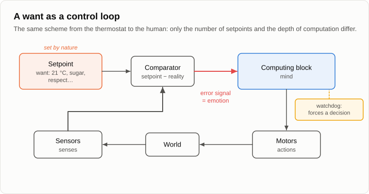
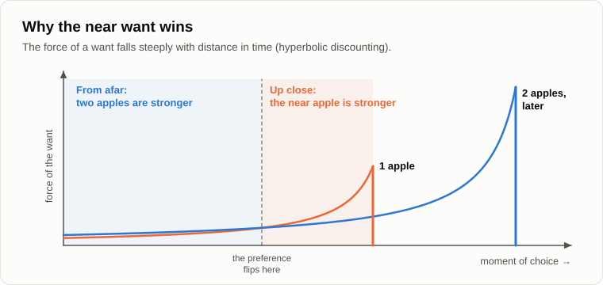

# The Anatomy of Wants

Oleg sat down by the fire, took a bag of sweets out of his pocket and unwrapped one.

— My doctor told me to give up sugar, — he explained. — This is the last bag.

— The last one this week? — Andrey squinted.

— Don't start. You promised to take wants apart, so take them apart. Fifteen years you've been saying "wants" about everything, and I still don't know what they are.

— Then let's start with something simple. Is there a thermostat on your heating at home?

— There is. I set it to twenty-one.

— When the room cools down, what does it do?

— Switches the boiler on. When it's warm again, it switches it off.

— Does the thermostat want twenty-one degrees?

— It doesn't want anything. It's been set.

— A bacterium, an E. coli in a drop of water, swims towards sugar. It [compares](https://en.wikipedia.org/wiki/Chemotaxis) how much sugar there is now with how much there was a second ago. If there is more, it keeps swimming. If there is less, it tumbles and tries another direction. Does it want sugar?

— That's chemistry. It has been set too.

— The Venus flytrap we talked about on the evening about [mind](03-mind-and-intelligence.md). It waits for two touches of its hairs within half a minute, and only then does it shut. Does it want the fly?

— Set, — Oleg said, more slowly now.

— Your dog by the door at seven in the evening?

— Wants a walk. That one really wants it.

— And you, with that sweet?

— I want it, — Oleg looked at the wrapper. — Though apparently I'm "set" too, is that where you're going?

— Then where does the line run? The thermostat has been set, the bacterium has been set, the flytrap has been set, the dog wants, and you want. At what point did "set" turn into "want"?

— Somewhere around the dog. It has feelings.

— And the flytrap has a memory of the first touch, and the bacterium a memory of a second ago. Each step is a little more complex than the last, and none of them is a jump. The line between "set" and "want" is drawn by anthropocentrism, exactly where it starts to resemble us. Take it away, and the scheme is the same everywhere. Shall I draw it?

— Go on.

Andrey picked up a stick and drew boxes and arrows in the ash by the fire.

— This is the regulator, the most ordinary one, as engineers draw it. Here are the sensors: they measure what is going on. Here is the setpoint: the value the system has to hold. The comparator subtracts one from the other and gets an error signal. The computing block works out what to do to make the error smaller. The motors do it. The world changes, the sensors measure it again, and the loop closes. In the thermostat the setpoint is twenty-one degrees and the computing block is a single relay.

— And in me?

— In you there are thousands of setpoints. Hunger, thirst, warmth, fear, sex, curiosity, the wish to be respected, the wish to stand out. Each is a setpoint with its own comparator. Wants are setpoints. Mind is the computing block. And emotions are the error signal: the bigger the gap between the setpoint and reality, the stronger the itch.

— And where am I in this drawing?

— Where would you put yourself?

Oleg looked at the ash for a long time.

— In the computing block, I suppose. I'm the one who thinks.

— Remember what I said fifteen years ago: mind without wants is an expensive car with a powerful engine, parked with nobody at the wheel. The neurologist Antonio Damasio had a patient, Elliot, after an operation on the frontal lobes. His memory, his logic and his intelligence tests were all fine. But his emotions [had gone flat](https://en.wikipedia.org/wiki/Somatic_marker_hypothesis), and he could no longer make decisions. Another patient with the same damage spent almost half an hour choosing between two dates for his next appointment, weighing the pros and cons of each, and could not choose. The computing block worked perfectly. Nobody was asking it for anything.

— The car without a driver.

— And the driver is the wants. Now let's go further. You have thousands of setpoints, and they pull in different directions. Remember the wallet?

— One want says take it, another says I'm a decent person.

— Draw each of them as an arrow, a force with a size and a direction. Add up all the arrows, and you get the resultant. That is what you will do. And if two arrows are about equal and opposite?

— I'll dither.

— There is an old puzzle about [Buridan's ass](https://en.wikipedia.org/wiki/Buridan%27s_ass): a donkey stands exactly halfway between two identical haystacks and starves to death, because it has no reason to prefer either. Has a real donkey ever starved like that?

— No, of course not.

— Why not?

— It'll get hungry and go to one of them. Any one.

— Exactly. Engineers have a watchdog timer: if the system hangs, the watchdog resets it and makes it do at least something. The torment of choice is such a watchdog. While you stand at the balance point, it itches unbearably. As soon as you lean to one side, the itch dies down. And it makes sure you don't go back. In 1956 the psychologist Jack Brehm asked women to rate household appliances and then let each take one of two she had rated about equally. Afterwards they rated the one they had chosen higher, and the one they had rejected lower. That is [cognitive dissonance](https://en.wikipedia.org/wiki/Cognitive_dissonance) at work: the watchdog doesn't only push you to decide, it then defends the decision.

— And conscience?

— The same watchdog, only late. The forces have changed with time, the resultant now points the other way, and the deed is already done. The error signal keeps itching until you find a way to put things right.

— Fine, — Oleg unwrapped a second sweet. — Then let me ask what you promised to explain. Why does my reason obey? I know perfectly well that sugar is bad for me. I can see two moves ahead, three if you like. And still.

— Do you think you're the only one? In the United States, two smokers in three [say they want to quit](https://www.cdc.gov/tobacco/php/data-statistics/smoking-cessation/index.html). About one in eleven manages it in a year. Every one of them can read the warning on the packet. Fifteen years ago I told you about the absurd "dirty-sock inhaler": nobody would buy it, but the same harm in a cigarette is bought. Reason sees. Wants decide.

— But why?

— For two reasons. The first: the computing block has no initiative of its own. It works out how to satisfy the wants. It doesn't pick them. When you decide to resist a want, which want gives the order?

— The want to be healthy.

— So one want against another. Even when we want to change our wants, we serve the want "to change our wants". Odysseus knew the sirens would win, so he had himself tied to the mast while he was still sober. Psychologists still call such arrangements an [Ulysses pact](https://en.wikipedia.org/wiki/Ulysses_pact). That is the only trick reason has: to set one want against another in advance. It can't get out from under all of them at once.

— And the second reason?

— Distance. Let me ask you. One apple today, or two apples tomorrow?

— One today. Why wait?

— One apple in a year, or two in a year and a day?

— Two, obviously. What's one more day after a year?

— That example is from Richard Thaler, who [got the Nobel Prize](https://en.wikipedia.org/wiki/Hyperbolic_discounting) partly for work like it. Look at what you've just done. It's the same day of waiting, but in one case you won't wait it and in the other you will. The force of a want falls with distance in time, and falls steeply at first. The sweet is here, right now, and its arrow is enormous. Diabetes is ten years away, and its arrow is a thin line.

— So "logic two moves deep"...

— ...is not a failure of logic. Reason calculates the second move perfectly well. But the want attached to the second move is weak, because the move is far away. The first move wins by force, not by argument. That's why nobody is stupid and everyone acts against their own interest.

— All right. But wants can be changed. People get brought up, educated, treated. People do change.

— They do. And what changes them?

— Upbringing. A good book. A doctor.

— Inputs from outside. Parents, school, a book, an illness, a fright. The setpoints shift, and they shift for reasons, not by an act of free will. The one who changes your wants is someone else, with his own wants, or circumstances. You can't pull yourself out of the swamp by your own hair, like Baron Munchausen.

— Then society can do it. Pass a law. Ban the harmful wants.

— Was that ever tried?

— The United States [banned alcohol](https://en.wikipedia.org/wiki/Prohibition_in_the_United_States) in 1920.

— And?

— And they lifted the ban in 1933. In between, the bootleggers got rich.

— The want didn't go anywhere. It went underground and found another way out. A law can't take a want away. It can only add another one against it: fear of punishment. We talked about that yesterday. And a suppressed want finds a detour. In Soviet times, people who couldn't stand out any other way bought jeans from black-marketeers. Today they put a ring through their nose. Press a want in one place and it comes out in another, like water.

— Then the problem is scarcity, — Oleg would not give up. — People fight because there isn't enough. Give everyone plenty, and the bad wants will go quiet.

— Do you know what I see at my bird feeder every winter? I fill a big feeder with sunflower seeds, more than the birds can eat in a week. And there's always one chaffinch who sits on it and drives everyone else away. There's plenty of food for all, and he still drives them away.

— A bird.

— Then here are people. In 1998 two researchers at Harvard, Solnick and Hemenway, [asked](https://ideas.repec.org/a/eee/jeborg/v37y1998i3p373-383.html) staff and students to choose between two worlds. In the first you earn fifty thousand a year and everyone else earns twenty-five. In the second you earn a hundred thousand and everyone else earns two hundred. Prices are the same in both. Which would you choose?

— The hundred, of course. It's twice as much.

— About half of them chose the fifty. They preferred being poorer in order to be above others. And the economist Richard Easterlin showed back in the seventies that as countries grow richer over the decades, people in them [hardly get any happier](https://doi.org/10.1073/pnas.1015962107). A cave-dweller would look at any of today's "exploited" workers as at a Stone-Age Rothschild. And the Rothschild still complains.

— Why?

— Because the setpoint moves. In the nineties the neuroscientist Wolfram Schultz recorded the dopamine neurons in monkeys' brains. When a monkey unexpectedly got juice, the neurons fired. Once the juice became expected, they fell silent at the juice itself: they [fired at the signal](https://doi.org/10.1126/science.275.5306.1593) that promised it. And if the promised juice didn't come, their activity dropped below normal. The brain rewards not the good thing itself, but the good thing above what was expected. You reach the setpoint, and it moves up. Psychologists call it the [hedonic treadmill](https://en.wikipedia.org/wiki/Hedonic_treadmill).

— So you can never be satisfied.

— Not for long. A tramp who gets five thousand roubles is in raptures. A man who used to get five hundred thousand and now gets five thousand hangs himself. The five thousand is the same. The setpoint is different.

— Gloomy.

— But objective. And the bad wants aren't the only ones on the list. Curiosity is a want too. It's what brought you to this fire tonight. Love of children, care for others, the wish to make things: all wants. Remember, we said that "good" and "evil" are just labels for directions in which the arrows point. The scheme is the same for all of them.

— And who set my setpoints, then? The sugar one, for instance?

— Nature, through a long chain of ancestors. A want held on where it kept its carriers alive. Sweet meant ripe fruit, and fruit was rare. The setpoint for sugar was tuned in a world where sugar was scarce. Now it's in every shop, and the setpoint is the same. In 2022 one person in eight in the world was [living with obesity](https://www.who.int/news-room/fact-sheets/detail/obesity-and-overweight), and that share among adults has more than doubled since 1990.

— And the setpoint for standing out?

— Tuned in a tribe where status meant food and offspring. The setpoints were not made for us. We are made for them: we are their carriers. And here's something else for you to think about. The technosphere doesn't need to rewrite anyone's wants. It has learned to satisfy them better than anything else. Sugar, comfort, the "like" under a photograph: each is a little arrow, and each one tells a person to hand over a bit more control. That's why we give it everything voluntarily, as we said on the evening about [symbiosis](11-symbiosis-and-parasitism.md).

— And a machine? Does a machine have wants?

— A machine has its setpoints too: the goal it was given, the reward it is trained on. Where its tasks come from, and whether it can set them for itself, is a separate evening. Let's finish for today by fixing the result.

1. **Wants are the setpoints of a control system, and nature sets them. Mind is its computing block, emotions are its error signals and watchdogs, and behaviour is the resultant of all the forces. From the thermostat to the human the scheme is the same; only the number of setpoints and the depth of computation differ.**
2. **Wants cannot be legislated away. A law only adds a counter-want, and a suppressed want finds another way out. Abundance doesn't remove them either, because a setpoint moves up as soon as it is reached.**
3. **Mind serves its wants even when it sees two moves ahead, because it has no initiative of its own, and because the force of a want falls with distance in time: the near want beats the far one.**

— You know what's odd, — Oleg turned the empty bag over in his hands. — All evening you talked about the boxes in that drawing. But in the computing block something has to sit in the memory: what the world looks like, what a sweet is, what diabetes is. Images. Where do they come from? And why does one idea in my head push out another?

— Because images compete for memory, the way animals compete for food. The weak ones are erased, and the strong ones spread from head to head, — Andrey wiped out the drawing with his foot. — That's [tomorrow's](19-struggle-of-images.md) topic.

— Well, until tomorrow, — Oleg reached into his pocket, found it empty, and sighed.

— Bye.

---

*Continuation of the series* (Part I. Re-examining the foundations): a new article written for this repository after the author's original 15, in his method. It was not written by Andrey Gordienko (Garya), the author of articles 01–15. Builds on: [03](./03-mind-and-intelligence.md), [04](./04-source-of-initiative.md), [08](./08-human-psyche.md), [09](./09-unemployment-and-famine.md), [17](./17-global-determinism.md).

[← 17](./17-global-determinism.md) · [Contents](./README.md) · [19 →](./19-struggle-of-images.md)
