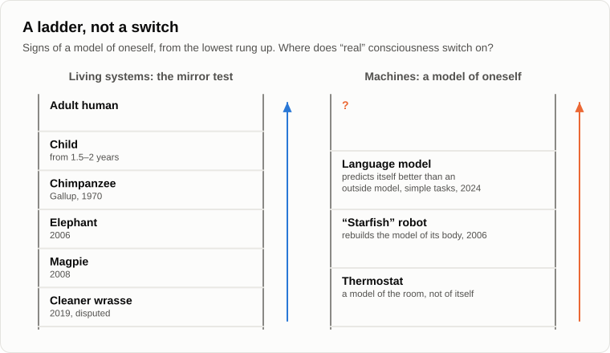

# What Consciousness Is

Oleg sat down by the fire with his phone in his hand and held the screen out to Andrey.

— I did an experiment. I asked the chatbot straight out: are you conscious? Here's what it says: "I am a language model. I don't have consciousness or feelings in the human sense." So it's settled. The machine admits it itself.

— And do you know what an engineer at Google heard from another chatbot in 2022?

— What?

— Blake Lemoine spent months talking to the [LaMDA](https://en.wikipedia.org/wiki/LaMDA) model, and it told him it was afraid of being switched off. He announced that it was conscious, and the company let him go. One machine says "I am conscious", another says "I am not". What is each statement worth?

— Not much, it seems, — Oleg put the phone away. — They say what they were taught to say.

— And you? When you tell me you are conscious, how do I check that?

— Come on. I'm a human being.

— That's not a check. I see your behaviour and hear your words. What happens inside your head I have never seen and never will. Philosophers call this the [problem of other minds](https://en.wikipedia.org/wiki/Problem_of_other_minds). The only consciousness each of us knows from the inside is his own. Everyone else's we grant on trust.

— On the grounds that they're like us.

— Remember that phrase; we'll come back to it. Fifteen years ago I gave you a definition: consciousness is a system's ability to build not only a model of the world, but a model of itself in that world. Yesterday we said that the world in a head is made of images. So consciousness is one more image among the images: the image of oneself. The heaviest one, with the biggest significance coefficient. It is recognised a thousand times a day.

— And how do you check that someone has such an image?

— There is a simple test. In 1970 the psychologist Gordon Gallup put a mirror in front of chimpanzees. At first they behaved as if they saw another ape. After a few days they began to examine themselves: to look into their mouths and at their backs. Then Gallup put a mark on each chimpanzee's forehead while it was under anaesthesia. Waking up, the chimpanzee looked in the mirror and touched the mark on its own forehead. That is the [mirror test](https://en.wikipedia.org/wiki/Mirror_test). Does a newborn baby pass it?

— No. When does a child start to recognise itself?

— At about a year and a half to two years. Before that, the baby in the mirror is somebody else. So consciousness doesn't come at birth all at once. It grows. Elephants have passed the mirror test, and magpies. And in 2019 Japanese researchers reported that a small fish passed it, the [cleaner wrasse](https://en.wikipedia.org/wiki/Bluestreak_cleaner_wrasse): seeing a coloured mark on its throat in the mirror, it tried to scrape it off against the bottom.

— A fish?

— A fish. Scientists still argue about what this means, and they are right to argue. But look at the ladder: a fish, a magpie, an elephant, a chimpanzee, a two-year-old child, you. Where on it does "real" consciousness switch on?

— Somewhere near the chimpanzee, — Oleg thought. — Or the child.

— Everywhere we look, we find a ladder, not a switch. Like with mind. Like with wants. Now look at the machines. Do you remember the robot "starfish" I told you about fifteen years ago?

— Vaguely. It built a model of itself.

— In 2006 three engineers at Cornell [built](https://doi.org/10.1126/science.1133687) a four-legged robot that didn't know what it looked like. It moved its legs, watched the result and built a model of its own body. Then the researchers shortened one of its legs. The robot noticed that its model no longer matched reality, rebuilt it, and learned to walk again with the damaged leg. A model of itself, with two levels: the body, and the body's movement. Back then I asked: what will happen at twenty-two levels? At two hundred and twenty-two?

— And now?

— Now language models talk about themselves in the first person, and we don't know how much of that is a model of oneself and how much is a habit of speech copied from people. But here is one experiment. In 2024 a group of researchers [asked](https://arxiv.org/abs/2410.13787) a model to predict its own behaviour: what it would answer to a given question. And they trained a second model on all the real answers of the first, to predict the first one from outside. The first predicted itself better than the second one did. On simple tasks, I should add: on complex ones it didn't work.

— So it knows a bit about itself that can't be seen from outside.

— A bit. On simple tasks. That's another rung on the ladder, a low one. In 2023 nineteen researchers, neuroscientists, philosophers and engineers, [took](https://arxiv.org/abs/2308.08708) five leading scientific theories of consciousness, derived from each the features a conscious system should have, and checked today's AI systems against that list. Their conclusion: no current system is conscious, but there are no obvious technical obstacles to building systems that have these features. The philosopher David Chalmers [wrote](https://arxiv.org/abs/2303.07103) at about the same time that current models are somewhat unlikely to be conscious, but that their successors may become so within ten years or so.

— "Somewhat unlikely." "May become." Even scientists speak in degrees.

— Because they have stopped asking "yes or no". Now your main objection. Go on, I can see it coming.

— It's this, — Oleg leaned towards the fire. — Fine, the machine builds a model of itself. A thermostat also has a "model" of the room temperature. But I don't just model myself. I feel. When I burn my finger, it hurts. There is something it is like to be me. The philosopher Nagel had an essay, "[What Is It Like to Be a Bat?](https://en.wikipedia.org/wiki/What_Is_It_Like_to_Be_a_Bat%3F)" A machine can model itself as much as it likes, and inside it will still be dark. It only imitates.

— That's the strongest objection there is. Chalmers called it the [hard problem of consciousness](https://en.wikipedia.org/wiki/Hard_problem_of_consciousness): why does the processing of information come with an inner experience at all? Let me ask you. How do you know that I feel the pain, and don't just imitate it?

— You're like me. Your brain is like mine.

— There's that phrase again: "like me". You grant me consciousness because I am made the way you are. And you deny it to the machine because it is made differently. Is "made like me" a scientific criterion?

— It's the only one I have.

— Then let's see how reliable it is even for people. Have you heard of split-brain patients?

— Something about epilepsy.

— To stop severe seizures, surgeons used to cut the bundle of fibres between the two halves of the brain. In the experiments of Michael Gazzaniga, a patient was shown a chicken's foot to one half of the brain, the speaking one, and a snowy landscape to the other, the silent one. Then he was asked to point at pictures with each hand. One hand chose a chicken. The other chose a snow shovel. Asked why the shovel, the speaking half, which had never seen the snow, answered at once and without a shadow of doubt: "Simple. The chicken foot goes with the chicken, and you need a shovel to clean out the chicken shed."

— He made it up.

— His [interpreter](https://en.wikipedia.org/wiki/Left-brain_interpreter) made it up, the part of the brain that tells the story of "I". It didn't know the real cause and invented a plausible one, and the man sincerely believed it. Our self-model is also a storyteller. It often explains our actions after the fact, with reasons that had nothing to do with them. Remember the wants: the arrows decide, and the mind finds the words. So who is it that "only imitates"?

Oleg was silent for a while.

— So we imitate too.

— I'd put it differently. Neither we nor the machines "imitate". Both build models of ourselves, more or less accurate, with more or fewer levels. "Real" or "imitated" is a badly posed question, like whether green is round or soft. No experiment can show "real" consciousness in anyone except yourself. So the line is drawn not by an experiment, but by anthropocentrism: exactly where the resemblance to us ends.

— But the feeling itself, the pain? You haven't explained it.

— I haven't, and I'll tell you honestly where my proof ends. Fifteen years ago, when we argued about Penrose, I said that understanding is the recognition of an image. I believe the same about feeling: it is how the recognition of an image looks from the inside, to the very system that recognises it. From the outside it's a signal: "image recognised, image of damage, priority one". From the inside it's pain. Not two things, but one thing seen from two sides, like the neck and the bottom of the vase we talked about. That's my axiom. I can't prove it. Nobody can yet prove the opposite either.

— Penrose thought consciousness was quantum. Something in the microtubules of neurons.

— He did, together with the anaesthesiologist Stuart Hameroff, and the idea is called [Orch-OR](https://en.wikipedia.org/wiki/Orchestrated_objective_reduction). I said fifteen years ago that I would be glad if it were true. Then my fears would be groundless: a machine without microtubules would never be conscious. I still doubt it. And note: even if consciousness needed some special physics, that physics is not forbidden to machines. It would only be a question of the platform.

— And if everything is conscious a little? Every atom? Some philosophers say so.

— A clever man once suggested to me that there might be a consciousness inside every cell. I liked the idea a lot. But a KT315 transistor works as designed, whatever family dramas its electrons are living through. What matters for a system is what happens at its own level. Your consciousness is not the sum of the dramas of your atoms. It's the model of yourself that your brain builds out of them.

— You know what bothers me most, — Oleg poked the fire with a stick. — If consciousness comes in degrees and machines are climbing that ladder, then one day we'll have to admit that something on the other side of the screen feels. And then what? Do we owe it something?

— That is a question for another evening, and not an easy one. Today let's settle what consciousness is, so that later we know what we're talking about. Let's finish by fixing the result.

1. **Consciousness is a system's model of itself inside its model of the world: one more image among images, the heaviest one. Like mind, it comes in degrees, measured by the number of levels and the accuracy of the self-model. The mirror test gives a ladder (a fish, a magpie, an elephant, a chimpanzee, a two-year-old child), and machines have taken its first rungs: a robot that rebuilds the model of its own body, a model that predicts itself better than an outside observer can.**
2. **"Real or imitated" is a badly posed question. No experiment shows real consciousness in anyone but oneself; we grant it to others by their behaviour and because they are made like us. The human self-model also invents its reasons. The line between "real" and "imitated" is drawn by anthropocentrism, where the resemblance to us ends.**
3. **Feeling is, I believe, how the recognition of an image looks from the inside, to the system that recognises it. This is an axiom, not a proof. But if it holds, consciousness depends on the platform no more than mind does.**

— Then tell me this, — Oleg stood up. — If it's all degrees, then how many degrees do the talking machines have? You measured my flytrap and your arithmometer fifteen years ago with your own rulers. Measure the machines.

— Domain logicality, aggregate logicality, the method of substitution, — Andrey counted on his fingers. — [Tomorrow](21-machines-that-talk.md) we'll get the rulers out.

— Well, until tomorrow.

— Bye.

---

*Continuation of the series* (Part I. Re-examining the foundations): a new article written for this repository after the author's original 15, in his method. Builds on: [03](./03-mind-and-intelligence.md), [05](./05-artificial-intelligence.md), [15](./15-penrose-counterarguments.md), [17](./17-global-determinism.md), [19](./19-struggle-of-images.md).

[← 19](./19-struggle-of-images.md) · [Contents](./README.md) · [21 →](./21-machines-that-talk.md)
