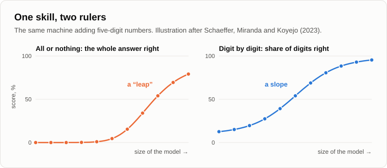
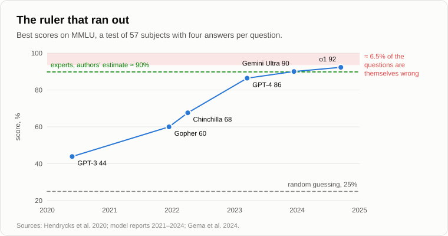
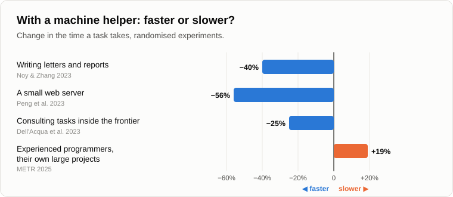

# Machines That Talk

Andrey was already at the fire when Oleg came up. On the log beside him lay an old folding carpenter's rule, yellow, with half the numbers rubbed off.

— You promised rulers, — Oleg nodded at it. — I didn't think you meant it literally.

— It was my father's. It measured everything at the dacha, from the boards to my height on the door frame. Sit down. What shall we measure?

— The talking machines. For four years everyone around me has been saying the same thing. Before 2022 machines couldn't talk, after 2022 they can. A leap. A new era. And you told me fifteen years ago that evolution goes in small steps. So which is it?

— Let's see. Before 2022, did your phone finish your words when you typed a message?

— It did. And it turned "meeting" into "meat".

— Were there machine translators?

— Google Translate. Clumsy, but I read Spanish recipes with it.

— In 2016 Google switched its translator to a neural network, and on its tests the errors [fell by about sixty percent](https://arxiv.org/abs/1609.08144) at once. Five years before that, phones began answering questions in a human voice. And in 1966 Joseph Weizenbaum wrote [ELIZA](https://en.wikipedia.org/wiki/ELIZA), a program that played a psychotherapist by turning your own words back into questions. His secretary, who knew perfectly well how it worked, asked him to leave the room so that she could talk to it in private. So when did the machine start talking?

— Somewhere along the way, — Oleg shrugged. — But in 2022 something did happen. Everyone felt it.

— Something happened. Now let's see what exactly. That same year a large group of researchers [wrote a paper](https://arxiv.org/abs/2206.07682) about the "emergent abilities" of language models. Small models can't do a task at all, can't do it, can't do it, and then, at a certain size, suddenly they can. Arithmetic, for example. A jump on the chart, like a step.

— There you are. A leap.

— A year later three researchers at Stanford, Schaeffer, Miranda and Koyejo, [looked at the rulers](https://arxiv.org/abs/2304.15004) those jumps were measured with. Suppose a machine adds five-digit numbers. How would you mark its answer?

— Right or wrong.

— And if four digits out of five are right?

— Still wrong. An answer is an answer.

— That's how they marked it: all or nothing. Now suppose the machine gets each digit right a little more often with every step in size. Sixty percent of digits, seventy, eighty, ninety. What happens to your "right or wrong"?

Oleg thought for a moment.

— For all five to be right at once... At ninety percent per digit, that's about sixty percent of whole answers. At sixty, almost nothing.

— Almost nothing, almost nothing, and then suddenly a lot. A step. Mark the same answers digit by digit, and the step turns into a smooth slope. The jump was in the ruler, not in the machine.

— A pass-or-fail ruler.

— A binary ruler. We have met binary questions here every evening. Is it alive or not, is it reasonable or not, is it conscious or not. Here is the same thing in a laboratory: a ruler with only two marks shows only leaps.

— Fine, but people didn't feel the leap because of rulers. They felt it talking to the thing.

— That's true, and this is the more interesting part. In 1950 Alan Turing proposed a test: if you talk to a machine in writing and can't tell it from a person, call it thinking. Tell me, how would my Venus flytrap do on the Turing test?

— Zero. It doesn't talk.

— And a dog?

— Zero.

— And a chess program that beat Kasparov?

— Zero as well.

— So the test that people consider the test of mind measures one thing: how much the machine talks like us. Remember yesterday's phrase, "like me"? For decades machines were finding causal links and acting ahead of events in chess, in translation, in route-finding, and nobody felt a leap. Then the machine came into the domain of words, the one where people are used to measuring mind, and everyone felt it at once. The leap happened in us, not in the machine.

— So nothing new happened at all?

— I didn't say that. Fifteen years ago I said that evolution makes small and seemingly insignificant improvements, which accumulate and then give a transition to a new turn. The new turn is real. Words are where humanity has kept its knowledge for five thousand years. The machine got access to all of it at once. But it walked to this turn step by step, for decades.

— Then here's my real objection, — Oleg leaned forward. — Not mine, actually. In 2021 a group of researchers led by the linguist Emily Bender called these models "[stochastic parrots](https://en.wikipedia.org/wiki/Stochastic_parrot)". A language model guesses the next word from statistics. It has read the whole internet and repeats what it has read, shuffled. A parrot also says "hello" at the right moment, and it doesn't understand a thing.

— A strong objection, and many serious people hold it. Let me ask you. What did we call mind on our evening about [mind and intelligence](03-mind-and-intelligence.md)?

— Finding causal links and using them... to act ahead of events.

— And what is acting ahead of events?

— Doing something before it happens. Predicting.

— The flytrap waits for a second touch because it predicts that a raindrop won't touch twice and a fly will. You put out your hand before the cup falls. Mind, from the bottom of the ladder to the top, is prediction. And of the machine you say "it only predicts", as if that were a small thing.

— It predicts words. Not cups.

— Then take a detective novel. The last page: "And the murderer is..." What does it take to guess the next word?

— To have understood the plot, — Oleg said, slowly.

— Now an experiment. In 2022 a group of researchers took a small model of the same kind and gave it nothing but records of games of [Othello](https://en.wikipedia.org/wiki/Reversi): lists of moves, like "C4, D3, E6". No board, no rules. It learned to predict the next legal move. Then they looked inside it and [found a board](https://arxiv.org/abs/2210.13382): the network had built for itself a picture of which square was black and which white. And when they changed that picture from inside, flipping one piece in the model's "head", the machine began to suggest moves for the changed board.

— Nobody showed it a board.

— Nobody. It needed the board to predict the moves, so it built one. Does a parrot need a board to say "hello"?

— But that's a game.

— And games, we said, are training for life. A model that is trained to predict texts written by people has to build inside itself something of the world that people write about: physics in the physics textbooks, the plot in the detective story, the patient in the case history. How good those pictures are is a separate question; often they are crude. But a parrot doesn't build them at all.

— And it really speaks one word at a time?

— One piece of a word at a time. And you? Fifteen years ago I told you that thinking in the narrow sense is inner speech that goes through the point of attention, one thought after another, while the bulk of the brain works underneath, in parallel. Do you know the end of your sentence when you start it?

— Not always, — Oleg laughed. — My wife says never.

— Then let's get the rulers out, — Andrey unfolded the carpenter's rule with a crack. — The first is domain logicality. We measure it the way we measured chess players: by competition. In September 2025 the world finals of the student programming championship were held, the [ICPC](https://en.wikipedia.org/wiki/International_Collegiate_Programming_Contest). There were 139 teams of the best young programmers from all over the world, three people per team, twelve problems, five hours. Machines sat the same problems outside the competition. One system solved all twelve. None of the human teams did.

— And the same machine can't count the letters in a word. I remember.

— That's the point. Now picture the domain logicality of a person as a line: the same height everywhere, a little higher where he studied. And the machine's?

— A saw, — Oleg drew a zigzag in the air.

— Researchers at Harvard came to the same picture. In 2023 they [gave](https://papers.ssrn.com/sol3/papers.cfm?abstract_id=4573321) 758 consultants of a large consulting firm real work tasks, some with a language model to help and some without. On the tasks the machine was good at, those with the machine did 12% more tasks, a quarter faster, and the quality was rated 40% higher. On a task that looked just as hard but lay outside its abilities, those with the machine were 19 percentage points *less* likely to get the right answer than those without. They trusted the machine where it was weak. The researchers called it a "jagged frontier".

— So you need to know where its teeth are.

— For now. The teeth keep moving. The second ruler is aggregate logicality, the union of all domains. Deep Blue had one domain. How many does the machine in your phone have?

— Law, medicine, cooking, code, poetry... I don't know. All of them, more or less.

— In 2020 a group of researchers put together a [test](https://arxiv.org/abs/2009.03300) of fifty-seven subjects, from school mathematics to law, medicine and moral philosophy: almost sixteen thousand questions with four answers each. Guessing at random gives twenty-five percent. Experts in their own subjects, by the authors' estimate, get about ninety. The best model of 2020 got forty-four.

— And now?

— By the end of 2023 machines passed ninety. In 2024, more than ninety-two. And then it [turned out](https://arxiv.org/abs/2406.04127) that about six and a half percent of the questions in the test itself were wrong: a muddled question, two correct answers, or a wrong answer in the key. In virology, more than half of the questions checked.

— So the machine was being marked against an answer key with mistakes in it.

— The ruler ran out before the machine did. It was shorter than what it measured, and its errors were bigger than the gap it was supposed to measure.

— Then make a harder test.

— They do. Every year a new one, harder than the last, and every year the machines climb up it. But remember what I told you fifteen years ago, when we spoke about the ant that can't perceive the mind of a man. The logicality of two systems can be compared only by a measuring system whose own logicality is no lower than theirs. Who checks the machines' answers to the hardest questions now?

— Experts.

— More and more often, other machines. People write the questions, and it is getting harder for them to write ones that the machines can't answer. The ruler is passing out of human hands.

— Gloomy.

— But objective. And the third ruler is my favourite, the method of substitution. Take the machine away, put a human helper in its place, and see how much brain work he needs to give the same help. In July 2025 people were sending one chatbot alone eighteen billion messages a week. Seven hundred million people, [about one adult in ten](https://www.nber.org/papers/w34255) on the planet. Let's count on the back of an envelope. Say each answer saves a human helper five minutes of work.

— Five minutes is a lot. Half of them ask for a pancake recipe.

— The same study says that more than seventy percent of the messages have nothing to do with work. Fine, take one minute. Eighteen billion minutes a week. How many hours is that?

— Three hundred million, — Oleg counted in his head.

— At forty hours a week, how many helpers working full time?

— Seven and a half million.

— At one minute per answer. At five, nearly forty million. A whole country of helpers with an encyclopaedia in their heads who work day and night and don't take a salary. The estimate is rough, but notice that both ends of it are measured in millions.

— You're counting messages. Not work. Did the people get anything done with all that help?

— There are measurements too. In 2023 economists [gave](https://www.science.org/doi/10.1126/science.adh2586) 453 professionals ordinary writing tasks: letters, reports, press releases. With the model they spent 40% less time, and the quality was rated 18% higher. In another experiment, programmers with a code assistant [wrote](https://arxiv.org/abs/2302.06590) a small web server 56% faster. In a large company's customer support, 5,179 operators with a machine prompter [resolved](https://www.nber.org/papers/w31161) 14% more requests an hour, the beginners a third more, and the most experienced almost no more than before.

— And now I'll give you something, — Oleg took out his phone. — I came prepared. In 2025 the organisation [METR](https://arxiv.org/abs/2507.09089), the same one that measures how long a task a machine can finish, ran a proper experiment. Sixteen experienced programmers, each in his own large project that he had worked on for years, 246 real tasks. Some tasks with the machine, some without, chosen by lot. Before the start the programmers expected the machine to make them a quarter faster. Afterwards they believed it had made them a fifth faster. And by the clock they were 19% *slower*.

— Thank you, — Andrey said seriously. — That's a good experiment and an honest result, and I won't wave it away. What does it tell us?

— That your substitution is an illusion. People only feel that they're faster.

— About the feeling you're right, and that feeling is worth remembering: a want to believe in a pleasant thing sits on the scales too. But look who was helped and who wasn't. The beginners in customer support, a third. The experienced ones, almost nothing. The writers with average skills got the most. And the masters in their own projects, which they know better than anyone, lost time checking the machine. What does that remind you of?

— Your nine engineers with the CAD system, — Oleg said after a pause. — It replaces functions, not people. The simple, mass ones first.

— Regrouping of functions. The machine takes over the work of the beginner first, and the master keeps the hardest part for now. And where does a master come from?

— From a beginner.

— And if beginners are no longer hired, because the machine does their work... We talked about the young programmers who stopped being taken on. And one more thing: those were the tools of early 2025. The task length that machines can manage doubles roughly every seven months. In any domain where a ruler is applied twice, a year apart, the machine's tooth has moved.

— So it is a leap after all, — Oleg folded his arms. — Only a slow one.

— It's a turn. Small steps that add up, and at some point the system is working on a different basis. Water in a kettle warms one degree after another, each degree costing the same heat, and at a hundred it boils. For the water that's a new state. For the stove it's the same stove.

— And the stove is nature.

— You're getting the hang of it, — Andrey smiled. — Let's finish for today by fixing the result.

1. **The talking machine is not a sudden leap but small steps that have added up to a new turn: the machine has come into the domain of words, where humanity keeps its knowledge and where it is used to measuring mind. The "leap" was partly in the rulers (pass-or-fail tests) and partly in us: we noticed mind when it began to speak our language.**
2. **"It only predicts the next word" is not an objection. Acting ahead of events is what mind is, from the flytrap to man, and to predict well a system has to build a model of the world that produces the words.**
3. **By domain logicality the machine is a saw, not a line: in some domains above the best of us, in others below a child, and the teeth keep moving. Its aggregate logicality spans more domains than any one person's, and the human rulers are running out. By the method of substitution it already does the brain work of millions of helpers, and it replaces the beginner's functions first.**

— One thing still bothers me, — Oleg stood up and stretched. — However clever it is, it answers. I ask, it answers. It has never once asked me anything itself. You told us when we argued about Penrose that the essence of mind is not solving tasks but setting them. So who sets its tasks?

— And who sets yours? — Andrey folded the rule. — That's [tomorrow](22-who-sets-the-tasks.md).

— Well, until tomorrow.

— Bye.

---

*Continuation of the series* (Part II. Machines today): a new article written for this repository after the author's original 15, in his method. Builds on: [03](./03-mind-and-intelligence.md), [05](./05-artificial-intelligence.md), [16](./16-fifteen-years-later.md), [20](./20-what-consciousness-is.md).

[← 20](./20-what-consciousness-is.md) · [Contents](./README.md) · [22 →](./22-who-sets-the-tasks.md)
