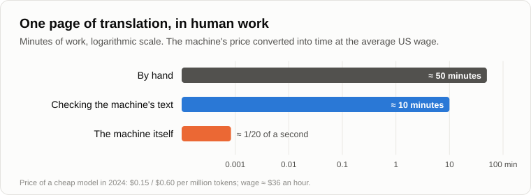
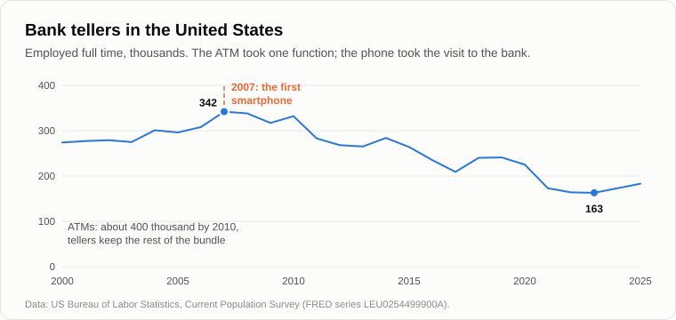

# The Last Profession

Oleg came with a round loaf under his arm, still warm, and a knife in his pocket.

— You promised to measure with a loaf, — he said. — So here is the loaf. From the bakery by the station. At least afterwards we can eat the measuring instrument.

— Then let's measure it first, — Andrey took out his phone and opened the calculator. — Fifteen years ago a shop loaf cost twelve roubles, and the average wage was twenty-one thousand a month. How many minutes of work is that?

— You counted eight.

— Eight with the correction for subsidies. Without it, about five and a half. Now a kilo of wheat bread costs about 117 roubles, and the average wage in 2025 was just over a [hundred thousand](https://www.kommersant.ru/doc/8480418) a month. Our loaves from the six sotkas came out at about four hundred grams each. Four hundred grams is forty-seven roubles. An hour of work is about six hundred.

— A bit over four and a half minutes.

— And by hand, from our six sotkas with a spade and a sickle, it was twenty-two. Bread is an old technology. The technosphere took it over long ago and is only polishing it now. Today let's count where it is moving fastest. Fifteen years ago you told me that scientists, engineers and writers could never be replaced. Intellectual work, creative work.

— And you said: not yet. — Oleg cut the loaf and handed Andrey the crust. — All right. I've seen the machines write. Let's go profession by profession.

— Let's start with one that is simple to count. A translator. How long does a professional take to translate a page?

— A page is about two hundred and fifty words. A good translator does two or three thousand words a day. So about fifty minutes a page.

— And the machine?

— Seconds.

— Now in money, since we count in minutes of work. In 2024 one of the cheap language models cost fifteen cents per million pieces of words that you send it and sixty cents per million that it writes back. A page is a few hundred pieces each way. How much is that?

Oleg counted on his fingers, lost count, and took the phone.

— About a twentieth of a cent.

— And at the average American wage of about thirty-six dollars an hour, how many seconds of work is a twentieth of a cent?

— A twentieth of a second.

— Fifty minutes against a twentieth of a second. That's sixty thousand times.

— But someone has to check the translation. Machines still make mistakes.

— Correct. And what is left of the translator's profession is the check. Say ten minutes instead of fifty. Remember the nine engineers with the CAD system? The machine doesn't replace the translator. It replaces four fifths of his work, and four translators out of five become unnecessary.

— And is that happening, or is it just arithmetic?

— It's happening, slowly. In 2023 three economists [looked](https://pubsonline.informs.org/doi/abs/10.1287/orsc.2023.18441) at one of the largest freelance marketplaces. After the chatbot appeared, the writers and translators there got 2% fewer jobs a month and earned 5% less. After the picture-drawing machines appeared, illustrators got almost 4% fewer jobs and earned 9% less. And the most experienced lost more than the beginners.

— The experienced? Three evenings ago you said that the machine takes the beginner's work first.

— It does. It pulls everyone up to a decent middle level. For the beginner that's help. For the master it's a loss: he was paid for the gap between himself and the beginner, and the gap has narrowed.

— Now let me give you an argument that every economist will give you, — Oleg wiped the knife. — It's called the Luddite fallacy. Every time machines came, people shouted that there would be no work left, and every time there was more work than before. The best example is the cash machine. ATMs appeared in the seventies. Everyone was sure the bank tellers were finished. And in America there were more tellers in 2010 than in 1980.

— That's true, and it's a good example. The economist James Bessen [worked out](https://www.imf.org/external/pubs/ft/fandd/2015/03/bessen.htm) why. An urban branch used to need twenty tellers, and with ATMs it needed thirteen. So a branch became cheaper, and the banks opened more of them, almost half as many again in the cities. And the tellers stopped counting cash and started selling loans and talking to clients. Now tell me what happened to the tellers after 2010.

— I don't know.

— In America the number of tellers working full time [peaked](https://fred.stlouisfed.org/series/LEU0254499900A) in 2007, at about 340 thousand. By 2023 it was half that. And the Labor Department [expects](https://www.bls.gov/ooh/office-and-administrative-support/tellers.htm) all tellers to lose another 13% over the next ten years. What happened in 2007?

— The first smartphone, — Oleg said after a pause.

— The ATM took one function from the teller, counting money. The teller kept the rest of the bundle and even grew. Then the phone in your pocket took the whole visit to the bank. There was nothing left to move into.

— So the economists are wrong?

— They are right about the step and wrong about the trend. A profession is a bundle of functions. While the machine takes one function, the profession rearranges itself and can even grow, as it did with the tellers. When the machine has taken the whole bundle, there is nothing to rearrange. Compensation comes in steps. Displacement is a trend. In 2011 I said compensation is partial, and I underestimated how long it lasts. I still don't think it lasts forever.

— Then here is your counterexample, from your own camp, — Oleg grinned. — In 2016 Geoffrey Hinton, the man who later got the Nobel Prize for neural networks, said that we should stop training radiologists, because within five or ten years machines would read scans better. Ten years have passed. In 2025 American hospitals offered a [record number](https://www.cnn.com/2026/02/09/tech/ai-replacing-jobs-concerns-radiology) of training places in radiology, and radiologists earn half as much again as they did in 2015.

— Good. Hinton himself said later that he had spoken too broadly. Let's see why. What does a radiologist do besides looking at images?

— Talks to the doctors. Does procedures. Signs the conclusion.

— Signs. If the machine misses a tumour, whom do you take to court?

— The doctor.

— That's the radiologist's shield. Not that reading an image is hard: machines read them well in many tasks. The shield is the signature. The law requires a person who answers for it. And there is a second shield: images became cheaper and faster to read, so more of them are taken, and there is more work. But what is a law?

— A rule.

— A want written down. The want for safety, fear of risk, the want to have someone to blame. Wants shift when the arithmetic shifts. Fifteen years ago the law did not allow a car without a driver on a city street. Today in San Francisco you call a taxi and nobody is sitting at the wheel. The law was changed when the machine became safe enough and cheap enough.

— So the order of professions is not set by how hard they are.

— We found that out on the first evening: what is hard for a person turned out to be easy for a machine. The order is set by shields. Let me count them. The first shield is none at all: work with words and symbols. Translators, copywriters, call centres, junior programmers. They go first, and they are already going. Though even here the curve is not smooth. In 2024 one large payment company [announced](https://www.klarna.com/international/press/klarna-ai-assistant-handles-two-thirds-of-customer-service-chats-in-its-first-month/) that its machine was doing the work of seven hundred support agents. A year later its director admitted that the quality had fallen, and they began hiring people again.

— Back again?

— Partly. The machine stayed and does more than before. The people returned to the part of the bundle that it did badly. That's the step. The second shield is the hands, work in an unpredictable world: the plumber under your sink, the nurse, the electrician who lays cable to the data centres. Moravec's paradox protects them. But there are four times as many robots as in 2011, and the hands are being taught too. The third shield is the signature: the doctor, the judge, the pilot, the notary. A want written into law. And the fourth...

— The fourth?

— Who plays chess better: a person or a machine?

— A machine, since 1997.

— And have people stopped watching people play chess?

— No. Even more of them watch.

— More than one and a half million players now have an international [rating](https://www.fide.com/rating-analytics-the-number-of-rated-chess-players-goes-up/). People pay to watch a person, not the best player. The live concert, the handmade cup, the actor on the stage. The fourth shield is "made by a human". It protects not the skill but the human himself, and it holds on one thing only: people want people. Remember the want to stand out? A handmade cup is a mark of status.

— Then the last profession is to be a person for other people, — Oleg said slowly. — An actor. A priest. A nanny. A friend.

— A friend. In 2025 a survey [asked](https://www.commonsensemedia.org/press-releases/nearly-3-in-4-teens-have-used-ai-companions-new-national-survey-finds) American teenagers about machine companions, the chatbots that play the part of a friend. Three in four had tried them, half used them regularly, and almost a third said that talking to the machine satisfied them as much as talking to real friends, or more.

— A third, — Oleg put down his bread. — That's no longer a shield. That's a crack in it.

— The shield is made of wants, and the machine satisfies wants better and better. But that's not the main thing. Suppose people go on wanting people. Who pays the musician at the live concert?

— The audience.

— And where does the audience get its money?

— From work. — Oleg stopped. — Translators, tellers, programmers, drivers...

— There you are. Remember what we said fifteen years ago about the [market](07-global-economic-crisis.md)? It's bounded. The musician's customer is the translator. When the translator has no earnings, the musician has no audience, however much people love live music. The last profession falls not when the machine learns it. It falls when its customers lose their pay.

— Gloomy.

— But objective. Let's finish for today by fixing the result.

1. **A profession is a bundle of functions, and the machine takes functions, not professions. While it takes one function, the profession rearranges itself and can even grow (the tellers after the ATM, the radiologists). When it has taken the whole bundle, there is nothing left to rearrange. Compensation comes in steps; displacement is a trend.**
2. **The order in which professions go is set not by difficulty but by shields: words have none, the hands hold out longer, the signature longer still (a law is a want written down), and longest of all "made by a human", protected only by people's want for people.**
3. **The last profession is a person needed by other people because he is a person. It falls not when the machine learns it, but when its customers lose their earnings: the bounded market of 2011 again.**

— Then the answer is obvious, — Oleg stood up and put the rest of the loaf into Andrey's bag. — Let the machines work and give people money. A basic income for everyone. Then they'll pay the musician too.

— A freebie for everyone? — Andrey squinted. — Who pays for it, and for how long can the technosphere afford it? [Tomorrow](25-freebies-for-everyone.md).

— Well, until tomorrow.

— Bye.

---

*Continuation of the series* (Part III. Economy and people): a new article written for this repository after the author's original 15, in his method. It was not written by Andrey Gordienko (Garya), the author of articles 01–15. Builds on: [05](./05-artificial-intelligence.md), [07](./07-global-economic-crisis.md), [09](./09-unemployment-and-famine.md), [12](./12-value-shares.md), [16](./16-fifteen-years-later.md), [21](./21-machines-that-talk.md).

[← 23](./23-machine-for-making-people-good.md) · [Contents](./README.md) · [25 →](./25-freebies-for-everyone.md)
