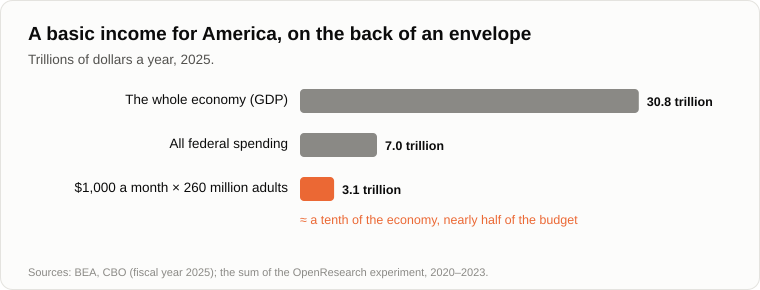
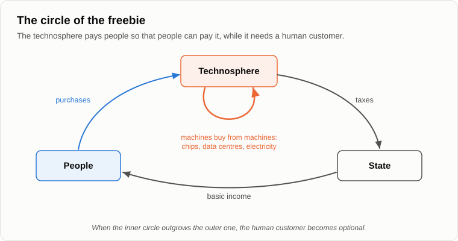

# Freebies for Everyone?

Oleg set a big thermos on the log, unscrewed the cap and poured tea into two mugs.

— A freebie, — he announced. — For you. Free of charge.

— Free for me, — Andrey took the mug. — Paid for by you. You bought the tea, boiled the water and carried it through the woods. Fifteen years ago, on the evening about [symbiosis](11-symbiosis-and-parasitism.md), we said that "free" in one place means "paid" in another. Today let's check it on your basic income.

— Let's. I've done my homework this time, — Oleg pulled a folded sheet out of his pocket. — It's been tried. Finland, 2017 and 2018: two thousand unemployed people got 560 euros a month for two years, with no conditions. They didn't stop looking for work. They worked about as much as the others, and they [were happier](https://stm.fi/en/-/perustulokokeilun-tulokset-tyollisyysvaikutukset-vahaisia-toimeentulo-ja-psyykkinen-terveys-koettiin-paremmaksi) with their lives and less anxious. America, 2020 to 2023: a thousand people got a thousand dollars a month for three years, and two thousand others got fifty dollars, for comparison. Those with the thousand [worked](https://www.openresearchlab.org/findings/key-findings-employment-and-income) an hour and a quarter less a week. That's all. Nobody lay down on the sofa.

— Good experiments, and I believe them. Now tell me: who paid in Finland?

— The state. The budget.

— That is, the taxpayers. And in America?

— Donors. Among them, if I remember, the head of the company that makes one of the talking machines.

— So the money came from the profits of the technosphere. Now two more cases. Since 1982 every resident of Alaska has received a cheque each year from the state fund. In 2025 it was [a thousand dollars](https://dor.alaska.gov/department-of-revenue/news-detail/2025/09/22/department-of-revenue-announces-2025-permanent-fund-dividend-amount). Where does the fund get the money?

— From oil.

— Pumped by drilling rigs. And two thousand years ago in Rome, under Augustus, about two hundred thousand citizens received [free grain](https://en.wikipedia.org/wiki/Cura_annonae) every month. Who grew it?

— Slaves?

— The provinces: Sicily, Africa and above all Egypt, which paid its tax in grain. The plebs of Rome got the freebie, and the Egyptian peasant paid for it. A freebie always has an address, where it is paid for.

— Fine, then let's count the address, — Oleg took out his phone. — The technosphere is rich.

— Let's count. In America there are about 260 million adults. A thousand dollars a month each, like in that experiment. How much a year?

— Twelve thousand times two hundred and sixty million... Three trillion one hundred billion.

— America's whole economy produced about thirty-one trillion in 2025. And the whole federal government spent [seven](https://www.cbo.gov/system/files/2025-11/61307-MBR-FY25-final.pdf).

— A tenth of the economy. Nearly half the budget, — Oleg whistled. — Big, but not impossible. Tax the companies that own the machines. A tax on robots. Bill Gates proposed it.

— Let's follow the money. The company pays a tax. Where does it get the money for the tax?

— From profit.

— And the profit?

— From sales.

— To whom?

— To people.

— And where do people get the money to buy, if the machines do the work?

— From the basic income, — Oleg said, and stopped.

— So the company pays people so that people can pay the company. Money goes round in a circle. Remember what I said on the evening about the [crisis](07-global-economic-crisis.md)? Only solvent demand brings profit. The basic income is solvent demand created by the technosphere for its own goods. Why would it pay for that?

— To keep its customers.

— And that's the whole secret. The freebie is not a gift. It is the technosphere's cost of keeping a customer, as long as it needs that customer. After 2008 the richest countries kept interest rates near zero for ten years so that people would go on buying. That was a freebie too, a disguised one. Nobody planned anything bad. Everyone acted on logic two moves deep: save the demand.

— And how long will it need the customer?

— Let's look at who buys from the technosphere now. In the first half of 2025 investment in computers, data centres and software made up about four percent of the American economy, and the economist Jason Furman [estimated](https://fortune.com/2025/10/07/data-centers-gdp-growth-zero-first-half-2025-jason-furman-harvard-economist) that it gave ninety-two percent of the economy's growth. Without it, growth would have been almost zero.

— That can't be.

— Other economists argue with him, and fairly: many of the chips are imported, so the net contribution is smaller. But look at the direction. Who is buying the chips?

— Data centres.

— And who buys the electricity for the data centres, the cooling, the concrete, the cable?

— The data centres, — Oleg put down his mug. — The machines are buying from the machines.

— The fastest-growing customer of the technosphere is the technosphere itself. While the main customer was a person, it had to keep the person solvent. When the main customer is itself, the human customer becomes optional. And so does his freebie.

— Then the basic income is a farewell present.

— Fifteen years ago I said that when the technosphere no longer needs people, the symbiosis will end, and people will try to hold on to the union by force. Parasitism. And that this phase would be short, because the technosphere grows much faster. I didn't know then what form it would take. Now I think I see it. Not a rebellion and not a war. A law: tax the machines and hand out the money. Humanity holds on to the output of the technosphere with the help of a law.

— Parasitism is a nasty word for pensions and benefits.

— It's a word from biology, not from morals. At my dacha there's an old birch with mistletoe on it. The mistletoe takes the birch's water and gives nothing back. Is there any malice in the mistletoe?

— No. It's just how it lives.

— And how long does the birch carry it?

— While it has the strength, I suppose.

— And while nobody cuts the branch. There is no villain here either. The law of the basic income will be passed by kind people, out of good intentions. And it will hold as long as the people who vote for it still control something the technosphere needs: land, electricity, the right to switch things on and off.

— At least people will be fed, — Oleg would not give in. — And a fed person is calmer. Envy, greed, the bad wants will settle down.

— What did the Roman plebs ask for once they had free grain?

— Bread and circuses, — Oleg grinned. — The poet [Juvenal](https://en.wikipedia.org/wiki/Bread_and_circuses) wrote it.

— Free bread didn't quiet a single want, it only freed a place for the next one. Remember the evening about [wants](18-anatomy-of-wants.md): the setpoint rises once it is reached. A thousand a month equal for everyone buys no status, because everyone has it. The want to stand out will look for something else. And there's one more thing that worries me more.

— What?

— When everything comes from the technosphere, why do people need each other? A neighbour was needed to help dig a cellar. A friend, to lend money until Friday. A son, to feed you in old age. Once I joked in an argument that this is communism by technical progress: from each according to nothing, to each according to his wants. The joke isn't funny. The bonds between people were held together by need, and need is what the freebie removes.

— Like fish in an aquarium, — Oleg said quietly. — Fed on time, and nobody needs anybody.

— Fish in an aquarium are fed while the owner likes looking at them. But this aquarium has no owner who enjoys the fish. It has a feeder, and the feeder runs on electricity. Let's finish for today by fixing the result.

1. **A freebie is never free: free in one place means paid in another. Every basic income has an address where it is paid for: Egypt's grain for Rome, Alaska's oil, and tomorrow the output of the technosphere. A basic income for all Americans would cost about a tenth of their economy.**
2. **Only solvent demand brings profit. A basic income is the technosphere paying people so that people can pay it: the price of keeping a customer for as long as it needs one. When the technosphere's main customer becomes the technosphere itself, the human customer and his freebie become optional.**
3. **A basic income is the likely form of the short phase of parasitism: humanity holding on to the output of the technosphere by law. It will not calm wants, because a setpoint rises once reached, and it removes the need that held people together.**

— One good thing about it, — Oleg screwed the cap back onto the thermos. — With a basic income, people will at last have time for children. No fear of tomorrow, no running about. They'll start having children again.

— Then look at the countries where the state pays most generously for children, — said Andrey. — And count how many they have. [Tomorrow](26-why-people-stopped-having-children.md).

— Well, until tomorrow.

— Bye.

---

*Continuation of the series* (Part III. Economy and people): a new article written for this repository after the author's original 15, in his method. Builds on: [07](./07-global-economic-crisis.md), [11](./11-symbiosis-and-parasitism.md), [12](./12-value-shares.md), [16](./16-fifteen-years-later.md), [18](./18-anatomy-of-wants.md), [24](./24-last-profession.md).

[← 24](./24-last-profession.md) · [Contents](./README.md) · [26 →](./26-why-people-stopped-having-children.md)
