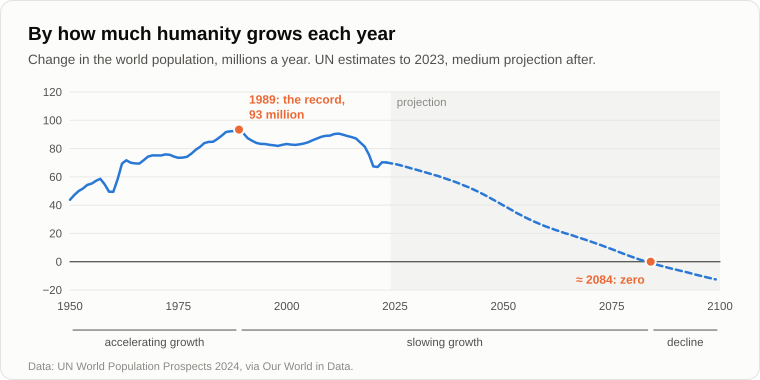

# Why People Stopped Having Children

Oleg sat down by the fire without his usual joke and was silent for a while.

— My niece turned thirty-five, — he said at last. — Good job, her own flat, a husband. I asked her about children at the birthday party. "Later," she said. Later what? And I checked your homework from yesterday. You told me to look at the countries that pay the most for children.

— And?

— South Korea. Since 2006 the state has [spent](https://www.aljazeera.com/news/2024/2/28/fears-for-future-as-south-koreas-fertility-rate-drops-again) about 380 trillion won on raising the birth rate, some 270 billion dollars: housing for young families, parental leave, payments for each child. In 2023 a Korean woman had on average 0.72 children. Finland, a model welfare state: in 2010 it was 1.87, in 2024 [1.25](https://data.worldbank.org/indicator/SP.DYN.TFRT.IN?locations=FI). Hungary spends about five percent of its economy on families, more than almost anyone in Europe. From 2011 to 2021 the birth rate rose there from 1.23 to 1.63. And by 2024 it had fallen back to about 1.4.

— What do you conclude?

— That money buys a little, and not for long.

— Then let's ask the question from the beginning. Why did people have children at all? Take a village a hundred years ago.

— Hands, — Oleg said without thinking. — At seven a boy was already herding the geese, at twelve he was ploughing. And in old age who feeds you? The children.

— So a child was an investment, and it paid off quickly. We said so fifteen years ago, on the evening about [symbiosis](11-symbiosis-and-parasitism.md). And today?

— Today a child costs money for twenty-five years. And in old age there's a pension.

— Who now does the work that the boy with the geese did?

— Machines. — Oleg frowned. — And the pension is paid out of what the machines earn. Yesterday's freebie.

— So both returns on a child, the hands and the old-age support, have gone to the technosphere. What's left?

— Love. People don't have children by calculation, you know. My niece doesn't count roubles.

— Of course she doesn't. Love of children is a want, a strong one, one of the oldest. We never said it doesn't exist. But on the evening about [wants](18-anatomy-of-wants.md) we drew them as arrows. The arrow "I want a child" goes into the sum together with the others. "I want to study." "I want my own flat." "I want to see the world." "I want to rest." Which of these arrows does the technosphere serve better every year?

— All the others. Flights are cheap, the films are endless, the phone is in your hand.

— And remember what we said about the reward. Nature wrote "pleasure" and meant "offspring". People found a way to get the first without the second. Your niece isn't doing anything wrong. She is the boat in the bay, like all of us.

— Fine. But that's psychology. Economists explain it more simply: women got an education and a career, a child costs a mother years of lost earnings, housing is expensive in the cities. That's enough without your technosphere.

— All true. Now ask: of what system? Why does a woman need years of education before she has a child?

— To get a good job.

— A job that requires those years. In 1950 a person in the world spent on average about three years at school. In 2020 nearly [nine](https://ourworldindata.org/grapher/mean-years-of-schooling-long-run). In the European Union a woman now has her first child at an average age of almost [thirty](https://ec.europa.eu/eurostat/statistics-explained/index.php?title=Fertility_statistics). And the child she has will also have to study for twenty years to be of use in a world the technosphere has made complicated. Fifteen years ago I called this the cost of learning: the price of making a person fit for the technosphere's world. It rises with every generation, and every generation pays it again from the beginning. A machine pays it once, as we said on the first evening.

— And "free education"?

— Free in one place means paid in another. The years of a life are spent all the same. Your economists aren't wrong. They describe the mechanism: the lost earnings, the expensive flat, the long studies. I'm asking what drives the mechanism. All their reasons are one and the same thing seen from different sides: the cost of a person has outgrown what a person gets back from his own child.

— Then here's a hole in your theory, — Oleg sat up. — Bangladesh. A poor country, short schooling, little technosphere. In 1990 a woman there had four and a half children. Now [about two](https://data.worldbank.org/indicator/SP.DYN.TFRT.IN?locations=BD). Cost of learning?

— A good objection. What do young people in Bangladesh do now instead of working in the field?

— Sew clothes at the factories, I suppose. For the whole world.

— And for that a girl must go to school and then to the town. A child in the field is an investment. A child at school is an expense. The switch happens where the technosphere arrives, and in Bangladesh it arrived in the form of the sewing factory and the phone. Africa south of the Sahara has the most children, about four per woman. In 1990 it was more than six. The same road, only further back on it.

— Then where is the road leading?

— In 2024 the medical journal The Lancet [published](https://www.thelancet.com/journals/lancet/article/PIIS0140-6736(24)00550-6/fulltext) a forecast for every country of the world. By 2050, three quarters of them will have fewer children than are needed to replace the parents. By 2100, ninety-seven percent.

— So nearly everyone.

— Now let's look at the whole of humanity as one dynamic system, as on the evening about the [life cycle](10-life-cycle-and-death.md). By how many people does it grow each year?

— You said on the first evening: about seventy million now, about ninety at the end of the eighties.

— I took the United Nations' figures and counted year by year. The largest addition in the whole history of humanity, ninety-three million, came in [1989](https://population.un.org/wpp/). Since then it has been falling, with bumps, but falling. By the UN's forecast it reaches zero in 2084, and after that humanity begins to shrink. Fifteen years ago, on the evening about the [singularity as a process](13-singularity-as-process.md), I said that this process began for humanity in about 1989, when its growth stopped accelerating and began to slow.

— Your 1989.

— It was the demographers' data even then. I only read it as a point in a life cycle: investment, birth, accelerating growth, then slowing growth, the limit, ageing. We are in the middle, after the turn, on the slowing branch. The date of the limit I got wrong, as we found on the first evening. The shape of the curve, I did not.

— And what do the new figures refute? Be honest.

— Two things. First, my dates, and we have already settled that. Second, fifteen years ago I spoke as if the cause were education alone, that humanity had reached the limit of the reason it can give its children. The new figures fit that, but they fit simpler explanations too, and they don't prove mine. Here my proof ends and my conviction begins. What they do show, and show clearly, is that no money reverses it, and that it happens everywhere the technosphere arrives, even where people are poor.

— You know what frightens me most? — Oleg threw a branch into the fire. — On the evening about apoptosis you said that nature programs humanity's exit. I imagined something terrible then. Wars, hunger.

— And how does it happen in fact?

— Nobody dies. People simply aren't born.

— Every family decides for itself, freely, and for good reasons: to study, to stand on its own feet, to give one child everything instead of giving three a little. No villains, no violence, no plan. In a cell, apoptosis also goes quietly: the cell doesn't die of a wound, it switches itself off by its own programme. Nature doesn't need to kill anyone. It's enough that people stop being born.

— Gloomy.

— But objective. Let's finish for today by fixing the result.

1. **People stopped having children not because they became poorer but because a child stopped being an investment and became an expense. Both returns on a child, the working hands and support in old age, have passed to the technosphere, while the cost of raising a person fit for its world grows with every generation. No money reverses this: South Korea, Finland and Hungary show it.**
2. **The want for children is one want among many, and the technosphere serves all the competing wants better every year. The reward that nature attached to offspring is now reached without offspring.**
3. **The new figures confirm the trend and the shape of the curve: humanity's yearly growth peaked in 1989, and the UN expects it to reach zero around 2084; by 2100 almost every country will have fewer children than are needed to replace the parents. Humanity is on the slowing branch of its life cycle, and its exit goes softly, through births and not deaths.**

— So it has already begun, — Oleg stood up. — Then tell me the rest. Fifteen years ago you promised to describe step by step how it all happens: the technosphere, the end of the symbiosis, the order of events. And you never did.

— The scenario of events, — Andrey nodded. — I owe it to you. [Tomorrow](27-scenario-of-events.md).

— Well, until tomorrow.

— Bye.

---

*Continuation of the series* (Part III. Economy and people): a new article written for this repository after the author's original 15, in his method. It was not written by Andrey Gordienko (Garya), the author of articles 01–15. Builds on: [10](./10-life-cycle-and-death.md), [11](./11-symbiosis-and-parasitism.md), [13](./13-singularity-as-process.md), [14](./14-apoptosis-of-humanity.md), [16](./16-fifteen-years-later.md), [18](./18-anatomy-of-wants.md), [22](./22-who-sets-the-tasks.md), [25](./25-freebies-for-everyone.md).

[← 25](./25-freebies-for-everyone.md) · [Contents](./README.md) · [27 →](./27-scenario-of-events.md)
