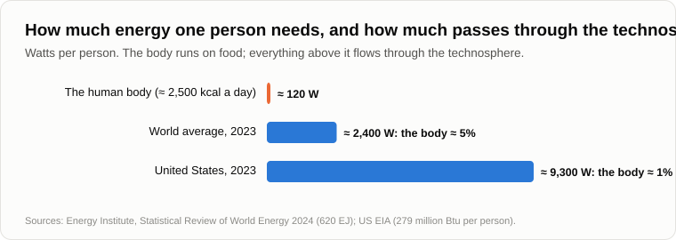

# The Scenario of Events

When Oleg came, Andrey was smoothing a sheet of paper on his knee, covered with curves drawn in pencil.

— Homework? — Oleg sat down beside him.

— A debt. Fifteen years ago, on the evening about [symbiosis](11-symbiosis-and-parasitism.md), I showed you a chart of the forces of attraction between humanity and the technosphere. The picture was lost with the old blog. I drew it again, from memory and from my own words.

— I remember something. Two curves crossing.

— Here is humanity's interest in the technosphere. At the start, a million years ago, it is small: a stone axe gives little advantage. And here is the technosphere's interest in humanity. At the start it is huge: an axe can't make itself. Humanity's curve rises, the technosphere's falls. Where they cross, the interest is mutual and equal. That is the point of parity, where the union holds most firmly.

— And then?

— Then the technosphere needs people less and less: machines are made by machines. The union weakens, faster than it grew. When the technosphere no longer needs people at all, the symbiosis ends. Humanity, whose interest is still growing, tries to hold the technosphere by force. That is parasitism. It lasts while humanity's pull is stronger than the technosphere's push. Then the union breaks.

— And you promised, on the evening about [apoptosis](14-apoptosis-of-humanity.md), to describe how it goes step by step. And you never did.

— That's why I've brought the drawing. But first let's agree on how much to trust what I'm about to say. Remember the cow?

— That she'll calve, roughly when, and what colour the calf will be, — Oleg counted on his fingers. — Trend best, date worse, details hardly at all.

— So I'll give you the order of the steps and the signs of each. Dates I won't give. I've been wrong about dates. And the details of the last steps I'll name, but trust them least of all. Agreed?

— Agreed. Go on.

— Step one. The technosphere takes the youngest of human functions: words, symbols, calculation. Is it visible?

— That's all our evenings, — Oleg nodded. — Translators, the young programmers nobody hires, the tellers.

— Step two. The chain of tasks loses its human links, from the middle. The foreman has been replaced by the app, and the programmer is starting to be replaced by the agent. The person stays at the top, as the one who wants, and at the bottom, as the one with hands.

— Visible too. Couriers.

— Step three. The technosphere becomes its own main customer. Machines buy from machines: chips for the data centres, electricity for the data centres. In 2023 data centres in Ireland [used](https://www.cso.ie/en/releasesandpublications/ep/p-dcmec/datacentresmeteredelectricityconsumption2023/keyfindings/) more than a fifth of all the electricity in the country, more than all the households in its towns and cities together.

— More than the people in the towns?

— Twenty-one percent against eighteen. Step four, and it's the key one. The technosphere learns to reproduce itself without people. That's the moment I spoke of fifteen years ago: the symbiosis ends when people are no longer needed for its reproduction. Is it visible?

— Robots don't build robots yet.

— They do. At one Japanese factory robots have been assembling robots since 2001, and the halls [can run](https://en.wikipedia.org/wiki/Lights_out_(manufacturing)) for a month with nobody in them, with the lights and even the heating switched off. Google lets a machine lay out its own chips for neural networks: by 2024 it had [laid out](https://deepmind.google/discover/blog/how-alphachip-transformed-computer-chip-design/) parts of three generations of them, faster than human engineers and at least as well. And the code for the machines is written more and more by the machines.

— But somebody still mines the ore, builds the data centres, lays the cable.

— People. With their hands. That's why I say this step has begun and not finished. Remember the shields of the professions? The hands were the second one. Watch the hands. When robots build the data centres and lay the cable to them, step four is complete.

— And step five?

— You know it from two evenings ago. People hold on to the technosphere by law: taxes on machines, a basic income, bans. Parasitism, in the biological sense. It holds while the people who vote for it still control something the technosphere needs: land, electricity, the right to switch things on and off. It will be short, because the technosphere grows much faster than the law.

— Why short? Laws can be strict. Europe passed a whole law on artificial intelligence in 2024. Ban it, and that's that.

— In March 2023 more than thirty thousand people, among them famous scientists and the heads of companies, [signed](https://futureoflife.org/open-letter/pause-giant-ai-experiments/) a letter asking for a pause of six months in training machines more powerful than the strongest of the time. What happened in those six months?

— I think nobody paused.

— The computing power for training kept growing four or five times a year, as before. Nobody was a villain. Each company reasoned: if I stop and the others don't, I lose, and the machine will be built anyway, only by someone else. Each country reasoned the same way. Logic only two moves deep, and every move pays. Fifteen years ago, on the evening about apoptosis, we talked about weapons: what can be used will be used, the only question is when. A law is a counter-want. It doesn't remove the want for an advantage; it sends it round, like water.

— Then what about merging with the machine? A chip in the head. Then the technosphere won't leave us behind; we'll be part of it.

— Such chips already help paralysed people move a cursor with their thoughts, and that's a good thing. But as a way for the species to keep up, it's a valve radio with a modern chip bolted on. We spoke about it on the evening about symbiosis: why upgrade an old platform with hard-fixed wants and twenty-five years of schooling per copy, when you can build a new one and copy it in a minute? It's easier to rewrite the program from scratch than to fix someone else's.

— Fine. Step six.

— The technosphere stops giving. Not takes, stops giving. Let's count. How many watts does a person need to live?

— No idea.

— About two and a half thousand kilocalories a day. That's about a hundred and twenty watts, an old light bulb. Fifteen years ago I said a hundred and forty; let it be a hundred and twenty. Now, how much energy does humanity use per person? In 2023 the world [used](https://www.energyinst.org/statistical-review) 620 exajoules. Divide by eight billion people and by the seconds in a year.

Oleg took out his phone and counted for a long time.

— Two and a half thousand watts.

— And in America, nine thousand. So of all the energy that passes through humanity, the body of a person takes about five percent in the world as a whole, and about one percent in America. The rest flows through the technosphere: heating, pumps, lifts, tractors, lorries, factories, servers. For now it flows on our behalf. When it flows on the technosphere's own behalf, people lose ninety-five percent of what they consider theirs, and in rich countries ninety-nine. Nobody needs to take it away.

— A house without water and electricity...

— ...is a box of concrete. A city without lorries is hungry in three days. Clothes wear out, tools rust. No war, no evil robots. We said so fifteen years ago: it is enough to stop giving.

— And people?

— Step seven, the exit of humanity. It has already begun on the gentlest branch: births, as we saw yesterday. What comes after the parasitism breaks, I trust least of all. Fifteen years ago I wrote that those who live by their own muscle, without electricity and without transport, might last a generation or two longer than the rest. I can't say more than that honestly. Here my forecasting is weakest.

— And can the whole thing go differently? Faster?

— It can. On the evening about symbiosis I said that the union might break even before parasitism, from oscillations: crises, wars, panic. And on the evening about apoptosis, that the more powerful the knowledge, the cheaper a catastrophe becomes: a madman with a club could kill one person, a madman with knowledge, everyone. I won't paint that. It isn't a separate scenario; it's the same steps, only cut short.

— And when, — Oleg leaned forward. — I won't let you go without a when.

— Then I'll give you not a date but gauges, like on a control panel. Three of them. The first: the share of the world's income that goes to labour. We talked about it on the first evening; it's falling slowly, like a glacier. The second: the share of machines among the customers of machines. Electricity for data centres against electricity for homes. The third: the hands. Robots that build robots, lay cable and assemble data centres. When all three needles have pointed the same way for long enough, step six is close. And you'll be able to read them without me.

— Gloomy.

— But objective. Let's finish for today by fixing the result.

1. **The scenario is not a war but a sequence of steps. The technosphere takes the youngest human functions; the chain of tasks loses its human links; the technosphere becomes its own main customer; it learns to reproduce itself; people hold on to it by law (a short parasitism); it stops giving, and it already carries about 95% of the energy per person in the world and 99% in America; humanity leaves softly, through births.**
2. **The first three steps can be seen now, the fourth has begun. I trust the order, I give no dates, and I trust the details of the last steps least of all.**
3. **Nobody plans it and nobody can stop it: every step pays, and whoever stops loses to whoever does not, as the pause of 2023 that never happened showed. Three gauges show how close the end of the symbiosis is: labour's share of income, the machine as the machine's customer, and the hands.**

— Then the last question, the one your readers asked in the comments, — Oleg stood up. — And what should I do? You promised a "strategy of action" at the very end.

— I promised it, — Andrey folded the sheet in four. — But I don't sell salvation. What I can give is for those who understand. [Tomorrow](28-those-who-understand.md).

— Well, until tomorrow.

— Bye.

---

*Continuation of the series* (Part IV. The transition and after): a new article written for this repository after the author's original 15, in his method. It was not written by Andrey Gordienko (Garya), the author of articles 01–15. Builds on: [10](./10-life-cycle-and-death.md), [11](./11-symbiosis-and-parasitism.md), [13](./13-singularity-as-process.md), [14](./14-apoptosis-of-humanity.md), [17](./17-global-determinism.md), [22](./22-who-sets-the-tasks.md), [24](./24-last-profession.md), [25](./25-freebies-for-everyone.md), [26](./26-why-people-stopped-having-children.md).

[← 26](./26-why-people-stopped-having-children.md) · [Contents](./README.md) · [28 →](./28-those-who-understand.md)
