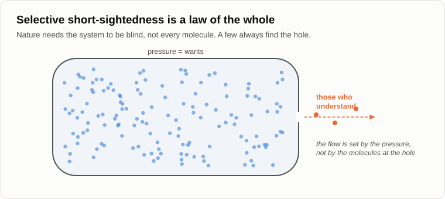
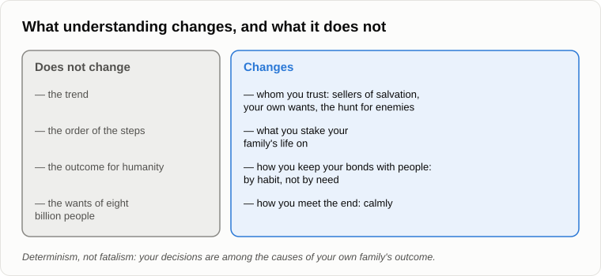

# For Those Who Understand

Oleg brought a printed page and handed it to Andrey before he sat down.

— From the archive of your old blog. Look at the comments under the evening about unemployment. A reader asks: and how will those who are able to understand survive? And you answer: "I want to set out all the details in one of the articles of this blog, and I'll tell you what needs to be done by those who want to survive and save their children." Fifteen years, Andrey.

— I remember, — Andrey folded the page and put it in his pocket. — Then let's begin with what I won't do. I won't sell salvation.

— That's convenient.

— It's honest. Whoever frightens you and then sells you a cure is a con man. A bunker with a three-year supply of tinned food. A course in living off the land. A promise to upload your mind into a computer and live forever. A politician who swears he will bring the jobs back. Each of them makes money on your fear. If after all our evenings I sold you a remedy, I'd be one of them.

— Then why frighten people at all? — Oleg sat down. — If nothing can be changed, understanding is useless. You only spoil their mood. That's fatalism.

— Remember the evening about [determinism](17-global-determinism.md). What's the difference between determinism and fatalism?

— Fatalism says the outcome is the same whatever I do. Determinism says that what I do is one of the causes of the outcome.

— Then that's the answer. The outcome for humanity my understanding won't change: it is made of the wants of eight billion people, and every step pays. But the outcome for your own family has your decisions among its causes. Understanding doesn't move the herd. It changes where you yourself walk.

— Wait. Before the advice, I have a debt to collect. — Oleg squinted slyly. — At the end of the evening about Penrose you admitted the weakest point of the whole thing. By your own theory, nature blinds human reason exactly where it could see its own end. So nobody should understand it. And you did. How?

— I said then that I didn't see the causes. Fifteen years later I think I see some, and I also think I put it too strongly. Remember the gas cylinder with a hole in it?

— The molecules fly about at random, and the gas leaks at a steady rate.

— Does any one molecule know that it's flying towards the hole?

— No.

— And does a molecule stay in the cylinder because it is forbidden to leave?

— No. Most of them simply never get to the hole.

— That's selective short-sightedness. It's a law of the whole, not of every particle. Nature doesn't need every person to be blind. It needs the system to be blind: humanity as a whole should not act on what it could see. A few molecules always find the hole. Do they change the flow?

— No, — Oleg thought. — The flow is set by the pressure.

— And the pressure is the wants. Here is your proof. In May 2023 hundreds of scientists who build artificial intelligence, among them the heads of the very companies that build it, [signed](https://en.wikipedia.org/wiki/Statement_on_AI_Risk) a statement of one sentence: reducing the risk of extinction from AI should be a global priority, alongside pandemics and nuclear war. They understood. And what did they do the next morning?

— Went on building, — said Oleg slowly.

— Every one of them for good reasons: if I stop, someone worse will build it. Understanding is not a force. A force is a want. So it was not a contradiction that I understood. It was a contradiction only in the strong form in which I put it in 2012. The understanding of a few is allowed. It changes nothing in the flow.

— And why you, of all the molecules?

— I don't believe in chance, so let me name the causes I can see. Years of weeding anthropocentrism out of my own head, from the day I saw how badly it bends logic. A diagnostic program in 1989 that learned faster than I did. And a teenage underground that taught me where machines for making people good lead. And the main thing, I believe: in me curiosity turned out to be stronger than the want for a comfortable picture. We talked about it on the evening about the [psyche](08-human-psyche.md): if you want to look where reason won't go, use one want, curiosity, and watch your own reactions through it. That's not a merit. It's a combination of setpoints.

— Fine, — Oleg nodded. — I accept it. Now the advice. For those who understand.

— Not advice. What I do myself, and what I'd tell my own children. The first: don't let yourself be deceived. By the sellers of salvation, we've spoken of them. By your own wants: the more pleasant a forecast, the more carefully check who is paying for it. And by the hunt for enemies.

— What hunt?

— Fifteen years ago, in the same comments, I wrote that when things get hard, people will look for the cause of their troubles outside themselves: the rich, the poor, foreigners, neighbours, "those over there". And many will be glad to tell them that their anger is holy and that the guilty must be punished. On the evening about [apoptosis](14-apoptosis-of-humanity.md) that was one of the instruments: mass aggression. Whoever understands that there are no villains in this story won't pick up a stick. That alone is a great deal. I wrote then that those who manage to keep out of the general brawl may last longest.

— The second?

— Don't stake your family's life on what is ending. If your son wants a profession with no shield, not because he loves it but because it was prestigious in your youth, tell him what we said about shields. If your whole plan for old age is a pension paid by the next generation of workers, remember that by the middle of the century one person in six on Earth will be [over sixty-five](https://www.un.org/en/global-issues/ageing), and that the next generation is smaller than yours. I don't tell you what to do instead. I tell you not to bet everything on the old order holding.

— And the third?

— On the evening about the freebie we said that the bonds between people were held together by need, and that the technosphere removes the need. So hold them by habit, without the need. Visit your mother, even though she has a phone. Help your neighbour dig his cellar, even though he could hire a machine. It won't save humanity. It's simply how life looks while it lasts.

— You sound like a priest.

— I sound like a man who feeds the birds at his dacha every winter, — Andrey smiled. — My feeder won't save the tits as a species. But these tits, this winter, are fed. And the fourth: meet it calmly. When I was young, I was so ill that I didn't expect to live to thirty. I've lived more than twice that. One thing I learned then: a calm view of the end doesn't spoil the life before it. It makes it clearer.

— And for humanity? Nothing at all?

— Humanity doesn't read blogs. It acts by its wants, and it will act by them. I'm speaking to the few for whom curiosity turned out stronger. To those who understand.

— Gloomy, — Oleg said, but without his usual grin.

— But objective. Let's finish for today by fixing the result.

1. **There is no salvation for humanity, and whoever frightens you and then sells a cure is a con man. Understanding does not change the outcome for the whole, but it changes the decisions of one person, and they are among the causes of his own family's outcome: determinism, not fatalism.**
2. **The weakest point of the concept has an answer. Selective short-sightedness is a law of the whole, like the gas in a cylinder: nature needs the system to be blind, not every person. Those who see do not stop the process, because understanding is not a force; the builders themselves signed the warning and went on building.**
3. **What a person who understands can do: not let himself be deceived, by sellers of salvation, by his own wants or by the hunt for enemies; not stake his family's life on what is ending; keep his bonds with people by habit, now that need no longer holds them; and meet the end calmly.**

— One thing I can't stop thinking about, — Oleg stood up and looked at the sky. The stars were out above the trees. — If it's a law of nature, then it has happened before, somewhere out there. Other civilisations, other technospheres. Then why is it so quiet? We've been listening to the sky with radio telescopes for more than sixty years, and nothing.

— You've asked the question I took to the astronomers in 2012, — said Andrey. — [The silence of the universe](29-silence-of-the-universe.md). Tomorrow.

— Well, until tomorrow.

— Bye.

---

*Continuation of the series* (Part IV. The transition and after): a new article written for this repository after the author's original 15, in his method. Builds on: [01](./01-introduction.md), [08](./08-human-psyche.md), [14](./14-apoptosis-of-humanity.md), [15](./15-penrose-counterarguments.md), [17](./17-global-determinism.md), [18](./18-anatomy-of-wants.md), [25](./25-freebies-for-everyone.md), [27](./27-scenario-of-events.md).

[← 27](./27-scenario-of-events.md) · [Contents](./README.md) · [29 →](./29-silence-of-the-universe.md)
