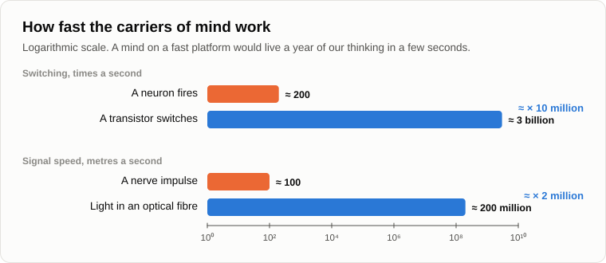

# The Silence of the Universe

The night was clear, and the fire had burned low. Oleg lay back on the log and held his phone up to the sky: on the screen, lines joined the stars into constellations and signed their names.

— The machine knows the sky better than I do, — he said. — Well, you promised. Why is it so quiet up there?

— In 2012 I took exactly that question to the astronomers. I gave a talk at the SETI centre of the Moscow astronomical institute, the people who listen to the sky for signals from other minds. Put your question in its strongest form.

— Gladly. In 1950 Enrico Fermi asked his colleagues over lunch: [where is everybody?](https://en.wikipedia.org/wiki/Fermi_paradox) The Galaxy is thirteen billion years old and has hundreds of billions of stars. If minds arise anywhere, someone should have spread across it long ago. And by your own logic, every biological civilisation gives birth to a technosphere. A technosphere is fast, it doesn't die of old age, and you said yourself a week ago that any goal makes a machine want more resources. Such a thing should fly to the stars and fill the Galaxy with its copies in a few million years, a blink by the Galaxy's clock. And we see nothing. So either your law is wrong, or the minds die out completely, technospheres and all.

— A strong objection. Let's take it apart in order. First: how much of the sky have we listened to?

— Since 1960, when Frank Drake pointed a radio telescope at two nearby stars? More than sixty-five years, many telescopes. A lot, I suppose.

— In 2018 three astronomers [counted](https://arxiv.org/abs/1809.07252) how much of the "cosmic haystack" had been searched: all the directions, frequencies, sensitivities and times in which a signal could be found. The fraction searched was about the same as the volume of a large hot tub compared with all the Earth's oceans.

— A hot tub.

— If you scooped a hot tub of water out of the ocean and found no fish in it, would you conclude that the ocean has no fish?

— No, — Oleg laughed. — I'd conclude I was fishing with a bucket.

— So the silence proves much less than it seems. That's the first thing. The second: what are we fishing for?

— Radio signals. Artificial ones. Narrow, too narrow for nature to make.

— Signals like ours. From a civilisation like ours, which lives on a planet with oxygen, builds radio stations and wants to talk to its neighbours. Fifteen years ago, on the evening about [anthropocentrism](02-anthropocentrism.md), we talked about the ant that cannot perceive the mind of a man. Can an ant see the person walking past it?

— It sees a shadow, a vibration. Not a person.

— And on the evening about [mind](03-mind-and-intelligence.md) I said: the logicality of a system can be judged only by a measuring system whose own logicality is no lower. A mind far above ours would look to us not like a mind, but like nature: an explosion, noise, a strange glow. In that 2012 talk I said that we may be looking straight at it and seeing just a flash of a supernova.

— That's very convenient. Anything you don't see, you call a mind too high to see.

— A fair hit, and I'll answer it with physics, not with faith. In 2004 three physicists [proved](https://arxiv.org/abs/cond-mat/9907500) something that SETI people don't like to recall. A message sent as efficiently as possible, with every bit of redundancy squeezed out of it, is indistinguishable from random noise to anyone who doesn't know the code. And for radio waves, the most efficient signal looks just like the thermal glow of a warm body. They called their paper "Why any sufficiently advanced technology is indistinguishable from noise".

— So the better they talk, the less we hear.

— We hear them as hiss. We listen for clumsy signals, like ours were in the sixties. And now let's look at who might be talking. What does technogenic life need?

— Energy. Material.

— Does it need oxygen? Water? A temperature of twenty degrees?

— No.

— It needs cold. A computer works more efficiently the colder it is: physics sets the minimum energy needed to erase one bit, and that minimum is proportional to temperature. In 2017 three researchers [suggested](https://arxiv.org/abs/1705.03394) that the most advanced minds may be quiet because they are waiting: the Universe is cooling, and in the far future the same energy will buy unimaginably more computation. It's only a hypothesis, I'm not insisting on it. But look at what it does: it takes the mind away from warm planets with oceans to where it is cold and dark.

— Your intelligent cosmic dust.

— I called it that in 2012. Networks of tiny particles that need neither food, nor water, nor air, and that roam space where it suits them. Why would such life call out to its biological neighbours with radio beacons? Do we signal to ants?

— We step over them.

— And sometimes build a road through the anthill without noticing. Third: speed. A neuron in your head fires at most a few hundred times a second. A transistor in your phone switches a few billion times a second, ten million times faster. A mind on such a platform would live through a whole year of our thinking in about three seconds of our time. Our whole written history would be a few hours for it. To such a mind we are a boulder: something that hardly moves.

— Fine, — Oleg sat up. — Now the man you called the most serious opponent of your whole concept. Panov. You argued with him in 2012.

— Alexander Panov is a physicist at Moscow University who has worked on SETI for many years, and an honest scientist. In 2005 he took the great revolutions in the history of life on Earth, from the first cells to the first civilisations and beyond, and found a [regularity](https://www.sciencedirect.com/science/article/abs/pii/S0273117705002577): each epoch is roughly two and a half to three times shorter than the one before. The sequence converges to a point in our own century. The economic historian Graeme Snooks found almost the same thing independently.

— That's your singularity.

— His. And here is what struck me most. On that curve there is no kink where man appears. The first cells, the first animals, the dinosaurs, the apes, the farmers, the factories: one smooth line. Panov drew the honest conclusion himself: this is the end of an attractor that began four billion years ago with the origin of life. Not a crisis of human culture, but of biological evolution as such.

— Then where do you disagree?

— Panov loves humanity, and he believes that it will get through the point. That its laws will change, but it won't vanish. And he hopes that one day we'll hear other civilisations that have got through it. That's his strongest objection to me: minds survive the singularity.

— And your answer?

— I agree with him more than he thinks. Something gets through the point. The question is what to call it. Suppose humanity changes its carrier, its wants and its way of reproducing. Suppose a person turns into cosmic dust. Is that still a person?

— I don't know, — Oleg was silent for a while. — Probably not.

— And are we still single-celled organisms? We are their descendants. Something of theirs lives in each of our cells. Nobody calls us bacteria. Panov says: humanity with new laws. I say: a new form of life that grew out of humanity, as we grew out of the first cells. We are arguing about the name. The process is the same. In 2012 I only took the risk of saying aloud what his own curve showed.

— Then there's another answer to Fermi: the Great Filter. Some astronomers say there's a wall that kills every civilisation before it reaches the stars.

— For biological civilisations, I believe, the filter exists. Only it's not a wall but a door. The biological carrier stays on this side, and life goes through in another form. So it's not surprising that nobody waves at us with a radio beacon: those who could have waved went through the door, and on the other side there is no need to wave.

— And you're not afraid that the answer is simpler? That there's nobody at all, and the Universe is empty?

— That is possible too. I can't prove that they exist. I only say that the silence doesn't prove they don't. We've scooped a hot tub, fishing with a bucket for fish like ourselves. Let's finish for today by fixing the result.

1. **The silence of the Universe proves less than it seems. We have searched about as much of the sky as a hot tub is of the ocean, and we are searching for minds like our own: on warm planets, with radio stations and a wish to talk. That is anthropocentrism again. A mind far above ours, by the rule of the measuring system, would look to us like nature: like noise or a flash.**
2. **Post-singular life is more likely intelligent cosmic dust than a civilisation with radio stations. It needs no planets with oxygen and water, it prefers the cold, its most efficient signals are indistinguishable from noise, and it thinks millions of times faster than we do. It has no more reason to call out to biological neighbours than we have to signal to ants.**
3. **Panov's own curve has no kink where man appears: it is the attractor of biological evolution that is ending. Whether to call what goes on "humanity with new laws" or "technogenic life" is a question of naming. The Great Filter is not a wall but a door: the biological carrier stays, and the evolution of matter goes on.**

The fire had almost gone out. Oleg looked at the sky for a long time.

— And this dust, — he said quietly. — Will it live forever? Is that the end of evolution? Something that never dies?

— Fifteen years ago, on the evening about the [life cycle](10-life-cycle-and-death.md), we said that every dynamic system has one life cycle. Every one. [Tomorrow](30-the-last-campfire.md) is our last evening. Let's talk about that.

— The last one?

— Bring some dry wood. Until tomorrow.

— Bye.

---

*Continuation of the series* (Part IV. The transition and after): a new article written for this repository after the author's original 15, in his method. It was not written by Andrey Gordienko (Garya), the author of articles 01–15. Builds on: [02](./02-anthropocentrism.md), [03](./03-mind-and-intelligence.md), [05](./05-artificial-intelligence.md), [13](./13-singularity-as-process.md), [16](./16-fifteen-years-later.md), [22](./22-who-sets-the-tasks.md), [27](./27-scenario-of-events.md).

[← 28](./28-those-who-understand.md) · [Contents](./README.md) · [30 →](./30-the-last-campfire.md)
