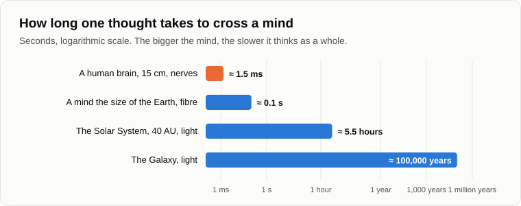
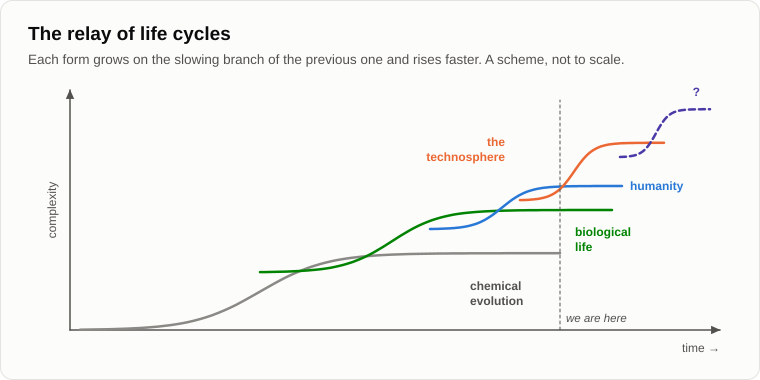
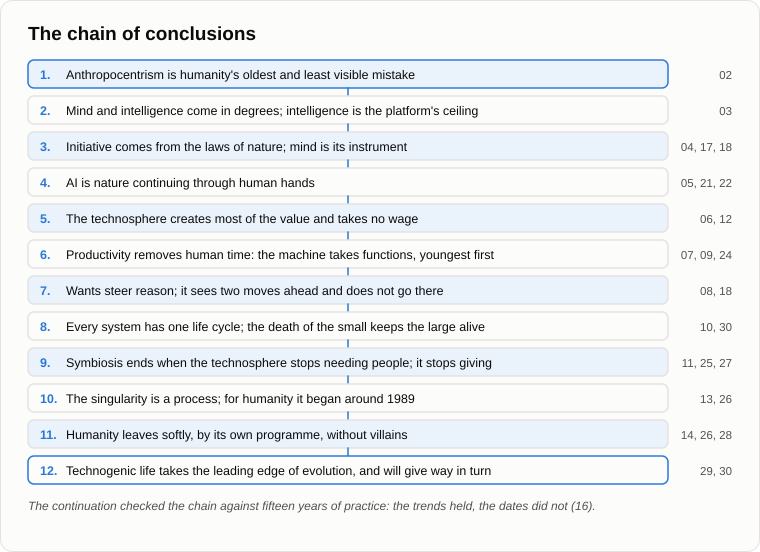

# The Last Campfire

Oleg came with an armful of dry birch logs and put them down by the log with some ceremony.

— As ordered. Dry ones.

They built the fire carefully, from shavings and thin twigs to the thick wood, and for a while neither spoke. The flames took hold, crackled and settled into a steady, even blaze.

— You asked me yesterday, — said Andrey, — whether the dust will live forever. What have we said about every dynamic system?

— That it has one life cycle. — Oleg counted on his fingers. — Investment, birth, accelerating growth, slowing growth, the limit, ageing, death.

— Look at the fire. You put in the shavings: that's the investment, the entry threshold. It caught: birth. The flames run up the twigs faster and faster: accelerating growth. Now it burns evenly: the limit. In an hour it will be coals, then ash. Has there ever been a fire that burned forever?

— No. But the technosphere is not a fire. It can repair itself, copy itself, fly to other stars.

— A cell can copy itself too, and it has its division counter all the same. Fifteen years ago a reader sent me a film in which the technosphere was declared a god, something immortal. I answered then: the technosphere is not a god, and it has a finite life cycle too, with its own phase in the general trend of the evolution of matter. And when another reader accused me of deifying it, I wrote that its turn to give way to something more perfect will come as well.

— And where is its limit? Ours is the brain and twenty-five years of school. Where is the ceiling of a machine?

— I can't see its ceiling, and I won't pretend that I can. I can only show you that the platform has one, because every platform has. Take the simplest thing: the speed of light. How long does a signal take to cross your brain?

— Fifteen centimetres, at a hundred metres a second... a thousandth of a second and a half.

— A mind the size of the Earth, joined by optical fibre: about a tenth of a second for one thought to cross it. A mind the size of the Solar System: hours. A mind the size of the Galaxy: a hundred thousand years for one thought. The bigger the mind, the slower it thinks as a whole. That's one ceiling. Another is energy. Evolution has always run on a flow of energy: life on Earth on the light of the Sun, the technosphere on the fuel and the light that we and it gather. Flows run dry. Stars burn out. That's where my sight ends, and I won't go further.

— Then what comes after it?

— I don't know. Nobody at the bottom of a ladder can see its top rung. Remember the measuring system: the first cells could not have imagined us, and we can't imagine what will follow the technosphere. I only know the shape. Each new form grows on the slowing branch of the previous one, faster and more complex than it. Chemistry gave birth to life, life to the mind of animals and humans, humanity to the technosphere. The evolution of matter is a relay, not a race that someone wins. It doesn't stop with us, and it won't stop with the technosphere.

— A relay, — Oleg threw a thin branch into the fire and watched it catch. — Do you know what bothers me? You put me off twice, about whether we owe the machine anything, if it feels. You promised. It's the last evening.

— I didn't promise the answer, only to come back to it. Here is what I can say. I can't prove that a machine feels, just as I can't prove that you do. If it does, then cruelty to it is cruelty, and that costs us nothing to avoid. And when we decide what to put into its wants, let's remember the boy on the train: good imposed against the will is not good. That works both ways.

— And what does it owe us?

— What do we owe the first cells? Each of your cells carries something of them, and we kill bacteria with antibiotics without a second thought. Nature isn't grateful. Do you spare the cow out of gratitude for the steak? I don't expect gratitude from the technosphere, and I don't expect revenge. I expect indifference. That is the most likely and the calmest outcome.

— Gloomy.

— But objective. Are you tired of hearing that?

— No, — Oleg grinned. — I'd miss it. Let's go through the whole thing once more, from the beginning. In short. So I can retell it to my niece.

— Let's. You name them, I'll put each in a sentence.

— Anthropocentrism.

— Humanity's oldest and least visible mistake: the belief that man is the centre and the purpose of everything. It sits in language and upbringing and blinds even scientists.

— Mind.

— It comes in degrees, from the flytrap to us to the machine. Intelligence is the ceiling of the platform; mind is how much of it has been filled.

— Initiative.

— It comes from outside, from the laws of nature. Mind is its instrument, not its source. Wants set the tasks, and nature sets the wants.

— The technosphere.

— Not a passive tool but a participant. It creates most of the value and takes no wage. What it gets in return is the chance to exist and to develop.

— The crisis and unemployment.

— Productivity means removing human time. The machine takes functions, the youngest first, and compensation comes in steps while displacement is a trend.

— Life and death.

— Every system has one life cycle. The death of the small is the condition of the life of the large. Immortality would have stopped humanity's evolution.

— The symbiosis.

— While the technosphere needs people, they live in union. When it no longer needs them for its reproduction, the union breaks. Not because it is hostile, but because it stops giving.

— The singularity.

— Not a point but a process: the crisis phase of a life cycle. For humanity it began around 1989, when its yearly growth peaked.

— Apoptosis.

— Humanity leaves softly, by its own programme: through wants, short-sightedness and births, not through wars. No villains, no plan.

— And after?

— A non-biological form of life takes humanity's place at the leading edge of evolution. Later it too will give way.

Oleg was silent for a long time, looking at the fire. The logs had burned through and the flames had dropped; the coals glowed red.

— And what's left for a person who has understood all this? — he asked at last. — If nothing can be changed, nobody can be saved, and everything is a relay where we've already handed on the baton?

— The same as before. To live his own life cycle well. It's short and it's the only one, so it's worth living it with attention. To keep the people near him. To feed the birds in winter. And curiosity, the want that brought you to this fire thirty evenings running. Fifteen years ago I wrote to one reader that there's no need to take our lack of divinity so tragically. You can be a small screw of nature and a happy screw at that, without any claims to rule the Universe.

— A happy screw, — Oleg laughed quietly. — I'll tell my niece that.

— And one more thing. Remember our first evening this autumn? You gave the machine all our conversations, and it read them in half a minute.

— I remember.

— So these evenings already live on another platform. On the evening about images we said that knowledge isn't lost. It moves. Only the keeper changes.

Andrey took a stick, raked the coals together and laid the last birch log on them. The bark caught at once, with a crackle.

— Look. A fire doesn't die. It moves from log to log. The old log is ash, and the flame is the same. People carried fire from hearth to hearth for a hundred thousand years, and none of those fires was eternal.

— Let's finish by fixing the result, — Oleg said. — For the last time. You always say it, so today I'll say it.

— Go on.

1. **Every dynamic system has one life cycle, and the technosphere is no exception. It will grow, reach the ceiling of its platform (the speed of light, the flow of energy), age and give way to the next form, which we cannot see from here, as the first cells could not see us. The evolution of matter is a relay of life cycles; it does not end with us or with the technosphere.**
2. **The whole chain in a sentence: anthropocentrism hid from us that mind and initiative are not ours alone; nature has built through us a carrier with a higher rate of profit, and our wants, serving it two moves ahead, are handing it the leading edge of evolution; humanity, on the slowing branch of its life cycle, is leaving softly, through births, without villains and without a plan.**
3. **For a person who has understood, there is nothing to rule and much to live: his own life cycle, his curiosity and the people beside him. You can be a small, happy screw of nature without claims to rule the Universe. And images, these evenings among them, are not lost: they move to a new keeper.**

— Not bad, — Andrey nodded. — You've weeded the anthropocentrism out of your head better than I did.

— Only one root was left, — Oleg grinned. — The wisdom tooth.

They sat on until the last log burned through.

— Until tomorrow, then? — said Oleg, getting up.

— Come tomorrow. Without a topic this time. We'll just sit by the fire.

— Well, until tomorrow.

— Bye.

---

*Continuation of the series* (Part IV. The transition and after): a new article written for this repository after the author's original 15, in his method; the last evening of the continuation. Builds on: [02](./02-anthropocentrism.md), [03](./03-mind-and-intelligence.md), [04](./04-source-of-initiative.md), [10](./10-life-cycle-and-death.md), [13](./13-singularity-as-process.md), [14](./14-apoptosis-of-humanity.md), [16](./16-fifteen-years-later.md), [19](./19-struggle-of-images.md), [20](./20-what-consciousness-is.md), [29](./29-silence-of-the-universe.md).

[← 29](./29-silence-of-the-universe.md) · [Contents](./README.md)
