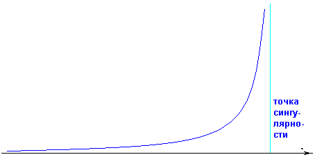
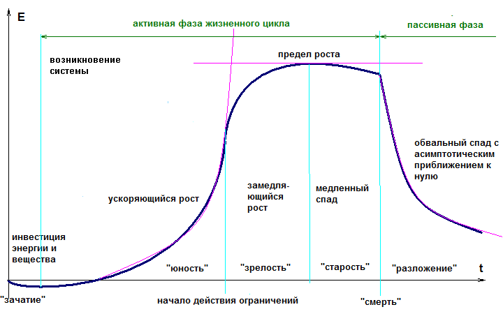

# Сингулярность как процесс

— И что же такое, по-твоему, сингулярность? — спросил Олег, пристраиваясь на бревнышке.

— По сути это математическое понятие, — Андрей протянул листок с рисунком. — Если эволюционный процесс развивается с возрастающим ускорением с обострением, он стремится к вертикальной асимтоте, пересечь которую в рамках действующих закономерностей не в состоянии.

— И какая сингулярность изображена на этом графике?

— Любая. Эволюционирующие системы переживают локальные микроэволюции и микрокризисы, периоды между которыми сокращаются по законам геометрической прогрессии. И из характера этой математической зависимости следует, что эволюция системы не может длиться бесконечно, она рано или поздно достигает точки сингулярности.

— И что, эволюционирующие системы действительно "улетают в бесконечность" возле точки сингулярности?

— Разумеется, нет. Приведенный график является лишь математическим приближением эволюционных процессов. Однако, это приближение оказывается довольно точно описывающим развитие динамической системы, пока она не приблизилась вплотную к точке сингулярности. Когда [мы рассматривали жизненный цикл динамической](10-life-cycle-and-death.md) системы, мы уже видели эту кривую в более общем виде, давай еще раз посмотрим на этот рисунок. Посмотри внимательно, рост по законам геометрической прогрессии описывает часть жизненного цикла, соответствующую "юности" динамической системы, а точка сингулярности в первом приближении совпадает с тем моментом, когда на динамическую систему начинают действовать ограничения.

— Не совсем понятно, почему прогрессия обязательно геометрическая, а, например, не парабола или что-нибудь еще?

— Это связано с общей особенностью всех динамических систем. Помнишь, в прошлый раз мы говорили о таком показателе динамической системы как "норма прибыли"? По сути, этот показатель и есть показатель геометрической прогрессии. С каждого цикла прокачки через себя энергии динамическая система оставляет себе часть этой энергии и за счет накопленной энергии получает возможность еще больше накапливать энергию. Это система с положительной обратной связью, динамика которой определяется "нормой прибыли". Если этот показатель остается постоянным, то характер динамики оказывается очень близким к геометрической прогрессии. На фазе "юности" динамической системы он определяется "физиологическими особенностями" динамической системы. Можно зафиксировать несколько реперных точек развития динамической системы, определить показатель степени, то есть "норму прибыли" и получить довольно точный прогноз ее развития. А также определить ту черту, за которую динамическая система не сможет уйти, не претерпя качественного перелома. То есть, точку сингулярности.

— Что же происходит с системой в этой точке?

— В этой точке система начинает вести себя иначе, чем вела себя прежде. Она сталкивается с ограничениями, которые начинают тормозить ее динамику. Как я уже говорил, столкновение с ограничениями может быть весьма жестким и привести к моментальной утере стабильности — в этом случае динамическая система может "умереть" и начать разлагаться. Если ограничения начинают действовать плавно, то она может выйти на предельный уровень и начать "стареть". У некоторых динамических систем цикл "старения" может на порядки превышать цикл эволюции, и они довольно длительное время оказываются способными сохранять активность. У некоторых же разрушение систем происходит вблизи точки сингулярности.

— Судя по всему, наилучшим исходом для динамической системы является длительная старость.

— Если считать активную фазу "лучшим исходом", то да. Важно понимать, что за точкой сингулярности динамическая система уже не сможет развиваться по тем же законам, по которым развивалась прежде. И это действительно неизбежно практически для любой динамической системы. За точкой сингулярности динамическую систему ожидает либо "смерть", либо "старость", за которой неизбежно все равно наступит "смерть".

— Я понял. Точка сингулярности является переломным моментом для динамической системы.

— Не совсем так. Точка сингулярности — математическое понятие. Важно понимать, что реальная сингулярность динамической системы довольно сильно отличается от математической абстракции. Было бы большой ошибкой считать сингулярность неким моментальным событием типа "бац!". Реальная сингулярность не является одномоментной. Она является ***процессом, растянутым во времени***. Я бы назвал сингулярностью на приведенном выше графике промежуток времени, обозначенный как "зрелость". По завершению этого промежутка становится ясно, где находится "потолок", преодолеть который система уже уйти не сможет.

— Но я слышал о сингулярности как о некотором моменте...

— И во всех этих случаях речь шла о вычислении координаты асимптоты, а не о точке на графике, в которой он каким-то образом резко изламывается и теряет гладкость. Единственная точка, в которой происходит утеря гладкости — "смерть", на всех остальных промежутках график остается гладким. Поэтому я настаиваю на том, чтобы рассматривать сингулярность как процесс, протяженный во времени.

— Чем же характеризуется этот процесс?

— Прежде всего, замедлением динамики роста. Из этого следует, что с динамической системой "человечество" сингулярность как процесс уже происходит. Начался этот процесс примерно в 1989 году, когда рост численности человечества стал не ускоренным, а замедленным. При сохранении тренда, завершится этот процесс примерно к сороковым годам 21-го века, когда математически прогнозируется полное прекращение роста численности людей на планете и когда можно будет сказать, что человечество достигло "потолка" своего развития.

— Я так понял, что мы рассматриваем уже конкретную динамическую систему "человечество"?

— Да. Говоря о сингулярности системы "человечество", имеет смысл вспомнить советского историка [И.М.Дьяконова](http://ru.wikipedia.org/wiki/%D0%94%D1%8C%D1%8F%D0%BA%D0%BE%D0%BD%D0%BE%D0%B2,_%D0%98%D0%B3%D0%BE%D1%80%D1%8C_%D0%9C%D0%B8%D1%85%D0%B0%D0%B9%D0%BB%D0%BE%D0%B2%D0%B8%D1%87), который в 1994 году пришел к выводу, что при сохранении тенденции к ускорению исторического развития человечество достигнет фазы сингулярности. Правда, наблюдения его носили общий эмпирический характер, и он не назвал каких-то конкретных сроков и параметров этого процесса. В 1996 год австралийский ученый Г.Д.Снукс, исследуя эволюцию более обширной динамической системы — биосферы Земли, предложил значение фактора ускорения эволюции *a*=3. В этом же году С.П.Капица, исследуя эволюцию человека начиная с гоминид, преложил величину *a*~e — это уже динамическая система, более близкая к масштабам системы "человечество". В своей [книге](http://www.ozon.ru/context/detail/id/3689501/) А.Д.Панов получает параметры *a*=2.5 для биосферы Земли начиная с прокариот и *a*=2.66 для динамической системы "человечество".

— Близкие значения, но не совпадают.

— Верно. Они и не должны совпадать. Не будем забывать, что речь идет о разных динамических системах. Важно понимать, что сингулярности разных динамических систем не обязательно должны совпадать по времени, точно так же как и параметры динамики таких систем.

— Теперь о сингулярности технсоферы?

— Термин "сингулярность" употребил Фон Нейман в конце 40-х начале 50-х годов 20-го века. Исследуя влияние техносферы на человечество, он пришел к выводу, что под воздействием ускоряющегося развития технологий человечество должно войти в фазу сингулярности. Один из родоначальников концепции [технологической сингулярности](http://ru.wikipedia.org/wiki/%D2%E5%F5%ED%EE%EB%EE%E3%E8%F7%E5%F1%EA%E0%FF_%F1%E8%ED%E3%F3%EB%FF%F0%ED%EE%F1%F2%FC) [Рэй Курцвейл](http://ru.wikipedia.org/wiki/%D0%9A%D1%83%D1%80%D1%86%D0%B2%D0%B5%D0%B9%D0%BB,_%D0%A0%D1%8D%D0%B9%D0%BC%D0%BE%D0%BD%D0%B4) научно обосновал закон экспоненциального роста НТП. Однако, я еще раз подчеркиваю, что следует отличать общебиологическую, технологическую сингулярность и сингулярность человечества. Речь идет о разных системах. Достаточно известный в среде ИТ-специалистов [закон Мура](http://ru.wikipedia.org/wiki/%C7%E0%EA%EE%ED_%CC%F3%F0%E0) относится к четвертой системе, которая является лишь частью техносферы, и он тоже описывает геометрическую прогрессию. Все эти системы являются частями более крупной динамической системы.

— Так мы о сингулярности какой системы говорим? Человечества? Техносферы? Транзисторов из закона Мура?

— Человечества в том числе, но в данном случае речь идет о сингулярности системы более крупного масштаба, чем человечество. Речь идет о биосфере Земли. В своей [статье](http://spkurdyumov.narod.ru/Panov.htm) А.Д.Панов приходит к выводу о тесной взаимосвязи эволюции человечества и биосферы, как более масштабной системы. По его выкладкам получается, что сингулярность затронет *всю биосферу нашей планеты*.

— Как такое возможно?

— Человечество является частью биосферы. Если сингулярность затрагивает всю биосферу, то и человечество тоже.

— Но что может произойти с биосферой?

— Давай попробуем представить, что некие сверхразумные наносистемы с ИИ получили контроль над всеми ресурами нашей планеты. Им не нужен воздух, чистая вода, биологическая пища. Соответственно, у них совершенно иная система ценностей. То, что для нас сейчас представляется жизненно необходимым, для них всего лишь часть пейзажа, строительный материал, или даже просто мусор. Они могут без какого-либо сожаления уничтожить многие биологические виды на нашей планете. Или даже просто не обращать внимания на всё это биологическое мельтешение, но в результате своей деятельности изменить состав атмосферы, среднюю температуру по планете. Для столь совершенных созданий, которые могут жить в космосе, в безвоздушном пространстве, всё это несущественные мелочи, а те, кто не сможет дышать, пить и есть, просто погибнет. Для них гибель биологических видов может оказаться настолько же безразличной, насколько для нас гибель комаров, мух и тараканов.

— Ты веришь в то, что именно так и будет?

— Я полагаю, что это может произойти, но не сразу, а через некоторое время после сингулярности. Некоторая часть людей сможет выжить после того, как техносфера полностью возьмет под свой контроль ресурсы планеты. И одно-два поколения, выживших людей, вероятно, еще смогут существовать на нашей планете.

— А потом?

— А потом, возможно, не смогут даже те, кто выжил. И от человечества не останется вообще ничего. А от остальных биологических видов останутся только простейшие, наиболее приспособленные к самым суровым условиям жизни. Они смогут жить в агрессивной среде еще длительное время в виде осколков ранее процветавшей биологической жизни, которая сойдет с переднего края эволюции, уступив место новой форме жизни — нанотехногенной и сверхразумной.

— Это только догадки, причем, из разряда ужастиков.

— Даже если на время забыть об НТП, развитии ИИ-систем и нантохенологий, наша атмосфера всё равно обречена. Не техносфера, а мы, люди, запустили процессы высвобождения метана из вечной мерзлоты, и остановить их теперь наврядли удастся, потому что работает положительная обратная связь. Высвобождающийся метан увеличивает парниковый эффект атмосферы, из-за чего происходит потепление климата, которое в свою очередь вызывает высвобождение еще большего количества метана. В масштабах общего времени жизни нашей планеты этот процесс протекает почти молниеносно, хотя нам может казаться, что ничего радикально не изменяется. Вне зависимости от того, чем закончится история с ИИ-системами, нас ожидает более глобальное изменение климата на планете, чем происходило в ледниковый период. Если глобальное потепление приведет к гибели биологических видов, продуцирующих кислород, то кислород из атмосферы очень быстро исчезнет. В итоге мы получим раскаленную планету с атмосферой, не содержащей кислород и с настолько высокой температурой, что океаны могут превратиться в водяной пар. Вопрос лишь в том, кто в таких условиях сможет выжить. Биологические люди наврядли смогут. Техногенная жизнь — сможет. Так что природой всё расставлено так, что нам просто некуда деться. Но неизбежное изменение климата — это всё-таки более отдаленные события, которые взаимосвязаны с сингулярностью планетарной биоты. Эти события можно предсказывать только в очень общих чертах, и они относятся к периоду за пределами 21-го века.

— А более близкие?

— А более близкие касаются периода до 2030-2050 годов, до которых может продолжиться сингулярность человечества.

— Откуда такие сроки?

— Я свел в табличку различные прогнозы, имеющие отношение ко всему сказанному. Вот, взгляни...

Источник Период Объект ПримечаниеА.Д.Панов 2064 год Человечество Расчет точки сингулярности по историческим фазам ДьяконоваА.Д.Панов 1989 год Человечество Фазовый переход к посткапитализмуС.П.Капица 2027 год Человечество Точка обострения автомодельного закона роста народонаселенияА.Е.Чучин-Русов 2015 год Человечество Точка схождения культурно-экологических формацийС.Н.Гринченко 1981 год Человечество Точка инвариантности механизмов системной памяти [Википедия, Демографический переход](http://ru.wikipedia.org/wiki/%C4%E5%EC%EE%E3%F0%E0%F4%E8%F7%E5%F1%EA%E8%E9_%EF%E5%F0%E5%F5%EE%E4) 2050 год Человечество Прекращение роста численности населения ЗемлиА.Антонов, зав.кафедрой социологии МГУ 2051-2055 годы Человечество Не останется ни одной страны, в которой среднее количество детей на 1 женщину будет превышать уровень воспроизводства [Фон Фёрстер](http://ru.wikipedia.org/wiki/%D0%97%D0%B0%D0%BA%D0%BE%D0%BD_%D0%B3%D0%B8%D0%BF%D0%B5%D1%80%D0%B1%D0%BE%D0%BB%D0%B8%D1%87%D0%B5%D1%81%D0%BA%D0%BE%D0%B3%D0%BE_%D1%80%D0%BE%D1%81%D1%82%D0%B0_%D1%87%D0%B8%D1%81%D0%BB%D0%B5%D0%BD%D0%BD%D0%BE%D1%81%D1%82%D0%B8_%D0%BD%D0%B0%D1%81%D0%B5%D0%BB%D0%B5%D0%BD%D0%B8%D1%8F_%D0%97%D0%B5%D0%BC%D0%BB%D0%B8) 2026 год Человечество Точка обострения в динамике численности населения ЗемлиДэни Эдер 2016-2018 годы Технологии Технологическая сингулярностьОтчет 2007 года комисси по экономической политике конгресса США 2020-2030 годы Технологии Технологическая сингулярность [Вернор Виндж](http://ru.wikipedia.org/wiki/%C2%E8%ED%E4%E6,_%C2%E5%F0%ED%EE%F0) 2020-2040 годы Технологии Технологическая сингулярностьРэй Курцвейл 2014 год ИИ-системы Достижение суперкомпьютерами мощности человеческого интеллектаРэй Курцвейл 2020 год ИИ-системы Достижение персональными компьютерами мощности человеческого интеллектаРэй Курцвейл 2029 год ИИ-системы Компьютер проходит тест Тьюринга, доказывая свою разумностьРэй Курцвейл 2040 год ИИ-системы + человечество Отказ от биологического тела и замена человеческого тела техногеннымРэй Курцвейл 2045 год Технологии Технологическая сингулярность, Земля превращается в суперкомпьютер-сеть, дальнейшие прогнозы невозможныIBM проект SYNAPCE 2018 год ИИ-системы Разработка суперкомпьютера с мощностью человеческого интеллекта. По моим оценкам + 10-12 лет — и безработица на Земле станет 100%-ной.А.Д.Панов 2004 год Биосфера Земли Расчет по фазам от прокариотИстория 2007-2008 годы Экономика Начало глобального экономического кризиса

— Даты все разные, и часть почему-то относятся к прошлому.

— Совершенно верно. Нужно понимать, что у этих прогнозов есть определенный уровень неточности. А вот степень их их близости по времени как раз характеризует степень точности этих прогнозов. Понятно, что точность в пределах 10-15 лет, остальной разброс дат связан с временной протяженностью самого процесса сингулярности. А даты из прошлого фигурируют потому, что сингулярность человечества *УЖЕ ПРОИСХОДИТ*. Первые ее признаки появлись в конце 20-го века в виде замедления роста численности населения, впоследствии возникли уже более отчетливые признаки в виде глобального экономического кризиса. Нет смысла ждать, что эти явления сами собой рассосутся. К ним могут добавится лишь новые.

— Какие именно?

— Об этом в следующий раз. Сегодня уже поздно и пора по домам. Сегодня мы выяснили, что... **Сингулярность — это не одномоментное событие, это протяженный во времени процесс. Сейчас мы уже находимся в этом процессе. Сингулярность затрагивает не только человечество, но и всю биосферу Земли.** Ну, пока.

— До завтра.

— А это послушай перед сном...

---

Автор: [Андрей Гордиенко (Garya)](https://proza.ru/avtor/garya) · [Оригинал на sql.ru с комментариями](../sources/garya/sqlru/13-singularity-as-process.md)

[← 12](./12-value-shares.md) · [Оглавление](./README.md) · [14 →](./14-apoptosis-of-humanity.md)
