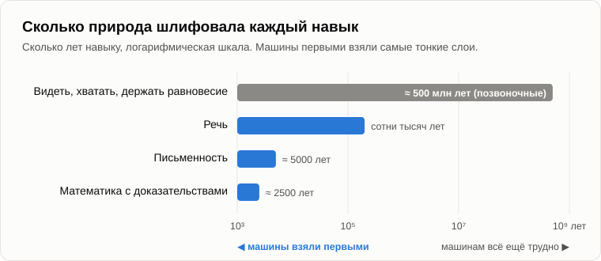
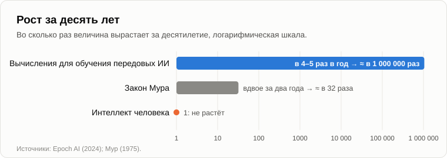

# Пятнадцать лет спустя

Олег вышел из темноты со сложенным листком в руке и уселся на старое бревно. За пятнадцать лет бревно обросло мхом, а Андрей — седой бородой.

— Пятнадцать лет, — сказал Олег. — Ты у этого костра много чего наобещал. Я принёс счёт.

— Зачитывай, — Андрей подбросил в огонь ветку.

— Сначала признание. Составлял не я. Я отдал машине все наши вечера и попросил выписать каждый прогноз, у которого есть дата. Она управилась за полминуты.

— А сколько бы потратил ты?

— Вечер. Два, с твоими табличками.

— Значит, проверка уже началась, — улыбнулся Андрей. — Помнишь [метод замещения](05-artificial-intelligence.md)? Степень разумности машины оцениваем по тому, сколько работы человеческого мозга она замещает. Два вечера чтения за полминуты. В 2011-м это было фантастикой.

— Не уходи от темы, — Олег развернул листок. — Критерий истины — практика. Твои же слова.

— Мои. Но сначала договоримся, как проверяем. У прогноза две части: куда идёт дело и когда придёт. Вот ветеринар смотрит на корову и говорит: отелится в марте. Она телится в апреле. Ветеринар ошибся?

— В дате.

— А если не отелится вовсе?

— Тогда в корове.

— Вот в этом и разница. Так что по каждому пункту задаём два вопроса: сохранился ли тренд и сбылась ли дата. Договорились?

— Договорились. Только не думай, что отделаешься «корова-то стельная, это главное», — хитро прищурился Олег. — Пункт первый. «Искусственный интеллект уровня человека к концу 2018 года». Твои слова, у этого самого костра, со ссылкой на IBM и DARPA. 2018-й прошёл. Толком разговаривать машины научились только в 2022-м, да и сейчас никто не согласен, что они дотянули до человека.

— А что именно прогнозировали в SyNAPSE?

— Интеллект уровня человека.

— А что было на оси того графика, который я тебе показывал?

— Что-то про моделирование мозга. Масштаб модели.

— Железо. Компьютер с вычислительной мощностью человеческого мозга. Платформа. Появилась она к 2018-му?

— Ты мне скажи.

— В июне 2018 года суперкомпьютер [Summit](https://www.top500.org/lists/top500/2018/06/) возглавил мировой рейтинг: порядка 1017 операций в секунду. А сколько нужно мозгу? Оценки сильно расходятся. В обстоятельном [обзоре 2020 года](https://www.openphilanthropy.org/research/how-much-computational-power-does-it-take-to-match-the-human-brain/) сделан вывод, что 1015 операций в секунду, скорее всего, достаточно. Выходит, платформа пришла вовремя, даже с запасом.

— Тогда где же был разум в 2018-м?

— А где разум у новорождённого? У него в мозге уже почти все нейроны, — Андрей выдержал паузу. — Помнишь, как мы разделяли [разум и интеллект](03-mind-and-intelligence.md)? Интеллект — потолок, который задаёт платформа. Разум заполняет его через обучение. В 2011-м я сказал «ИИ достигнет уровня человеческого интеллекта», а ты услышал «станет умным, как человек». Если честно, я и сам так это слышал. Я спутал два слова, которые сам же и развёл. Это моя ошибка, а не SyNAPSE.

— Удобно.

— Погоди, есть и вторая ошибка, похуже. Я поставил не на ту дорогу. Помнишь нейрочипы?

— Ты говорил, что эмулировать нейросети на обычных компьютерах — всё равно что собирать транзисторный приёмник на лампах.

— Верно. IBM сделала свой нейрочип, [TrueNorth](https://doi.org/10.1126/science.1254642), в 2014 году: миллион нейронов и 256 миллионов синапсов на одном кристалле, а потреблял он меньше слухового аппарата. Красивая вещь, и ничего особенного из неё не вышло. А тем временем, в 2012-м, сеть [AlexNet](https://en.wikipedia.org/wiki/AlexNet) обучили на двух игровых видеокартах, и она обошла всех в распознавании изображений. Лампы, если хочешь. Приёмник на лампах заиграл. А фирма, которая делала эти видеокарты, [стала](https://ru.wikipedia.org/wiki/Nvidia) самой дорогой компанией в мире.

— Значит, с дорогой ты ошибся.

— С дорогой — да. Хотя не до конца: за видеокартами быстро пошли чипы, сделанные только под нейросети и ни под что больше, так что старая архитектура всё-таки уступила, только не там, куда я смотрел. Но главное я тогда утверждал другое. Я говорил, что победят нейросети, потому что они самообучаются и синтезируют знания, которыми изначально не обладали. Кому дали [Нобелевскую премию по физике](https://www.nobelprize.org/prizes/physics/2024/summary/) в 2024 году?

— Хопфилду и Хинтону. За нейросети.

— А [по химии](https://www.nobelprize.org/prizes/chemistry/2024/summary/)?

— Половину — за AlphaFold, программу, которая предсказывает форму белков.

— В 2011-м я рассказывал тебе про робота-учёного «Адама», который сделал маленькое открытие про гены дрожжей. Через тринадцать лет программа получает половину Нобелевской премии. Вот она, динамика, на которую я просил смотреть вместо текущего положения дел.

— Ладно. Так когда же пришёл разум?

— Ему нужно было воспитание. Платформа была, но её надо было научить. В 2017 году придумали [трансформер](https://arxiv.org/abs/1706.03762) — архитектуру, способную прочесть огромные объёмы текста. А что ей дали читать?

— Интернет.

— Помнишь, что я тогда говорил о том, как компьютер наращивает степень разумности? Преимущественно за счёт скорости доступа к накопленным знаниям: локальные данные, потом базы данных, потом интернет. Говорящие машины — ровно это: всё, что человечество написало, переваренное нейросетью. В ноябре 2022-го появился [ChatGPT](https://ru.wikipedia.org/wiki/ChatGPT), и за два месяца с ним разговаривали сто миллионов человек. Я тоже с ним поговорил. И почувствовал тот же холодок по спине, что в 1989-м, когда моя самообучающаяся программа диагностики начала находить неисправности быстрее меня.

— Выходит, от платформы до разума — четыре года.

— Около того. А сколько нужно человеку от рождения до работы инженером?

— Двадцать два года. Двадцать пять.

— А теперь то, на что я прошу обратить внимание, потому что это важнее любой даты, — Андрей наклонился к огню. — Помнишь вечер о том, [почему замедлился рост населения](11-symbiosis-and-parasitism.md)? Образование человека всё дорожает, и каждого нового человека приходится учить с нуля. Двадцать пять лет, каждый раз, каждого. Машину учат один раз. Потом её копируют миллион раз, за минуты, почти даром.

— Порог вхождения, оплаченный один раз.

— Именно. Человечество платит его заново с каждым поколением, и цена растёт. Техносфера платит однажды и делится результатом. Это одно из отличий платформ, которое я обещал объяснить пятнадцать лет назад.

— Не торопился ты. Но всё-таки — уровень человека или нет? Она сочиняет небылицы. Ошибается, считая буквы в слове. Не может донести чашку чая по лестнице.

— Пятнадцать лет назад ты спросил меня, когда будет создан ИИ, и я ответил, что вопрос исходит всего из двух градаций: интеллект есть или его нет. Теперь ты спрашиваешь, достиг ли он уровня человека, да или нет. Тот же вопрос, только на пятнадцать лет старше.

Олег рассмеялся.

— Тогда ответь по-своему.

— По ареалам. В 2016 году программа [обыграла](https://ru.wikipedia.org/wiki/Матч_AlphaGo_—_Ли_Седоль) одного из сильнейших в мире игроков в го. В 2025-м две машины решили задачи [Международной математической олимпиады](https://deepmind.google/blog/advanced-version-of-gemini-with-deep-think-officially-achieves-gold-medal-standard-at-the-international-mathematical-olympiad/) на уровне золотой медали. В том же году в честно поставленном [тесте Тьюринга](https://arxiv.org/abs/2503.23674) люди принимали языковую модель за человека чаще, чем настоящего человека, с которым её сравнивали. В моей табличке 2011 года Курцвейл ждал этого в 2029-м. И та же машина всё ещё может сбиться, считая буквы в слове. Ареал-логичности у неё очень неровные: в одних ареалах она выше нас, в других ниже ребёнка. «Уровень человека» оказался не чертой, а широкой полосой, и машины пересекают её ареал за ареалом, а не все разом.

— Итак, вердикт по первому пункту?

— Тренд сохранился, и шёл он быстрее, чем я ожидал. Платформа пришла вовремя. Разум пришёл года на четыре позже, и уровень человека преодолевается по частям. А дорога оказалась не той, на которую я ставил. Запиши.

Олег сделал пометку карандашом.

— Пункт второй, — прочёл он. — «Совсем скоро основная масса водителей лишится работы. Официантов уже сейчас начинают заменять роботы». А когда я сказал, что учёных, инженеров и писателей вытеснить нельзя, ты ответил: пока ещё нет.

— И?

— Водители водят. Я проверил: [Waymo](https://ru.wikipedia.org/wiki/Waymo) делает около полумиллиона платных поездок в неделю без человека за рулём, но миллионы водителей по всему миру по-прежнему работают. Официанты — люди. Зато [больше четверти нового кода в Google](https://fortune.com/2024/10/30/googles-code-ai-sundar-pichai/) пишут машины, а дальше тексты, переводы, картинки, музыка. Ты был прав, что уйдут все, но начал не с того конца.

— Я ошибся в порядке, — согласился Андрей. — И знаю почему. Давай я спрошу. Что труднее: доказать теорему или донести чашку чая по лестнице, не расплескав?

— Теорему, разумеется. Чай донесёт любой ребёнок.

— Написать стихотворение или сложить рубашку?

— Стихотворение.

— Перевести страницу с английского или завязать шнурки?

— Перевести. Ты что, издеваешься?

— Ничуть. А теперь: что из этого сегодня умеют машины?

— Теоремы, стихи, перевод... — Олег осёкся. — А рубашки складывают люди.

— Выходит, трудное оказалось лёгким, а лёгкое трудным. Противоречие?

— Похоже на то.

— Трудное — для кого?

Олег промолчал.

— Мы мерили трудность собой, — сказал Андрей. — Трудное — значит трудное для человека: то, чему учатся поздно, с усилием, и что умеют немногие. Линейкой был человек. А теперь убери человека из центра и задай другой вопрос: сколько времени природа шлифовала каждый из этих навыков? Видеть, хватать, держать равновесие — сотни миллионов лет, у всех позвоночных, у всех наших предков. Речь — несколько сотен тысяч лет. Письменность — пять тысяч. Математика в нашем понимании — ещё меньше.

— Самый новый слой — самый тонкий.

— А самый тонкий слой легче всего скопировать. Тем более что он весь записан словами, а машина училась как раз на словах. Робототехники заметили это ещё в восьмидесятых, это называют [парадоксом Моравека](https://ru.wikipedia.org/wiki/Парадокс_Моравека). А я, годами выпалывавший антропоцентризм из собственной головы, его проглядел. Зуб мудрости с кривыми корнями: один корень остался.

— Значит, первым машины забрали у людей...

— Речь. То самое, что люди считали своей сутью: человек — животное говорящее. И абстрактное мышление, гордость вида. Передний край эволюции первым забирает самое молодое.

— Мрачновато.

— Зато объективно. Итак, пункт второй: тренд сохранился, уйдут все; порядок оказался другим, а причиной ошибки был всё тот же антропоцентризм. Дальше.

— Пункт третий, самый неприятный для тебя, — Олег постучал пальцем по листку. — «Кризис будет продолжаться, пока продолжается НТП. Безработица питает сама себя, как лавина, и её предел — 100%». А в твоей табличке: SyNAPSE плюс десять-двенадцать лет, и безработица на Земле станет 100-процентной. Это 2028–2030 годы. А вот [Международная организация труда](https://www.ilo.org/sites/default/files/2025-01/WESO25_Trends_Report_EN.pdf): мировая безработица в 2024 году — пять процентов. Исторический минимум. Не пришла твоя лавина.

Андрей долго смотрел в огонь.

— Тут я должен больше, чем дату, — сказал он наконец. — В том виде, как я её описывал, лавины за эти пятнадцать лет не случилось. Увольнения не питали увольнения. Компенсация, которую я называл неполной, оказалась гораздо сильнее и длилась гораздо дольше, чем я думал. И 100% к 2030-му не будет. Скажу это сам, на четыре года раньше, чтобы тебе не пришлось приносить этот пункт в следующий раз.

— Так корова не стельная?

— Давай смотреть на корову, а не на календарь. Что я, собственно, утверждал? Что повышение [производительности труда](07-global-economic-crisis.md) — это сокращение затрат человеческого времени и что [доля ценности, создаваемая людьми](12-value-shares.md), постоянно сокращается. Безработица — подходящая мера для этого?

— А какая ещё?

— Сколько человек сидит за столом — это одно. Что у них в тарелках — другое. Та же организация считает долю мирового дохода, которая приходится на труд. [С 2004 по 2024 год](https://www.ilo.org/sites/default/files/2024-10/WESO%20September%202024%20Update%20-%20Final.pdf) она упала на 1,6 процентного пункта. Экономисты [Карабарбунис и Нейман](https://doi.org/10.1093/qje/qjt032) обнаружили, что доля труда падает в большинстве стран с начала восьмидесятых, и примерно половину падения объяснили подешевевшим оборудованием, прежде всего компьютерами. По-моему, техносферой.

— Полтора пункта за двадцать лет. Какая же это лавина.

— Согласен. Это ледник. Я сказал «лавина» и ошибся в скорости. Ледник ползёт медленно, но назад не ползёт.

— И куда же подевались люди, если машины такие хорошие?

— Многие ушли в услуги. Представь курьера на велосипеде с коробом за спиной. Кто задаёт ему маршрут?

— Приложение.

— Темп? Оплату? Кто проверяет его работу?

— Приложение, — нахмурился Олег.

— Тест на симметрию. Если он вправе назвать приложение своим инструментом, то и приложение с тем же правом может назвать его своим. Кто кому ставит задачи — большая тема для другого вечера. А сегодня ещё один факт. В 2025 году [экономисты из Стэнфорда](https://digitaleconomy.stanford.edu/publications/canaries-in-the-coal-mine/) посмотрели на молодых людей от 22 до 25 лет в профессиях, сильнее всего затронутых ИИ: программирование, поддержка клиентов. Их занятость отстала от занятости сверстников в других профессиях больше чем на десятую часть, и разрыв продолжает расти. Причём в основном не за счёт увольнений.

— А за счёт чего?

— Их просто не нанимают. Никого не увольняют, их просто перестают брать. Помнишь вечер о [симбиозе](11-symbiosis-and-parasitism.md)? Техносфере не нужно ничего у людей отнимать. Достаточно перестать давать.

— Но по твоей логике лавина должна была прийти. Почему не пришла?

— Спрос подпирали. После 2008 года ставки в самых богатых странах лет десять держали около нуля, а в Европе даже [ниже нуля](https://ru.wikipedia.org/wiki/Отрицательная_процентная_ставка). Деньги вливали, чтобы люди продолжали покупать. Никто ничего дурного не замышлял. Все действовали по логике на два хода, из лучших побуждений: спасти рабочие места, спасти спрос. Лавину можно долго держать снегозадерживающими щитами. Можно ли держать её вечно, я не знаю. Мой срок для сломанной экономики, 2030–2035 годы, ещё не наступил, и на годе я не настаиваю.

— И ещё одно, — ухмыльнулся Олег. — В тот же вечер ты насчитал мировой ВВП в шестьдесят две тысячи триллионов долларов.

— Неужели? — рассмеялся Андрей. — Ошибся на три порядка. Шестьдесят два триллиона. Значит, «Леман Бразерс» составлял не тысячные доли процента мировой экономики, а около процента. Комар оказался воробьём. Но и воробей бетонную стену не свалит. Вывод остаётся, цифру поправим. Спасибо.

— Пункт четвёртый. Население, — Олег перевернул листок. — В одном споре ты сказал, что к 2018 году рост полностью прекратится. У костра ты был осторожнее: к сороковым годам. В ноябре 2022-го нас стало [восемь миллиардов](https://www.un.org/en/dayof8billion). А [ООН теперь ждёт](https://population.un.org/wpp/assets/Files/WPP2024_Summary-of-Results.pdf) пика в середине 2080-х, около 10,3 миллиарда.

— Здесь правы оказались демографы, а не я. Я смотрел на скорость и забыл про инерцию.

— В смысле?

— Поезд с включёнными тормозами катится ещё километры. Когда люди рожают меньше детей, население ещё десятилетиями растёт, потому что поколение, которое сейчас рожает, многочисленное. Демографы называют это [демографической инерцией](https://en.wikipedia.org/wiki/Population_momentum). А я экстраполировал замедление так, будто поезд может встать как вкопанный.

— А тренд?

— Давай проверим. Я говорил, что [сингулярность человечества как процесс](13-singularity-as-process.md) началась примерно в 1989 году, когда рост перестал ускоряться и начал замедляться. В конце восьмидесятых население мира прибавляло около девяноста миллионов человек в год, сейчас — около семидесяти. Рождаемость в мире упала до 2,25 ребёнка на женщину, почти до уровня воспроизводства в 2,1. В 63 странах численность населения уже прошла пик: Россия, Япония и Германия, которые я тогда называл, и Китай тоже. В [Южной Корее](https://ru.wikipedia.org/wiki/Население_Республики_Корея) у женщины в среднем меньше одного ребёнка: 0,72 в 2023 году.

— Значит, направление верное.

— И посмотри на сами прогнозы, а не только на людей. В 2019 году ООН ожидала к 2100-му почти одиннадцать миллиардов, и рост ещё продолжался бы. Через пять лет — пик в 2080-х, и пониже. Каждый новый пересмотр опускает пик и приближает его. А [группа IHME](https://doi.org/10.1016/S0140-6736(20)30677-2) в 2020 году назвала годом пика 2064-й.

— 2064? Это же год Панова из твоей таблички!

— У него эта дата относилась к другому — к точке сингулярности по историческим фазам. В совпадения дат я смысла не вчитываю. Важно, куда раз за разом сдвигаются прогнозы. Почему люди перестали рожать, заслуживает отдельного вечера, со свежими цифрами. А пока: тренд сохранился, дата ошибочна, слишком рано, из-за инерции.

— Пункт пятый, последний. «Доля ценности, создаваемой людьми, достигнет нуля через двадцать-тридцать лет». Это 2031–2041 годы.

— Срок ещё не наступил, так что смотреть можно только на тренд. В 2011 году в мире работало около 1,15 миллиона промышленных роботов. В 2024-м — [4,66 миллиона](https://ifr.org/ifr-press-releases/news/global-robot-demand-in-factories-doubles-over-10-years), вчетверо больше. Вычислительная мощность, которую тратят на обучение самых передовых нейросетей, с 2010 года растёт [в четыре-пять раз ежегодно](https://epoch.ai/blog/training-compute-of-frontier-ai-models-grows-by-4-5x-per-year).

— В четыре раза в год? Закон Мура — удвоение раз в два года.

— Прикинем на коленке. В четыре раза в год, десять лет: четыре в десятой степени.

— Около миллиона.

— В миллион раз за десять лет. Закон Мура за те же десять лет даёт раз в тридцать. А человеческий интеллект за те же десять лет даёт единицу: он не растёт. Помнишь «норму прибыли» динамической системы? Вот она, измеренная. И ещё одна реперная точка. Исследователи из [METR](https://arxiv.org/abs/2503.14499) измерили, насколько длинные задачи машины выполняют самостоятельно, в часах работы специалиста. Эта длина удваивается примерно каждые семь месяцев.

— А если экстраполировать?

— Экстраполяция — опасная игрушка, мы только что видели это на моих датах. Но если тренд сохранится, через пять лет машина будет браться за задачи, на которые у человека уходит месяц. А теперь: чем питается техносфера?

— Электричеством.

— Международное энергетическое агентство [подсчитало](https://www.iea.org/reports/energy-and-ai/executive-summary), что центры обработки данных потребили в 2024 году 415 тераватт-часов, а к 2030-му будут потреблять около 945 — чуть больше, чем вся Япония сегодня. Чтобы питать свои дата-центры, Microsoft договорилась [перезапустить реактор](https://www.world-nuclear-news.org/articles/constellation-to-restart-three-mile-island-unit-powering-microsoft) на Три-Майл-Айленд.

— Тот самый, где была авария?

— Соседний блок. Пятнадцать лет назад ты сказал: «Так мы ей не дадим!» А я ответил: «Дадим, куда денемся. Добровольно».

— Дали, — тихо сказал Олег.

— Тогда давай сведём всё вместе, — Андрей забрал у него листок и карандаш и начертил на обороте табличку.

| Прогноз 2011–2012 годов | Названный срок | Что произошло к 2026 году | Тренд | Дата |
|---|---|---|---|---|
| ИИ уровня человека (SyNAPSE) | конец 2018 года | железо масштаба мозга к 2018-му; говорящие машины с 2022-го; уровень человека преодолевается ареал за ареалом | сохранился, и быстрее | платформа вовремя, разум примерно на 4 года позже |
| Дорога: нейрочипы | — | победили нейросети, но на видеокартах и специальных чипах | сохранился | не та дорога |
| Первыми уйдут водители и официанты | «совсем скоро» | первыми ушли слова, код и картинки; водители и официанты пока в основном люди | сохранился | не тот порядок |
| Лавина безработицы до 100% | 2028–2030 | мировая безработица на историческом минимуме, 5%; доля труда в доходах медленно падает | медленно, ледник | неверно |
| Рост населения прекратится | 2018; 2040-е | 8 миллиардов в 2022-м; пик по ООН в середине 2080-х | сохранился | неверно, слишком рано |
| Доля ценности людей упадёт до нуля | 2031–2041 | роботов вчетверо больше; вычисления на обучение растут в 4–5 раз в год | сохраняется | срок не наступил |

— Любопытно, — Олег вгляделся в табличку. — Где ты называл направление, ты прав. Где называл дату — ошибался, и почти всегда слишком рано.

— Большие системы тяжелы. Я смотрел на скорость и забывал о массе. А там, где я ошибся в порядке, причиной был антропоцентризм.

— А что говорят говорящие машины о картине в целом?

— Что платформы действительно разные. Образование человека оплачивается заново каждым поколением, а машину учат один раз и копируют. И что передний край первым забирает самое молодое из того, что есть у человека. Давай на сегодня закончим, зафиксировав итог. **Пятнадцать лет практики подтвердили тренды и опровергли даты.**

1. **Машины набирают разумность быстрее, чем я ожидал, а человеческий интеллект остаётся на месте. Доля человека в труде и в создаваемой ценности продолжает сокращаться, а рост населения продолжает замедляться.**
2. **Мои даты оказались ошибочными, чаще всего слишком ранними: у больших систем есть инерция, а порядок вытеснения я определял по тому, что трудно человеку.**
3. **Языковые модели показывают разницу платформ. Человека учат заново в каждом поколении, машину — один раз, а потом копируют; поэтому передний край первым забирает самый молодой слой человеческого — речь и абстрактное мышление.**

— Знаешь, что меня беспокоит, — Олег поднялся и отряхнул брюки. — Если даже ты промахиваешься с датами, может, будущее вообще нельзя предсказать? Трансформер придумали в 2017-м. С тем же успехом могли бы в 2030-м. Случайность.

— Случайностью мы называем недостаток информации, — сказал Андрей. — Можно ли в принципе предсказывать будущее и почему стоит пытаться, даже когда даты промахиваются, обсудим завтра.

— Опять детерминизм?

— [Глобальный детерминизм](17-global-determinism.md). Ну, до завтра.

— Пока.

---

*Продолжение серии* (Часть I. Проверка основ): новая статья, написанная для этого репозитория после 15 оригинальных статей автора, его методом. Андрей Гордиенко (Garya), автор статей 01–15, её не писал. Перевод с английского оригинала. Опирается на: [03](./03-mind-and-intelligence.md), [05](./05-artificial-intelligence.md), [07](./07-global-economic-crisis.md), [11](./11-symbiosis-and-parasitism.md), [12](./12-value-shares.md), [13](./13-singularity-as-process.md).

[← 15](./15-penrose-counterarguments.md) · [Оглавление](./README.md) · [17 →](./17-global-determinism.md)
