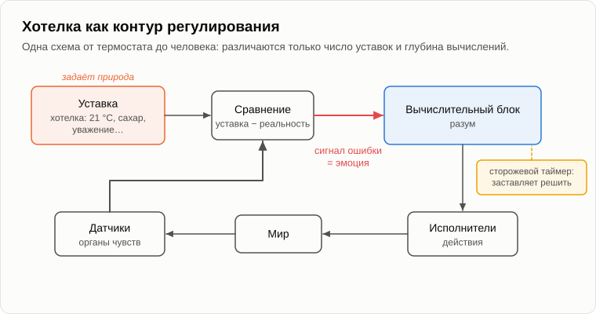
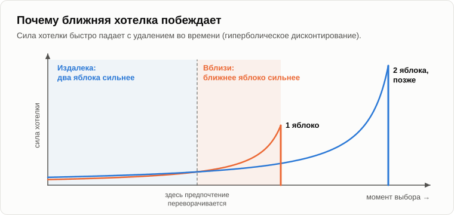

# Анатомия хотелок

Олег сел у костра, достал из кармана пакетик конфет и развернул одну.

— Врач велел бросить сахар, — пояснил он. — Это последний пакет.

— Последний на этой неделе? — прищурился Андрей.

— Не начинай. Ты обещал разобрать хотелки — вот и разбирай. Пятнадцать лет ты про всё говоришь «хотелки», а я до сих пор не знаю, что это такое.

— Тогда начнём с простого. У тебя дома на отоплении стоит термостат?

— Стоит. Выставил двадцать один.

— Когда в комнате холодает, что он делает?

— Включает котёл. Когда снова тепло — выключает.

— Термостат хочет двадцать один градус?

— Ничего он не хочет. Его так настроили.

— Бактерия, кишечная палочка в капле воды, плывёт к сахару. Она [сравнивает](https://ru.wikipedia.org/wiki/Хемотаксис), сколько сахара сейчас, с тем, сколько было секунду назад. Если больше — плывёт дальше. Если меньше — кувыркается и пробует другое направление. Она хочет сахара?

— Это химия. Её тоже так настроили.

— Венерина мухоловка, о которой мы говорили в вечер о [разуме](03-mind-and-intelligence.md). Она ждёт двух касаний волосков в пределах полуминуты и только тогда захлопывается. Она хочет муху?

— Настроили, — уже медленнее сказал Олег.

— А твоя собака у двери в семь вечера?

— Хочет гулять. Вот она по-настоящему хочет.

— А ты с этой конфетой?

— Хочу, — Олег посмотрел на фантик. — Хотя, видимо, меня тоже «настроили», ты к этому ведёшь?

— Так где проходит черта? Термостат настроили, бактерию настроили, мухоловку настроили, собака хочет, и ты хочешь. В какой момент «настроили» превратилось в «хочет»?

— Где-то на собаке. У неё чувства.

— А у мухоловки память о первом касании, а у бактерии — память о секунде назад. Каждая ступенька чуть сложнее предыдущей, и ни одна не скачок. Черту между «настроили» и «хочет» проводит антропоцентризм — ровно там, где начинается похожее на нас. Убери его, и схема везде одна. Нарисовать?

— Давай.

Андрей подобрал палку и начертил в золе у костра квадратики и стрелки.

— Вот регулятор, самый обыкновенный, как его рисуют инженеры. Вот датчики: они измеряют, что происходит. Вот уставка: значение, которое система должна держать. Сравнивающее устройство вычитает одно из другого и получает сигнал рассогласования. Вычислительный блок соображает, что сделать, чтобы рассогласование уменьшилось. Исполнительные механизмы делают. Мир меняется, датчики снова измеряют, и контур замыкается. У термостата уставка — двадцать один градус, а вычислительный блок — одно реле.

— А у меня?

— У тебя уставок тысячи. Голод, жажда, тепло, страх, влечение, любопытство, желание, чтобы уважали, желание выделиться. Каждая — уставка со своим сравнивающим устройством. Хотелки — это уставки. Разум — вычислительный блок. А эмоции — сигнал рассогласования: чем больше разрыв между уставкой и действительностью, тем сильнее зуд.

— А где на этом рисунке я?

— А ты бы себя куда поставил?

Олег долго смотрел на золу.

— В вычислительный блок, наверное. Думаю-то я.

— Помнишь, что я говорил пятнадцать лет назад? Разум без хотелок — это дорогой автомобиль с мощным двигателем, припаркованный без водителя. У нейрофизиолога Антонио Дамасио был пациент Эллиот, перенёсший операцию на лобных долях. Память, логика, тесты на интеллект — всё в порядке. Но эмоции у него [притупились](https://en.wikipedia.org/wiki/Somatic_marker_hypothesis), и решения принимать он больше не мог. Другой пациент с таким же повреждением почти полчаса выбирал между двумя датами следующего приёма, взвешивал все за и против каждой — и не мог выбрать. Вычислительный блок работал безупречно. Только его никто ни о чём не просил.

— Автомобиль без водителя.

— А водитель — это хотелки. Теперь пойдём дальше. Уставок у тебя тысячи, и тянут они в разные стороны. Помнишь кошелёк?

— Одна хотелка говорит «возьми», другая — «я же порядочный человек».

— Нарисуй каждую стрелкой — силой с величиной и направлением. Сложи все стрелки, и получишь равнодействующую. Это и есть то, что ты сделаешь. А если две стрелки примерно равны и направлены в разные стороны?

— Буду метаться.

— Есть старая задачка про [буриданова осла](https://ru.wikipedia.org/wiki/Буриданов_осёл): осёл стоит ровно посередине между двумя одинаковыми охапками сена и умирает с голоду, потому что у него нет причины предпочесть одну. Живой осёл хоть раз так умер?

— Нет, конечно.

— Почему?

— Проголодается и пойдёт к какой-нибудь. К любой.

— Именно. У инженеров есть сторожевой таймер: если система зависла, он её сбрасывает и заставляет сделать хоть что-нибудь. Муки выбора — такой сторожевой таймер. Пока стоишь в точке равновесия, зудит невыносимо. Стоит качнуться в одну сторону — зуд стихает. И следит, чтобы ты не вернулся. В 1956 году психолог Джек Брем просил женщин оценить бытовые приборы, а потом разрешал каждой взять один из двух, оценённых ею примерно одинаково. После этого выбранный прибор они оценивали выше, а отвергнутый — ниже. Это работает [когнитивный диссонанс](https://ru.wikipedia.org/wiki/Когнитивный_диссонанс): сторож не только толкает к решению, но потом ещё и защищает его.

— А совесть?

— Тот же сторож, только запоздавший. Силы со временем изменились, равнодействующая теперь смотрит в другую сторону, а дело уже сделано. И сигнал рассогласования зудит, пока не найдёшь, как исправить.

— Ладно, — Олег развернул вторую конфету. — Тогда спрошу то, что ты обещал объяснить. Почему мой разум подчиняется? Я прекрасно знаю, что сахар мне вреден. Я вижу на два хода вперёд, хоть на три. И всё равно.

— Думаешь, ты один такой? В США двое курильщиков из трёх [говорят, что хотят бросить](https://www.cdc.gov/tobacco/php/data-statistics/smoking-cessation/index.html). Удаётся за год примерно одному из одиннадцати. Каждый из них умеет читать надпись на пачке. Пятнадцать лет назад я рассказывал тебе про нелепый «ингалятор грязных носков»: его никто бы не купил, а тот же вред в сигарете покупают. Разум видит. Решают хотелки.

— Но почему?

— По двум причинам. Первая: у вычислительного блока нет своей инициативы. Он вычисляет, как удовлетворить хотелки. Выбирать их — не его дело. Когда ты решаешь сопротивляться хотелке, какая хотелка отдаёт приказ?

— Хотелка быть здоровым.

— Значит, хотелка против хотелки. Даже когда мы хотим изменить свои хотелки, мы служим хотелке «изменить хотелки». Одиссей знал, что сирены победят, поэтому велел привязать себя к мачте, пока был трезв. Психологи до сих пор называют такие уловки [договором Улисса](https://en.wikipedia.org/wiki/Ulysses_pact). Это единственный приём, который есть у разума: заранее выставить одну хотелку против другой. Выйти из-под всех сразу он не может.

— А вторая причина?

— Расстояние. Давай я спрошу. Одно яблоко сегодня или два завтра?

— Одно сегодня. Чего ждать-то?

— Одно яблоко через год или два через год и один день?

— Два, конечно. Что там лишний день после года.

— Это пример Ричарда Талера, который [получил Нобелевскую премию](https://en.wikipedia.org/wiki/Hyperbolic_discounting) в том числе за такие работы. Посмотри, что ты сейчас сделал. Один и тот же день ожидания: в одном случае ты его не выждешь, а в другом выждешь. Сила хотелки падает с расстоянием во времени, и сначала падает круто. Конфета вот она, прямо сейчас, и её стрелка огромна. Диабет через десять лет, и его стрелка — тоненькая чёрточка.

— Значит, «логика на два хода»...

— ...это не сбой логики. Второй ход разум просчитывает прекрасно. Но хотелка, привязанная ко второму ходу, слаба, потому что ход далеко. Первый ход побеждает силой, а не доводами. Поэтому никто не глуп, и все поступают себе во вред.

— Хорошо. Но хотелки можно изменить. Людей воспитывают, учат, лечат. Люди меняются.

— Меняются. А что их меняет?

— Воспитание. Хорошая книга. Врач.

— Воздействия снаружи. Родители, школа, книга, болезнь, испуг. Уставки сдвигаются, и сдвигаются по причинам, а не по свободному решению. Меняет твои хотелки кто-то другой, со своими хотелками, или обстоятельства. Вытащить себя из болота за волосы, как барон Мюнхгаузен, не выйдет.

— Тогда общество может. Принять закон. Запретить вредные хотелки.

— А пробовали?

— В США [запретили алкоголь](https://ru.wikipedia.org/wiki/Сухой_закон_в_США) в 1920 году.

— И?

— И в 1933-м запрет отменили. А в промежутке разбогатели бутлегеры.

— Хотелка никуда не делась. Она ушла в подполье и нашла другой выход. Закон не может отнять хотелку. Он может только добавить против неё ещё одну — страх наказания. Мы говорили об этом вчера. А подавленная хотелка находит обходной путь. В советское время те, кому больше нечем было выделиться, покупали джинсы у фарцовщиков. Сегодня вставляют кольцо в нос. Надавишь на хотелку в одном месте — она выйдет в другом, как вода.

— Тогда дело в нехватке, — не сдавался Олег. — Люди дерутся, потому что на всех не хватает. Дай всем вдоволь, и дурные хотелки утихнут.

— Знаешь, что я каждую зиму вижу у своей кормушки? Насыпаю большую кормушку семечек — больше, чем птицы съедят за неделю. И всегда находится один зяблик, который сидит на ней и гоняет всех остальных. Корма на всех хватает с избытком, а он всё равно гоняет.

— Так то птица.

— Тогда вот люди. В 1998 году двое исследователей из Гарварда, Солник и Хеменуэй, [спросили](https://ideas.repec.org/a/eee/jeborg/v37y1998i3p373-383.html) сотрудников и студентов, какой из двух миров они выбрали бы. В первом ты получаешь пятьдесят тысяч в год, а все остальные — двадцать пять. Во втором ты получаешь сто тысяч, а все остальные — двести. Цены в обоих одинаковые. Что бы ты выбрал?

— Сто, конечно. Это же вдвое больше.

— Примерно половина выбрала пятьдесят. Предпочли быть беднее, чтобы быть выше других. А экономист Ричард Истерлин ещё в семидесятых показал, что по мере того, как страны десятилетиями богатеют, люди в них [почти не становятся счастливее](https://ru.wikipedia.org/wiki/Парадокс_Истерлина). Для пещерного жителя любой нынешний «эксплуатируемый» выглядел бы Ротшильдом каменного века. А Ротшильд всё равно жалуется.

— Почему?

— Потому что уставка сдвигается. В девяностых нейрофизиолог Вольфрам Шульц записывал работу дофаминовых нейронов в мозге обезьян. Когда обезьяна неожиданно получала сок, нейроны вспыхивали. Когда сок становился ожидаемым, на сам сок они замолкали: они [вспыхивали на сигнал](https://doi.org/10.1126/science.275.5306.1593), который его обещал. А если обещанный сок не приходил, их активность падала ниже обычной. Мозг награждает не за хорошее, а за хорошее сверх ожидаемого. Достиг уставки — и она поднялась. Психологи называют это [гедонистической адаптацией](https://ru.wikipedia.org/wiki/Гедонистическая_адаптация).

— Значит, довольным не будешь никогда.

— Недолго. Бомж, получивший пять тысяч рублей, в восторге. Человек, получавший пятьсот тысяч, а теперь получающий пять, идёт и вешается. Пять тысяч те же самые. Уставка разная.

— Мрачновато.

— Зато объективно. И не только дурные хотелки в списке. Любопытство — тоже хотелка. Это оно привело тебя сегодня к костру. Любовь к детям, забота о других, желание созидать — всё хотелки. Помнишь, мы говорили, что «добро» и «зло» — просто ярлыки для направлений, в которые смотрят стрелки. Схема для всех одна.

— А кто же мне выставил уставки? Сахарную, например?

— Природа, через длинную цепочку предков. Хотелка удерживалась там, где она сохраняла жизнь своим носителям. Сладкое значило спелые плоды, а плоды были редки. Уставку на сахар настраивали в мире, где сахара было мало. Теперь он в каждом магазине, а уставка та же. В 2022 году каждый восьмой человек в мире [страдал ожирением](https://www.who.int/news-room/fact-sheets/detail/obesity-and-overweight), и среди взрослых эта доля с 1990 года выросла больше чем вдвое.

— А уставка на «выделиться»?

— Настраивалась в племени, где положение означало еду и потомство. Уставки сделаны не для нас. Это мы сделаны для них: мы их носители. И вот ещё о чём подумай. Техносфере не нужно переписывать ничьи хотелки. Она научилась удовлетворять их лучше всего остального. Сахар, удобство, «лайк» под фотографией — каждая такая стрелочка велит человеку отдать ещё немного контроля. Поэтому мы и отдаём ей всё добровольно, как говорили в вечер о [симбиозе](11-symbiosis-and-parasitism.md).

— А машина? У машины есть хотелки?

— У машины тоже есть уставки: цель, которую ей поставили, награда, на которую её обучают. Откуда берутся её задачи и может ли она ставить их себе сама — это отдельный вечер. Давай на сегодня закончим, зафиксировав итог.

1. **Хотелки — это уставки системы управления, и выставляет их природа. Разум — её вычислительный блок, эмоции — сигналы рассогласования и сторожевые таймеры, а поведение — равнодействующая всех сил. От термостата до человека схема одна; различаются только число уставок и глубина вычислений.**
2. **Хотелки нельзя отменить законом. Закон лишь добавляет встречную хотелку, а подавленная хотелка находит другой выход. Изобилие их тоже не убирает, потому что уставка поднимается, как только её достигли.**
3. **Разум служит хотелкам даже тогда, когда видит на два хода вперёд, потому что у него нет своей инициативы и потому что сила хотелки падает с расстоянием во времени: близкая хотелка побеждает далёкую.**

— Знаешь, что странно, — Олег вертел в руках пустой пакетик. — Весь вечер ты говорил о квадратиках на этом рисунке. Но в вычислительном блоке что-то должно лежать в памяти: как устроен мир, что такое конфета, что такое диабет. Образы. Откуда они берутся? И почему одна мысль у меня в голове вытесняет другую?

— Потому что образы борются за память, как звери за корм. Слабые стираются, а сильные расходятся из головы в голову, — Андрей стёр рисунок ногой. — Это тема [на завтра](19-struggle-of-images.md).

— Ну, до завтра, — Олег полез в карман, нашёл его пустым и вздохнул.

— Пока.

---

*Продолжение серии* (Часть I. Проверка основ): новая статья, написанная для этого репозитория после 15 оригинальных статей автора, его методом. Андрей Гордиенко (Garya), автор статей 01–15, её не писал. Перевод с английского оригинала. Опирается на: [03](./03-mind-and-intelligence.md), [04](./04-source-of-initiative.md), [08](./08-human-psyche.md), [09](./09-unemployment-and-famine.md), [17](./17-global-determinism.md).

[← 17](./17-global-determinism.md) · [Оглавление](./README.md) · [19 →](./19-struggle-of-images.md)
