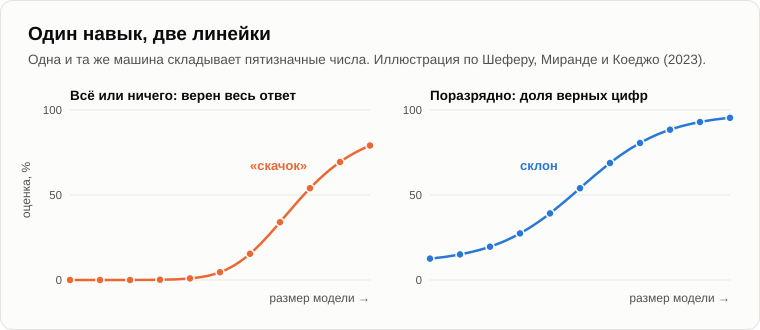
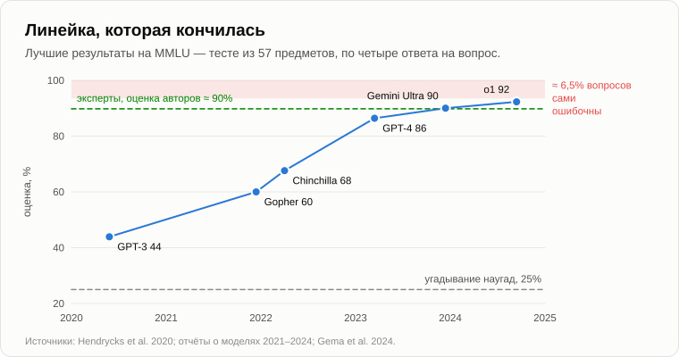
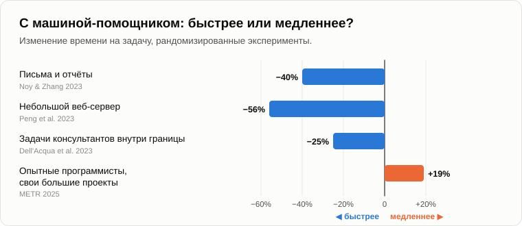

# Говорящие машины

Когда Олег подошёл, Андрей уже сидел у костра. Рядом с ним на бревне лежал старый складной плотницкий метр, жёлтый, с наполовину стёршимися цифрами.

— Ты обещал линейки, — кивнул на него Олег. — Не думал, что в буквальном смысле.

— Отцовский. Им на даче мерили всё, от досок до моего роста на дверном косяке. Садись. Что будем мерить?

— Говорящие машины. Четыре года все вокруг твердят одно и то же. До 2022 года машины говорить не умели, после 2022-го умеют. Скачок. Новая эра. А ты пятнадцать лет назад говорил мне, что эволюция идёт маленькими шагами. Так как же?

— Давай посмотрим. До 2022 года телефон дописывал за тебя слова, когда ты набирал сообщение?

— Дописывал. И превращал «встречу» во «встряску».

— А машинные переводчики были?

— Гугл-переводчик. Корявый, но испанские рецепты я с ним читал.

— В 2016 году Google перевёл свой переводчик на нейросеть, и ошибок на его тестах [стало примерно на шестьдесят процентов меньше](https://arxiv.org/abs/1609.08144) — разом. За пять лет до этого телефоны начали отвечать на вопросы человеческим голосом. А в 1966 году Джозеф Вейценбаум написал [«Элизу»](https://ru.wikipedia.org/wiki/Элиза_(программа)) — программу, которая изображала психотерапевта, переворачивая твои же слова в вопросы. Его секретарша, прекрасно знавшая, как программа устроена, попросила его выйти из комнаты, чтобы поговорить с ней наедине. Так когда машина начала говорить?

— Где-то по дороге, — пожал плечами Олег. — Но в 2022-м что-то ведь случилось. Все это почувствовали.

— Случилось. Теперь давай посмотрим, что именно. В том же году большая группа исследователей [написала статью](https://arxiv.org/abs/2206.07682) об «эмерджентных способностях» языковых моделей. Маленькие модели задачу совсем не решают, не решают, не решают, а потом, начиная с какого-то размера, вдруг решают. Арифметику, например. Скачок на графике, как ступенька.

— Ну вот. Скачок.

— Через год трое исследователей из Стэнфорда, Шефер, Миранда и Коеджо, [посмотрели на линейки](https://arxiv.org/abs/2304.15004), которыми эти скачки мерили. Допустим, машина складывает пятизначные числа. Как бы ты оценивал её ответ?

— Верно или неверно.

— А если четыре цифры из пяти верны?

— Всё равно неверно. Ответ есть ответ.

— Так его и оценивали: всё или ничего. А теперь пусть машина с каждым шагом в размере угадывает каждую цифру чуть чаще. Шестьдесят процентов цифр, семьдесят, восемьдесят, девяносто. Что при этом происходит с твоим «верно или неверно»?

Олег немного подумал.

— Чтобы все пять были верны сразу... При девяноста процентах на цифру это примерно шестьдесят процентов целых ответов. При шестидесяти — почти ничего.

— Почти ничего, почти ничего, а потом вдруг много. Ступенька. Оцени те же ответы поразрядно, и ступенька превращается в плавный склон. Скачок был в линейке, а не в машине.

— Линейка «сдал — не сдал».

— Двоичная линейка. Мы каждый вечер встречаем здесь двоичные вопросы. Живое или нет, разумное или нет, есть сознание или нет. А тут то же самое в лаборатории: линейка с двумя делениями показывает только скачки.

— Ладно, но люди почувствовали скачок не из-за линеек. Они почувствовали его, разговаривая с этой штукой.

— Это правда, и это интереснее. В 1950 году Алан Тьюринг предложил [тест](https://ru.wikipedia.org/wiki/Тест_Тьюринга): если ты переписываешься с машиной и не можешь отличить её от человека, считай, что она мыслит. Скажи, как бы моя венерина мухоловка сдала тест Тьюринга?

— На ноль. Она не разговаривает.

— А собака?

— На ноль.

— А шахматная программа, обыгравшая Каспарова?

— Тоже на ноль.

— Значит, тест, который люди считают тестом на разум, меряет одно: насколько машина говорит, как мы. Помнишь вчерашнюю фразу, «похож на меня»? Десятилетиями машины выявляли причинно-следственные связи и действовали на опережение в шахматах, в переводе, в прокладке маршрутов, и никакого скачка никто не чувствовал. Потом машина вошла в ареал слов, тот самый, где люди привыкли мерить разум, и все почувствовали его разом. Скачок случился в нас, а не в машине.

— Значит, ничего нового вообще не произошло?

— Я этого не говорил. Пятнадцать лет назад я говорил, что эволюция делает маленькие и на первый взгляд несущественные усовершенствования, которые накапливаются и в итоге дают переход на новый виток. Новый виток настоящий. Слова — это место, где человечество пять тысяч лет хранит свои знания. Машина получила доступ ко всем им сразу. Но к этому витку она шла шаг за шагом, десятилетиями.

— Тогда вот моё настоящее возражение, — Олег подался вперёд. — Вернее, не моё. В 2021 году группа исследователей во главе с лингвистом Эмили Бендер назвала такие модели «[стохастическими попугаями](https://ru.wikipedia.org/wiki/Стохастический_попугай)». Языковая модель угадывает следующее слово по статистике. Она прочитала весь интернет и повторяет прочитанное вперемешку. Попугай тоже говорит «привет» к месту и ничего при этом не понимает.

— Сильное возражение, и его держатся многие серьёзные люди. Давай спрошу. Что мы назвали разумом в наш вечер о [разуме и интеллекте](03-mind-and-intelligence.md)?

— Выявлять причинно-следственные связи и использовать их... чтобы действовать на опережение.

— А что такое действовать на опережение?

— Делать что-то до того, как оно случится. Предсказывать.

— Мухоловка ждёт второго касания, потому что предсказывает: капля дождя дважды не коснётся, а муха коснётся. Ты подставляешь руку раньше, чем чашка упадёт. Разум, от низа лестницы до верха, — это предсказание. А про машину ты говоришь «всего лишь предсказывает», будто это мелочь.

— Она предсказывает слова. Не чашки.

— Тогда возьми детектив. Последняя страница: «И убийца — это...» Что нужно, чтобы угадать следующее слово?

— Понять сюжет, — медленно сказал Олег.

— Теперь эксперимент. В 2022 году группа исследователей взяла небольшую модель того же рода и дала ей только записи партий в [реверси](https://ru.wikipedia.org/wiki/Реверси): списки ходов вроде «C4, D3, E6». Ни доски, ни правил. Она научилась предсказывать следующий допустимый ход. Потом исследователи заглянули внутрь и [нашли доску](https://arxiv.org/abs/2210.13382): сеть сама построила себе картину, какая клетка чёрная, а какая белая. А когда они изменили эту картину изнутри, перевернув одну фишку у модели «в голове», машина стала предлагать ходы для изменённой доски.

— Доску ей никто не показывал.

— Никто. Доска была нужна, чтобы предсказывать ходы, вот она её и построила. Попугаю нужна доска, чтобы сказать «привет»?

— Но это же игра.

— А игры, мы говорили, — тренировка для жизни. Модель, которую учат предсказывать тексты, написанные людьми, вынуждена строить в себе что-то от мира, о котором люди пишут: физику в учебниках физики, сюжет в детективе, больного в истории болезни. Насколько хороши эти картины — отдельный вопрос, часто они грубые. Но попугай их не строит вовсе.

— И она правда говорит по одному слову?

— По кусочку слова за раз. А ты? Пятнадцать лет назад я говорил тебе, что мышление в узком смысле — это внутренняя речь, которая идёт через точку внимания, одна мысль за другой, а основная масса мозга работает под ней, параллельно. Ты знаешь конец своей фразы, когда её начинаешь?

— Не всегда, — засмеялся Олег. — Жена говорит, что никогда.

— Тогда достаём линейки, — Андрей с треском разложил метр. — Первая — ареал-логичность. Мерим её так же, как мерили шахматистов: соревнованием. В сентябре 2025 года прошёл финал чемпионата мира по программированию среди студентов, [ICPC](https://ru.wikipedia.org/wiki/Международная_студенческая_олимпиада_по_программированию). 139 команд лучших молодых программистов со всего мира, по три человека в команде, двенадцать задач, пять часов. Машины решали те же задачи вне зачёта. Одна система решила все двенадцать. Ни одна команда людей этого не сделала.

— А та же машина не может сосчитать буквы в слове. Помню.

— В том-то и дело. Теперь представь ареал-логичность человека в виде линии: везде примерно одной высоты, чуть выше там, где он учился. А у машины?

— Пила, — Олег начертил в воздухе зигзаг.

— Исследователи из Гарварда пришли к той же картине. В 2023 году они [дали](https://papers.ssrn.com/sol3/papers.cfm?abstract_id=4573321) 758 консультантам крупной консалтинговой фирмы настоящие рабочие задачи, одним в помощь языковую модель, другим без неё. На задачах, где машина была сильна, работавшие с машиной сделали на 12% больше задач, на четверть быстрее, а качество оценили на 40% выше. На задаче, которая выглядела не легче, но лежала за пределами её возможностей, работавшие с машиной на 19 процентных пунктов *реже* приходили к верному ответу, чем работавшие без неё. Они доверяли машине там, где она слаба. Исследователи назвали это «зубчатой границей».

— Значит, надо знать, где у неё зубья.

— Пока что. Зубья всё время сдвигаются. Вторая линейка — совокупная логичность, объединение всех ареалов. У Deep Blue ареал был один. А сколько их у машины в твоём телефоне?

— Право, медицина, кулинария, код, стихи... Не знаю. Все, более или менее.

— В 2020 году группа исследователей составила [тест](https://arxiv.org/abs/2009.03300) из пятидесяти семи предметов, от школьной математики до права, медицины и этики: почти шестнадцать тысяч вопросов по четыре варианта ответа. Наугад выходит двадцать пять процентов. Эксперты в своих предметах, по оценке авторов, набирают около девяноста. Лучшая модель 2020 года набрала сорок четыре.

— А сейчас?

— К концу 2023 года машины перешли за девяносто. В 2024-м — больше девяноста двух. А потом [оказалось](https://arxiv.org/abs/2406.04127), что около шести с половиной процентов вопросов в самом тесте ошибочны: путаный вопрос, два верных ответа или неверный ответ в ключе. В вирусологии — больше половины проверенных вопросов.

— То есть машину проверяли по ключу с ошибками.

— Линейка кончилась раньше машины. Она оказалась короче того, что мерила, а её погрешность — больше разницы, которую она должна была измерить.

— Так сделайте тест потруднее.

— Делают. Каждый год новый, труднее прежнего, и каждый год машины по нему карабкаются вверх. Но вспомни, что я говорил пятнадцать лет назад, когда мы говорили о муравье, который не способен воспринять разумность человека. Сравнивать логичность двух систем может только такая измерительная система, чья собственная логичность не ниже их логичности. Кто сейчас проверяет ответы машин на самые трудные вопросы?

— Эксперты.

— Всё чаще — другие машины. Вопросы пишут люди, и им всё труднее придумывать такие, на которые машины не ответят. Линейка уходит из человеческих рук.

— Мрачновато.

— Зато объективно. А третья линейка — моя любимая, метод замещения. Убираем машину, ставим на её место помощника-человека и смотрим, сколько работы мозга ему нужно, чтобы помочь так же. В июле 2025 года одному только чат-боту люди отправляли восемнадцать миллиардов сообщений в неделю. Семьсот миллионов человек, [примерно каждый десятый взрослый](https://www.nber.org/papers/w34255) на планете. Посчитаем на коленке. Пусть каждый ответ экономит помощнику-человеку пять минут работы.

— Пять минут — это много. Половина из них спрашивает рецепт блинов.

— Это же исследование говорит, что больше семидесяти процентов сообщений к работе отношения не имеют. Хорошо, возьмём одну минуту. Восемнадцать миллиардов минут в неделю. Сколько это часов?

— Триста миллионов, — посчитал в уме Олег.

— По сорок часов в неделю — сколько помощников на полной ставке?

— Семь с половиной миллионов.

— При одной минуте на ответ. При пяти — почти сорок миллионов. Целая страна помощников с энциклопедией в голове, которые работают день и ночь и не берут зарплаты. Оценка грубая, но заметь: оба её конца меряются миллионами.

— Ты считаешь сообщения. Не работу. Люди с этой помощью что-нибудь сделали?

— Есть и измерения. В 2023 году экономисты [дали](https://doi.org/10.1126/science.adh2586) 453 специалистам обычные письменные задачи: письма, отчёты, пресс-релизы. С моделью они тратили на 40% меньше времени, а качество оценили на 18% выше. В другом эксперименте программисты с помощником для кода [написали](https://arxiv.org/abs/2302.06590) небольшой веб-сервер на 56% быстрее. В службе поддержки большой компании 5179 операторов с машинным суфлёром [решали](https://www.nber.org/papers/w31161) на 14% больше обращений в час, новички — на треть больше, а самые опытные почти не больше прежнего.

— А теперь я тебе кое-что подкину, — Олег достал телефон. — Я подготовился. В 2025 году организация [METR](https://arxiv.org/abs/2507.09089), та самая, что меряет, какой длины задачу машина доводит до конца, провела настоящий эксперимент. Шестнадцать опытных программистов, каждый в своём большом проекте, над которым работал годами, 246 настоящих задач. Одни задачи с машиной, другие без, по жребию. Перед началом программисты ждали, что машина ускорит их на четверть. После они считали, что она ускорила их на пятую часть. А по часам они стали на 19% *медленнее*.

— Спасибо, — серьёзно сказал Андрей. — Хороший эксперимент и честный результат, отмахиваться я не буду. Что он нам говорит?

— Что твоё замещение — иллюзия. Людям только кажется, что они быстрее.

— Насчёт «кажется» ты прав, и это стоит запомнить: хотелка верить в приятное тоже лежит на весах. Но посмотри, кому помогло, а кому нет. Новичкам в поддержке — на треть. Опытным — почти никак. Больше всех выиграли пишущие среднего уровня. А мастера в собственных проектах, которые они знают лучше всех, теряли время на проверку машины. Что это тебе напоминает?

— Твоих девятерых конструкторов с САПР, — помолчав, сказал Олег. — Она замещает функции, а не людей. Сначала простые, массовые.

— Перегруппировка функций. Машина первой берёт работу новичка, а мастеру пока оставляет самое трудное. А откуда берётся мастер?

— Из новичка.

— А если новичков больше не нанимают, потому что их работу делает машина... Мы говорили о молодых программистах, которых перестали брать. И ещё: это были инструменты начала 2025 года. Длина задач, с которыми машины справляются, удваивается примерно каждые семь месяцев. В любом ареале, где линейку приложили дважды с разницей в год, зубец машины сдвинулся.

— Значит, всё-таки скачок, — Олег скрестил руки на груди. — Только медленный.

— Это виток. Маленькие шаги, которые складываются, и в какой-то момент система работает уже на другой основе. Вода в чайнике греется градус за градусом, каждый градус стоит одного и того же тепла, а на сотом она закипает. Для воды это новое состояние. Для плиты — та же плита.

— А плита — это природа.

— Ты схватываешь, — улыбнулся Андрей. — Давай на сегодня закончим, зафиксировав результат.

1. **Говорящая машина — не внезапный скачок, а маленькие шаги, сложившиеся в новый виток: машина вошла в ареал слов, где человечество хранит свои знания и где оно привыкло мерить разум. «Скачок» был отчасти в линейках (тестах «сдал — не сдал»), отчасти в нас: мы заметили разум, когда он заговорил на нашем языке.**
2. **«Она всего лишь предсказывает следующее слово» — не возражение. Действовать на опережение и есть разум, от мухоловки до человека, а чтобы хорошо предсказывать, системе приходится строить модель мира, который порождает слова.**
3. **По ареал-логичности машина — пила, а не линия: в одних ареалах выше лучших из нас, в других ниже ребёнка, и зубья всё время сдвигаются. Её совокупная логичность охватывает больше ареалов, чем у любого отдельного человека, и человеческие линейки кончаются. По методу замещения она уже выполняет работу мозга миллионов помощников и первой замещает функции новичка.**

— Одно меня всё-таки не отпускает, — Олег встал и потянулся. — Какая бы она ни была умная, она отвечает. Я спрашиваю, она отвечает. Ни разу она сама меня ни о чём не спросила. Ты, когда мы спорили о Пенроузе, говорил, что суть разума не в решении задач, а в их постановке. Так кто ставит ей задачи?

— А тебе кто? — Андрей сложил метр. — Это [завтра](22-who-sets-the-tasks.md).

— Ну, до завтра.

— Пока.

---

*Продолжение серии* (Часть II. Машины сегодня): новая статья, написанная для этого репозитория после 15 оригинальных статей автора, его методом. Перевод с английского оригинала. Опирается на: [03](./03-mind-and-intelligence.md), [05](./05-artificial-intelligence.md), [16](./16-fifteen-years-later.md), [20](./20-what-consciousness-is.md).

[← 20](./20-what-consciousness-is.md) · [Оглавление](./README.md) · [22 →](./22-who-sets-the-tasks.md)
