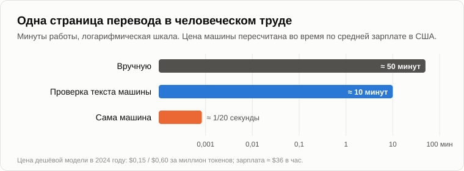
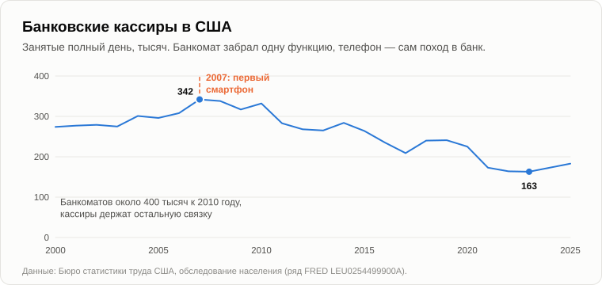
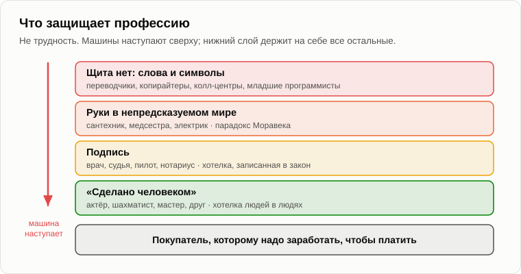

# Последняя профессия

Олег пришёл с круглым караваем под мышкой, ещё тёплым, и с ножом в кармане.

— Ты обещал мерить буханкой, — сказал он. — Вот тебе буханка. Из пекарни у станции. Хоть измерительный прибор потом съедим.

— Тогда сначала измерим, — Андрей достал телефон и открыл калькулятор. — Пятнадцать лет назад батон в магазине стоил двенадцать рублей, а средняя зарплата была двадцать одна тысяча в месяц. Сколько это минут работы?

— Ты насчитал восемь.

— Восемь с поправкой на дотации. Без неё — около пяти с половиной. Сейчас килограмм пшеничного хлеба стоит около 117 рублей, а средняя зарплата в 2025 году была чуть больше [ста тысяч](https://www.kommersant.ru/doc/8480418) в месяц. Наши буханки с шести соток выходили примерно по четыреста граммов. Четыреста граммов — это сорок семь рублей. Час работы — около шестисот.

— Чуть больше четырёх с половиной минут.

— А вручную, с наших шести соток, с лопатой и серпом, было двадцать две. Хлеб — технология старая. Техносфера давно её захватила и теперь только шлифует. Сегодня посчитаем там, где она движется быстрее всего. Пятнадцать лет назад ты говорил мне, что учёных, инженеров и писателей заменить невозможно. Интеллектуальный труд, творческий.

— А ты сказал: пока. — Олег отрезал от каравая и протянул Андрею горбушку. — Ладно. Я видел, как машины пишут. Пойдём по профессиям.

— Начнём с той, что легко посчитать. Переводчик. Сколько профессионал переводит одну страницу?

— Страница — это около двухсот пятидесяти слов. Хороший переводчик делает две-три тысячи слов в день. Значит, примерно пятьдесят минут на страницу.

— А машина?

— Секунды.

— Теперь в деньгах, раз уж мы считаем в минутах работы. В 2024 году одна из дешёвых языковых моделей стоила пятнадцать центов за миллион кусочков слов, которые ты ей посылаешь, и шестьдесят центов за миллион, которые она пишет в ответ. Страница — это несколько сотен кусочков в каждую сторону. Сколько выходит?

Олег начал считать на пальцах, сбился и взял телефон.

— Около одной двадцатой цента.

— А при средней американской зарплате около тридцати шести долларов в час — сколько это секунд работы, одна двадцатая цента?

— Одна двадцатая секунды.

— Пятьдесят минут против одной двадцатой секунды. Это в шестьдесят тысяч раз.

— Но перевод же кто-то должен проверить. Машины пока ошибаются.

— Верно. И от профессии переводчика остаётся проверка. Скажем, десять минут вместо пятидесяти. Помнишь девятерых конструкторов с САПР? Машина не заменяет переводчика. Она заменяет четыре пятых его работы, и четыре переводчика из пяти становятся не нужны.

— И это происходит, или это только арифметика?

— Происходит, медленно. В 2023 году трое экономистов [посмотрели](https://pubsonline.informs.org/doi/abs/10.1287/orsc.2023.18441) на одну из крупнейших бирж фрилансеров. После появления чат-бота пишущие и переводчики стали получать на 2% меньше заказов в месяц и зарабатывать на 5% меньше. После появления машин, рисующих картинки, у иллюстраторов стало почти на 4% меньше заказов, а заработок упал на 9%. И самые опытные потеряли больше новичков.

— Опытные? Три вечера назад ты говорил, что машина первой забирает работу новичка.

— Забирает. Она подтягивает всех до приличного среднего уровня. Для новичка это помощь. Для мастера потеря: ему платили за разрыв между ним и новичком, а разрыв сократился.

— А теперь я приведу довод, который тебе приведёт любой экономист, — Олег вытер нож. — Это называется ошибкой луддитов. Каждый раз, когда приходили машины, люди кричали, что работы не останется, и каждый раз работы становилось больше прежнего. Лучший пример — банкомат. Банкоматы появились в семидесятых. Все были уверены, что банковским кассирам конец. А в Америке в 2010 году кассиров было больше, чем в 1980-м.

— Это правда, и пример хороший. Экономист Джеймс Бессен [разобрался](https://www.imf.org/external/pubs/ft/fandd/2015/03/bessen.htm), почему. Городскому отделению раньше нужно было двадцать кассиров, а с банкоматами — тринадцать. Отделение подешевело, и банки открыли их больше, в городах почти в полтора раза. А кассиры перестали считать наличные и начали продавать кредиты и разговаривать с клиентами. Теперь скажи, что случилось с кассирами после 2010 года.

— Не знаю.

— В Америке число кассиров, работающих полный день, [достигло пика](https://fred.stlouisfed.org/series/LEU0254499900A) в 2007 году, около 340 тысяч. К 2023-му их стало вдвое меньше. А министерство труда [ждёт](https://www.bls.gov/ooh/office-and-administrative-support/tellers.htm), что всех кассиров за следующие десять лет станет ещё на 13% меньше. Что случилось в 2007 году?

— Первый смартфон, — помолчав, сказал Олег.

— Банкомат забрал у кассира одну функцию — счёт денег. Остальную связку кассир сохранил и даже вырос. А потом телефон в кармане забрал весь поход в банк. Перебираться стало некуда.

— Значит, экономисты неправы?

— Они правы насчёт шага и неправы насчёт тренда. Профессия — это связка функций. Пока машина забирает одну функцию, профессия перестраивается и может даже расти, как было с кассирами. Когда машина забрала всю связку, перестраиваться не во что. Компенсация идёт ступеньками. Вытеснение — это тренд. В 2011 году я говорил, что компенсация частичная, и недооценил, как долго она длится. Но вечной я её по-прежнему не считаю.

— Тогда вот тебе контрпример из твоего же лагеря, — усмехнулся Олег. — В 2016 году Джеффри Хинтон, тот самый, что потом получил Нобелевскую премию за нейросети, сказал, что пора перестать готовить рентгенологов: через пять-десять лет машины будут читать снимки лучше. Прошло десять лет. В 2025 году американские больницы предложили [рекордное число](https://www.cnn.com/2026/02/09/tech/ai-replacing-jobs-concerns-radiology) мест для обучения рентгенологии, а рентгенологи зарабатывают в полтора раза больше, чем в 2015-м.

— Хорошо. Сам Хинтон потом сказал, что выразился слишком широко. Давай посмотрим почему. Что делает рентгенолог, кроме того что смотрит снимки?

— Говорит с врачами. Делает процедуры. Подписывает заключение.

— Подписывает. Если машина пропустит опухоль, кого ты потащишь в суд?

— Врача.

— Вот щит рентгенолога. Не в том, что читать снимок трудно: во многих задачах машины читают их хорошо. Щит — подпись. Закон требует человека, который за неё отвечает. И есть второй щит: снимки стали дешевле и быстрее читаться, их стали делать больше, и работы прибавилось. Но что такое закон?

— Правило.

— Записанная хотелка. Хотелка безопасности, страх риска, хотелка иметь виноватого. Хотелки сдвигаются, когда сдвигается арифметика. Пятнадцать лет назад закон не разрешал машине без водителя ездить по улицам города. Сегодня в Сан-Франциско вызываешь такси, а за рулём никого. Закон изменили, когда машина стала достаточно безопасной и достаточно дешёвой.

— Значит, порядок профессий задаёт не то, насколько они трудны.

— Это мы выяснили в первый же вечер: трудное для человека оказалось лёгким для машины. Порядок задают щиты. Давай их пересчитаем. Первый щит — никакого: работа со словами и символами. Переводчики, копирайтеры, колл-центры, младшие программисты. Они уходят первыми и уже уходят. Хотя и тут кривая не гладкая. В 2024 году одна крупная платёжная компания [объявила](https://www.klarna.com/international/press/klarna-ai-assistant-handles-two-thirds-of-customer-service-chats-in-its-first-month/), что её машина выполняет работу семисот операторов поддержки. Через год её директор признал, что упало качество, и людей снова начали нанимать.

— Обратно?

— Отчасти. Машина осталась и делает больше прежнего. Люди вернулись в ту часть связки, которую она делала плохо. Это ступенька. Второй щит — руки, работа в непредсказуемом мире: сантехник у тебя под раковиной, медсестра, электрик, который тянет кабель к центрам обработки данных. Их защищает парадокс Моравека. Но роботов вчетверо больше, чем в 2011 году, и руки тоже учат. Третий щит — подпись: врач, судья, пилот, нотариус. Хотелка, записанная в закон. А четвёртый...

— Четвёртый?

— Кто играет в шахматы лучше: человек или машина?

— Машина, с 1997 года.

— А люди перестали смотреть, как играют люди?

— Нет. Смотрят даже больше.

— Международный [рейтинг](https://www.fide.com/rating-analytics-the-number-of-rated-chess-players-goes-up/) сейчас есть у полутора с лишним миллионов шахматистов. Люди платят, чтобы смотреть на человека, а не на лучшего игрока. Живой концерт, кружка ручной работы, актёр на сцене. Четвёртый щит — «сделано человеком». Он защищает не умение, а самого человека, и держится он на одном: люди хотят людей. Помнишь хотелку выделиться? Кружка ручной работы — знак статуса.

— Тогда последняя профессия — быть человеком для других людей, — медленно сказал Олег. — Актёр. Священник. Няня. Друг.

— Друг. В 2025 году американских подростков [спросили](https://www.commonsensemedia.org/press-releases/nearly-3-in-4-teens-have-used-ai-companions-new-national-survey-finds) о машинах-компаньонах — чат-ботах, которые играют роль друга. Трое из четырёх их пробовали, половина пользуется регулярно, и почти треть сказала, что разговор с машиной удовлетворяет их не меньше, чем разговор с настоящими друзьями, или даже больше.

— Треть, — Олег отложил хлеб. — Это уже не щит. Это трещина в щите.

— Щит сделан из хотелок, а машина удовлетворяет хотелки всё лучше. Но главное не в этом. Допустим, люди и дальше будут хотеть людей. Кто заплатит музыканту на живом концерте?

— Зрители.

— А откуда у зрителей деньги?

— От работы. — Олег осёкся. — Переводчики, кассиры, программисты, водители...

— Вот. Помнишь, что мы говорили пятнадцать лет назад о [рынке](07-global-economic-crisis.md)? Он ограничен. Покупатель музыканта — переводчик. Когда у переводчика нет заработка, у музыканта нет зрителей, как бы люди ни любили живую музыку. Последняя профессия падает не тогда, когда машина ей научится. Она падает, когда её покупатели теряют заработок.

— Мрачновато.

— Зато объективно. Давай на сегодня закончим, зафиксировав результат.

1. **Профессия — это связка функций, и машина забирает функции, а не профессии. Пока она забирает одну функцию, профессия перестраивается и может даже расти (кассиры после банкомата, рентгенологи). Когда забрана вся связка, перестраиваться не во что. Компенсация идёт ступеньками, вытеснение — тренд.**
2. **Порядок, в котором уходят профессии, задаёт не трудность, а щиты: у слов щита нет, руки держатся дольше, подпись ещё дольше (закон — это записанная хотелка), а дольше всех «сделано человеком», которое защищает только хотелка людей в людях.**
3. **Последняя профессия — человек, который нужен другим людям потому, что он человек. Она падает не тогда, когда машина ей научится, а когда её покупатели теряют заработок: снова ограниченный рынок 2011 года.**

— Тогда ответ очевиден, — Олег встал и сунул остаток каравая Андрею в сумку. — Пусть машины работают, а людям раздают деньги. Базовый доход для всех. Тогда они и музыканту заплатят.

— Халява для всех? — прищурился Андрей. — Кто её оплатит и как долго техносфера сможет себе это позволить? [Завтра](25-freebies-for-everyone.md).

— Ну, до завтра.

— Пока.

---

*Продолжение серии* (Часть III. Экономика и люди): новая статья, написанная для этого репозитория после 15 оригинальных статей автора, его методом. Перевод с английского оригинала. Опирается на: [05](./05-artificial-intelligence.md), [07](./07-global-economic-crisis.md), [09](./09-unemployment-and-famine.md), [12](./12-value-shares.md), [16](./16-fifteen-years-later.md), [21](./21-machines-that-talk.md).

[← 23](./23-machine-for-making-people-good.md) · [Оглавление](./README.md) · [25 →](./25-freebies-for-everyone.md)
