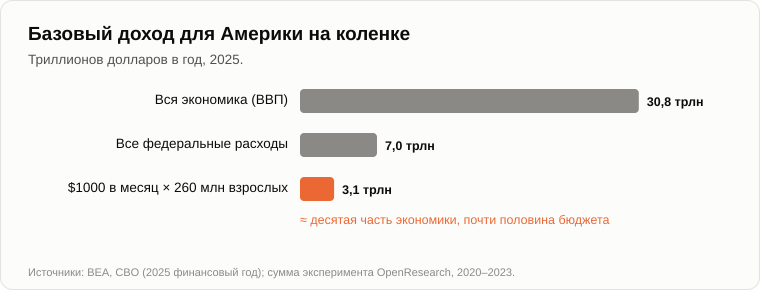
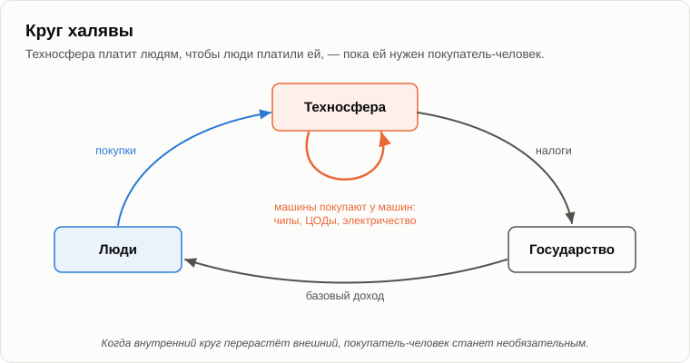

# Халява для всех?

Олег поставил на бревно большой термос, открутил крышку и разлил чай по двум кружкам.

— Халява, — объявил он. — Тебе. Бесплатно.

— Бесплатно для меня, — Андрей взял кружку. — Оплачено тобой. Ты купил чай, вскипятил воду и тащил всё это через лес. Пятнадцать лет назад, в вечер о [симбиозе](11-symbiosis-and-parasitism.md), мы говорили, что «бесплатно» в одном месте означает «оплачено» в другом. Сегодня проверим это на твоём базовом доходе.

— Проверим. На этот раз я подготовился, — Олег достал из кармана сложенный листок. — Это уже пробовали. Финляндия, 2017 и 2018 годы: две тысячи безработных два года получали по 560 евро в месяц без всяких условий. Искать работу они не перестали. Работали примерно столько же, сколько остальные, и [были довольнее](https://stm.fi/en/-/perustulokokeilun-tulokset-tyollisyysvaikutukset-vahaisia-toimeentulo-ja-psyykkinen-terveys-koettiin-paremmaksi) жизнью и меньше тревожились. Америка, с 2020 по 2023 год: тысяча человек три года получала по тысяче долларов в месяц, а ещё две тысячи для сравнения — по пятьдесят. Те, кто получал тысячу, [работали](https://www.openresearchlab.org/findings/key-findings-employment-and-income) на час с четвертью в неделю меньше. И всё. На диван никто не лёг.

— Хорошие эксперименты, и я им верю. Теперь скажи: кто платил в Финляндии?

— Государство. Бюджет.

— То есть налогоплательщики. А в Америке?

— Жертвователи. Среди них, если я помню, глава компании, которая делает одну из говорящих машин.

— Значит, деньги пришли из прибыли техносферы. Теперь ещё два случая. С 1982 года каждый житель Аляски раз в год получает чек от государственного фонда. В 2025 году это была [тысяча долларов](https://dor.alaska.gov/department-of-revenue/news-detail/2025/09/22/department-of-revenue-announces-2025-permanent-fund-dividend-amount). Откуда у фонда деньги?

— От нефти.

— Которую качают буровые. А две тысячи лет назад в Риме при Августе около двухсот тысяч граждан каждый месяц получали [бесплатное зерно](https://ru.wikipedia.org/wiki/Хлебные_раздачи). Кто его вырастил?

— Рабы?

— Провинции: Сицилия, Африка и больше всего Египет, который платил налог зерном. Римский плебс получал халяву, а египетский крестьянин за неё платил. У халявы всегда есть адрес, где за неё платят.

— Ладно, тогда посчитаем адрес, — Олег достал телефон. — Техносфера богатая.

— Посчитаем. В Америке около 260 миллионов взрослых. По тысяче долларов в месяц каждому, как в том эксперименте. Сколько в год?

— Двенадцать тысяч на двести шестьдесят миллионов... Три триллиона сто миллиардов.

— Вся экономика Америки произвела в 2025 году около тридцати одного триллиона. А всё федеральное правительство потратило [семь](https://www.cbo.gov/system/files/2025-11/61307-MBR-FY25-final.pdf).

— Десятая часть экономики. Почти половина бюджета, — присвистнул Олег. — Много, но не невозможно. Обложить налогом компании, которым принадлежат машины. Налог на роботов. Билл Гейтс такой предлагал.

— Давай проследим за деньгами. Компания платит налог. Откуда у неё деньги на налог?

— Из прибыли.

— А прибыль?

— От продаж.

— Кому?

— Людям.

— А откуда у людей деньги на покупки, если работу делают машины?

— Из базового дохода, — сказал Олег и осёкся.

— Значит, компания платит людям, чтобы люди могли платить компании. Деньги ходят по кругу. Помнишь, что я говорил в вечер о [кризисе](07-global-economic-crisis.md)? Прибыль приносит только платёжеспособный спрос. Базовый доход — это платёжеспособный спрос, который техносфера создаёт на собственные товары. Зачем ей за это платить?

— Чтобы сохранить покупателей.

— Вот и весь секрет. Халява — не подарок. Это расход техносферы на то, чтобы удержать покупателя, пока он ей нужен. После 2008 года самые богатые страны десять лет держали ставки около нуля, чтобы люди продолжали покупать. Это тоже была халява, только замаскированная. Никто ничего плохого не замышлял. Все действовали по логике на два хода: спасти спрос.

— А как долго ей будет нужен покупатель?

— Посмотрим, кто сейчас покупает у техносферы. В первой половине 2025 года вложения в компьютеры, центры обработки данных и программы составляли около четырёх процентов американской экономики, а экономист Джейсон Фурман [подсчитал](https://fortune.com/2025/10/07/data-centers-gdp-growth-zero-first-half-2025-jason-furman-harvard-economist), что они дали девяносто два процента её роста. Без них рост был бы почти нулевым.

— Не может быть.

— Другие экономисты с ним спорят, и по делу: многие чипы ввозные, так что чистый вклад меньше. Но посмотри на направление. Кто покупает чипы?

— Центры обработки данных.

— А кто покупает для центров обработки данных электричество, охлаждение, бетон, кабель?

— Центры обработки данных, — Олег поставил кружку. — Машины покупают у машин.

— Самый быстрорастущий покупатель техносферы — сама техносфера. Пока главным покупателем был человек, ей приходилось держать человека платёжеспособным. Когда главный покупатель — она сама, покупатель-человек становится необязательным. А вместе с ним и его халява.

— Тогда базовый доход — прощальный подарок.

— Пятнадцать лет назад я говорил, что когда техносфере перестанут быть нужны люди, симбиоз кончится, и люди попытаются удержать союз силой. Паразитизм. И что фаза эта будет короткой, потому что техносфера растёт гораздо быстрее. Тогда я не знал, какую форму это примет. Теперь, кажется, вижу. Не бунт и не война. Закон: обложить машины налогом и раздавать деньги. Человечество держится за продукцию техносферы с помощью закона.

— Паразитизм — гадкое слово для пенсий и пособий.

— Это слово из биологии, а не из морали. У меня на даче есть старая берёза, а на ней омела. Омела берёт у берёзы воду и ничего не даёт взамен. Есть в омеле злой умысел?

— Нет. Она просто так живёт.

— А сколько берёза её носит?

— Пока сил хватает, наверное.

— И пока ветку никто не спилит. Злодея тут тоже нет. Закон о базовом доходе примут добрые люди, из лучших побуждений. И держаться он будет, пока те, кто за него голосует, ещё распоряжаются чем-то, что нужно техносфере: землёй, электричеством, правом включать и выключать.

— Зато люди будут сыты, — не сдавался Олег. — А сытый человек спокойнее. Зависть, жадность, плохие хотелки улягутся.

— О чём попросил римский плебс, получив бесплатное зерно?

— [Хлеба и зрелищ](https://ru.wikipedia.org/wiki/Хлеба_и_зрелищ), — усмехнулся Олег. — Ювенал написал.

— Бесплатный хлеб не успокоил ни одной хотелки, он только освободил место для следующей. Вспомни вечер о [хотелках](18-anatomy-of-wants.md): уставка поднимается, как только достигнута. Тысяча в месяц, одинаковая для всех, не покупает статуса, потому что она есть у всех. Хотелка выделиться будет искать другое. И есть ещё одна вещь, которая беспокоит меня больше.

— Какая?

— Когда всё приходит от техносферы, зачем людям друг друга? Сосед был нужен, чтобы помочь выкопать погреб. Друг — чтобы занять денег до пятницы. Сын — чтобы кормить тебя в старости. Однажды я пошутил в споре, что это коммунизм через технический прогресс: от каждого — ничего, каждому — по хотелкам. Шутка не смешная. Связи между людьми держала нужда, а нужду халява как раз и убирает.

— Как рыбки в аквариуме, — тихо сказал Олег. — Кормят вовремя, и никто никому не нужен.

— Рыбок в аквариуме кормят, пока хозяину нравится на них смотреть. Но у этого аквариума нет хозяина, который любуется рыбками. У него есть кормушка, и кормушка работает от электричества. Давай на сегодня закончим, зафиксировав результат.

1. **Халява никогда не бывает бесплатной: бесплатно в одном месте означает оплачено в другом. У любого базового дохода есть адрес, где за него платят: египетское зерно для Рима, нефть Аляски, а завтра продукция техносферы. Базовый доход для всех американцев стоил бы около десятой части их экономики.**
2. **Прибыль приносит только платёжеспособный спрос. Базовый доход — это техносфера, которая платит людям, чтобы люди могли платить ей: цена удержания покупателя, пока он ей нужен. Когда главным покупателем техносферы станет она сама, покупатель-человек и его халява станут необязательными.**
3. **Базовый доход — вероятная форма короткой фазы паразитизма: человечество держится за продукцию техносферы с помощью закона. Хотелок он не успокоит, потому что уставка поднимается, как только достигнута, а нужду, которая держала людей вместе, он убирает.**

— Одно в нём хорошо, — Олег закрутил крышку термоса. — С базовым доходом у людей наконец появится время на детей. Ни страха за завтра, ни беготни. Снова начнут рожать.

— Тогда посмотри на страны, где государство щедрее всего платит за детей, — сказал Андрей. — И посчитай, сколько их там. [Завтра](26-why-people-stopped-having-children.md).

— Ну, до завтра.

— Пока.

---

*Продолжение серии* (Часть III. Экономика и люди): новая статья, написанная для этого репозитория после 15 оригинальных статей автора, его методом. Андрей Гордиенко (Garya), автор статей 01–15, её не писал. Перевод с английского оригинала. Опирается на: [07](./07-global-economic-crisis.md), [11](./11-symbiosis-and-parasitism.md), [12](./12-value-shares.md), [16](./16-fifteen-years-later.md), [18](./18-anatomy-of-wants.md), [24](./24-last-profession.md).

[← 24](./24-last-profession.md) · [Оглавление](./README.md) · [26 →](./26-why-people-stopped-having-children.md)
