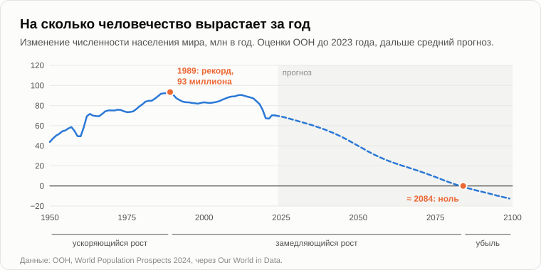

# Почему люди перестали рожать

Олег сел у костра без своей обычной шутки и какое-то время молчал.

— Племяннице исполнилось тридцать пять, — сказал он наконец. — Хорошая работа, своя квартира, муж. Я спросил её на дне рождения про детей. «Потом», — говорит. Что потом? А твоё вчерашнее домашнее задание я сделал. Ты велел посмотреть на страны, которые больше всех платят за детей.

— И?

— Южная Корея. С 2006 года государство [потратило](https://www.aljazeera.com/news/2024/2/28/fears-for-future-as-south-koreas-fertility-rate-drops-again) на повышение рождаемости около 380 триллионов вон, примерно 270 миллиардов долларов: жильё молодым семьям, отпуска для родителей, выплаты на каждого ребёнка. В 2023 году у кореянки было в среднем 0,72 ребёнка. Финляндия, образцовое государство благосостояния: в 2010 году было 1,87, в 2024-м — [1,25](https://data.worldbank.org/indicator/SP.DYN.TFRT.IN?locations=FI). Венгрия тратит на семьи около пяти процентов своей экономики, больше почти всех в Европе. С 2011 по 2021 год рождаемость там выросла с 1,23 до 1,63. А к 2024-му снова упала примерно до 1,4.

— Какой вывод?

— Что деньги покупают немного и ненадолго.

— Тогда задам вопрос с самого начала. Зачем люди вообще заводили детей? Возьми деревню сто лет назад.

— Руки, — не задумываясь, сказал Олег. — В семь лет мальчишка уже гусей пасёт, в двенадцать пашет. А в старости кто тебя кормит? Дети.

— Значит, ребёнок был вложением, и окупался он быстро. Мы говорили об этом пятнадцать лет назад, в вечер о [симбиозе](11-symbiosis-and-parasitism.md). А сегодня?

— Сегодня ребёнок двадцать пять лет стоит денег. А в старости есть пенсия.

— Кто теперь делает работу, которую делал мальчишка с гусями?

— Машины. — Олег нахмурился. — И пенсию платят из того, что зарабатывают машины. Вчерашняя халява.

— Значит, обе отдачи от ребёнка, руки и поддержка в старости, ушли к техносфере. Что осталось?

— Любовь. Люди ведь рожают не по расчёту. Племянница рубли не считает.

— Конечно, не считает. Любовь к детям — хотелка, сильная, одна из самых древних. Мы никогда не говорили, что её нет. Но в вечер о [хотелках](18-anatomy-of-wants.md) мы рисовали их стрелками. Стрелка «хочу ребёнка» входит в сумму вместе с другими. «Хочу учиться». «Хочу свою квартиру». «Хочу посмотреть мир». «Хочу отдохнуть». Какие из этих стрелок техносфера с каждым годом обслуживает лучше?

— Все остальные. Перелёты дешёвые, фильмы бесконечные, телефон в руке.

— И вспомни, что мы говорили о награде. Природа написала «удовольствие», а имела в виду «потомство». Люди нашли способ получать первое без второго. Твоя племянница ничего плохого не делает. Она — лодка в бухте, как и все мы.

— Ладно. Но это психология. Экономисты объясняют проще: женщины получили образование и карьеру, ребёнок стоит матери лет недополученного заработка, жильё в городах дорогое. Хватит и без твоей техносферы.

— Всё верно. Теперь спроси: какой системы? Зачем женщине годы учёбы, прежде чем родить?

— Чтобы получить хорошую работу.

— Работу, которая требует этих лет. В 1950 году человек в мире учился в школе в среднем около трёх лет. В 2020-м — почти [девять](https://ourworldindata.org/grapher/mean-years-of-schooling-long-run). В Евросоюзе женщина теперь рожает первого ребёнка в среднем почти в [тридцать](https://ec.europa.eu/eurostat/statistics-explained/index.php?title=Fertility_statistics). А ребёнку, которого она родит, тоже придётся двадцать лет учиться, чтобы пригодиться в мире, который техносфера сделала сложным. Пятнадцать лет назад я назвал это стоимостью обучения: ценой того, чтобы сделать человека пригодным для мира техносферы. Она растёт с каждым поколением, и каждое поколение платит её заново, с самого начала. Машина платит её один раз, как мы говорили в первый вечер.

— А «бесплатное образование»?

— Бесплатно в одном месте — оплачено в другом. Годы жизни всё равно тратятся. Твои экономисты не ошибаются. Они описывают механизм: упущенный заработок, дорогая квартира, долгая учёба. Я спрашиваю, что движет механизмом. Все их причины — одно и то же, увиденное с разных сторон: цена человека переросла то, что человек получает обратно от собственного ребёнка.

— Тогда вот тебе дыра в теории, — Олег выпрямился. — Бангладеш. Бедная страна, учатся недолго, техносферы мало. В 1990 году у женщины там было четыре с половиной ребёнка. Сейчас [около двух](https://data.worldbank.org/indicator/SP.DYN.TFRT.IN?locations=BD). Стоимость обучения?

— Хорошее возражение. Чем молодёжь в Бангладеш теперь занимается вместо работы в поле?

— Шьёт одежду на фабриках, наверное. На весь мир.

— А для этого девочке надо пойти в школу, а потом в город. Ребёнок в поле — вложение. Ребёнок в школе — расход. Переключение происходит там, куда приходит техносфера, а в Бангладеш она пришла в виде швейной фабрики и телефона. Больше всего детей в Африке южнее Сахары, около четырёх на женщину. В 1990 году было больше шести. Та же дорога, только они на ней дальше позади.

— А куда ведёт дорога?

— В 2024 году медицинский журнал The Lancet [опубликовал](https://www.thelancet.com/journals/lancet/article/PIIS0140-6736(24)00550-6/fulltext) прогноз по каждой стране мира. К 2050 году в трёх четвертях из них будет рождаться меньше детей, чем нужно, чтобы заменить родителей. К 2100-му — в девяноста семи процентах.

— То есть почти везде.

— Теперь посмотрим на всё человечество как на одну динамическую систему, как в вечер о [жизненном цикле](10-life-cycle-and-death.md). На сколько человек оно вырастает за год?

— Ты говорил в первый вечер: сейчас около семидесяти миллионов, в конце восьмидесятых — около девяноста.

— Я взял цифры ООН и посчитал год за годом. Самый большой прирост за всю историю человечества, девяносто три миллиона, пришёлся на [1989 год](https://population.un.org/wpp/). С тех пор он падает, с кочками, но падает. По прогнозу ООН, к 2084 году он дойдёт до нуля, а дальше человечество начнёт сокращаться. Пятнадцать лет назад, в вечер о [сингулярности как процессе](13-singularity-as-process.md), я говорил, что для человечества этот процесс начался примерно в 1989 году, когда рост численности из ускоренного стал замедленным.

— Твой 1989-й.

— Это и тогда были данные демографов. Я только прочёл их как точку жизненного цикла: вложение, рождение, ускоряющийся рост, потом замедляющийся рост, предел, старение. Мы посередине, после перелома, на ветви замедления. Дату предела я назвал неверно, это мы выяснили в первый вечер. Форму кривой — верно.

— А что новые цифры опровергают? Честно.

— Две вещи. Во-первых, мои даты, и это мы уже разобрали. Во-вторых, пятнадцать лет назад я говорил так, будто причина в одном образовании: человечество упёрлось в предел разумности, который оно может дать своим детям. Новые цифры с этим согласуются, но согласуются и с объяснениями попроще, и моего не доказывают. Здесь кончается моё доказательство и начинается убеждение. А показывают они, и показывают ясно, вот что: никакие деньги этого не разворачивают, и происходит это везде, куда приходит техносфера, даже там, где люди бедны.

— Знаешь, что меня пугает больше всего? — Олег подбросил ветку в огонь. — В вечер об апоптозе ты говорил, что природа программирует уход человечества. Я тогда представил что-то страшное. Войны, голод.

— А как это происходит на деле?

— Никто не умирает. Люди просто не рождаются.

— Каждая семья решает сама, свободно и по хорошим причинам: выучиться, встать на ноги, дать одному ребёнку всё вместо того, чтобы дать троим понемногу. Ни злодеев, ни насилия, ни плана. В клетке апоптоз тоже идёт тихо: клетка гибнет не от раны, она выключает себя по собственной программе. Природе не нужно никого убивать. Достаточно, чтобы люди перестали рождаться.

— Мрачновато.

— Зато объективно. Давай на сегодня закончим, зафиксировав результат.

1. **Люди перестали рожать не потому, что стали беднее, а потому, что ребёнок перестал быть вложением и стал расходом. Обе отдачи от ребёнка, рабочие руки и поддержка в старости, перешли к техносфере, а стоимость того, чтобы вырастить человека, пригодного для её мира, растёт с каждым поколением. Никакие деньги этого не разворачивают: это показывают Южная Корея, Финляндия и Венгрия.**
2. **Хотелка иметь детей — одна хотелка из многих, а все соперничающие с ней хотелки техносфера с каждым годом обслуживает лучше. Награду, которую природа привязала к потомству, теперь получают без потомства.**
3. **Новые цифры подтверждают тренд и форму кривой: годовой прирост человечества достиг пика в 1989 году, и ООН ожидает, что около 2084 года он дойдёт до нуля; к 2100 году почти в каждой стране детей будет рождаться меньше, чем нужно, чтобы заменить родителей. Человечество на ветви замедления своего жизненного цикла, и уходит оно мягко — через рождения, а не через смерти.**

— Значит, это уже началось, — Олег встал. — Тогда расскажи остальное. Пятнадцать лет назад ты обещал по шагам описать, как всё произойдёт: техносфера, конец симбиоза, порядок событий. И так и не описал.

— Сценарий событий, — кивнул Андрей. — Я тебе его должен. [Завтра](27-scenario-of-events.md).

— Ну, до завтра.

— Пока.

---

*Продолжение серии* (Часть III. Экономика и люди): новая статья, написанная для этого репозитория после 15 оригинальных статей автора, его методом. Андрей Гордиенко (Garya), автор статей 01–15, её не писал. Перевод с английского оригинала. Опирается на: [10](./10-life-cycle-and-death.md), [11](./11-symbiosis-and-parasitism.md), [13](./13-singularity-as-process.md), [14](./14-apoptosis-of-humanity.md), [16](./16-fifteen-years-later.md), [18](./18-anatomy-of-wants.md), [22](./22-who-sets-the-tasks.md), [25](./25-freebies-for-everyone.md).

[← 25](./25-freebies-for-everyone.md) · [Оглавление](./README.md) · [27 →](./27-scenario-of-events.md)
