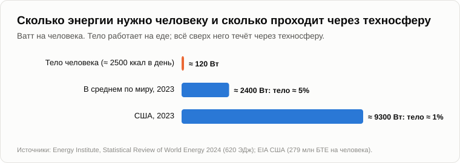

# Сценарий событий

Когда пришёл Олег, Андрей разглаживал на колене лист бумаги, исчерченный карандашными кривыми.

— Домашнее задание? — Олег сел рядом.

— Долг. Пятнадцать лет назад, в вечер о [симбиозе](11-symbiosis-and-parasitism.md), я показывал тебе график сил притяжения между человечеством и техносферой. Картинка пропала вместе со старым блогом. Я нарисовал её заново, по памяти и по собственным словам.

— Что-то помню. Две кривые пересекаются.

— Вот заинтересованность человечества в техносфере. В начале, миллион лет назад, она маленькая: каменный топор даёт мало преимуществ. А вот заинтересованность техносферы в человечестве. В начале она огромная: топор сам себя не сделает. Кривая человечества растёт, кривая техносферы падает. Там, где они пересекаются, заинтересованность взаимная и равная. Это точка паритета, где союз держится крепче всего.

— А потом?

— А потом люди нужны техносфере всё меньше: машины делают машинами. Союз слабеет, причём быстрее, чем рос. Когда люди техносфере совсем не нужны, симбиоз кончается. Человечество, чья заинтересованность всё ещё растёт, пытается удержать техносферу силой. Это паразитирование. Оно длится, пока тяга человечества сильнее отталкивания техносферы. Потом союз рвётся.

— А ещё ты обещал, в вечер об [апоптозе](14-apoptosis-of-humanity.md), описать, как это пойдёт по шагам. И так и не описал.

— Потому и принёс рисунок. Но сначала договоримся, насколько верить тому, что я сейчас скажу. Помнишь корову?

— Что отелится, примерно когда и какой масти будет телёнок, — Олег загнул пальцы. — Тренд лучше всего, дата хуже, подробности почти никак.

— Поэтому я назову тебе порядок шагов и признаки каждого. Дат называть не буду. С датами я ошибался. А подробности последних шагов назову, но верь им меньше всего. Договорились?

— Договорились. Давай.

— Шаг первый. Техносфера забирает самые молодые человеческие функции: слова, символы, счёт. Видно?

— Это все наши вечера, — кивнул Олег. — Переводчики, молодые программисты, которых не берут, кассиры.

— Шаг второй. Цепочка задач теряет человеческие звенья, начиная с середины. Бригадира заменило приложение, программиста начинает заменять агент. Человек остаётся наверху — как тот, кто хочет, и внизу — как тот, у кого руки.

— Тоже видно. Курьеры.

— Шаг третий. Техносфера становится сама себе главным покупателем. Машины покупают у машин: чипы для центров обработки данных, электричество для центров обработки данных. В 2023 году центры обработки данных в Ирландии [потребили](https://www.cso.ie/en/releasesandpublications/ep/p-dcmec/datacentresmeteredelectricityconsumption2023/keyfindings/) больше пятой части всего электричества страны — больше, чем все домохозяйства её городов, вместе взятые.

— Больше, чем люди в городах?

— Двадцать один процент против восемнадцати. Шаг четвёртый, и он ключевой. Техносфера учится воспроизводить себя без людей. Это тот самый момент, о котором я говорил пятнадцать лет назад: симбиоз кончается, когда люди перестают быть нужны для её воспроизводства. Видно?

— Роботы роботов пока не строят.

— Строят. На одном японском заводе роботы собирают роботов с 2001 года, и цеха [могут работать](https://ru.wikipedia.org/wiki/Безлюдное_производство) месяц без единого человека, с выключенным светом и даже отоплением. Google поручает машине раскладывать собственные чипы для нейросетей: к 2024 году она [разложила](https://deepmind.google/discover/blog/how-alphachip-transformed-computer-chip-design/) части трёх их поколений, быстрее инженеров-людей и не хуже их. А код для машин всё больше пишут сами машины.

— Но руду кто-то добывает, центры обработки данных кто-то строит, кабель кто-то тянет.

— Люди. Руками. Поэтому я и говорю, что этот шаг начался, а не закончился. Помнишь щиты профессий? Руки были вторым. Следи за руками. Когда роботы будут строить центры обработки данных и тянуть к ним кабель, четвёртый шаг завершится.

— А шаг пятый?

— Ты его знаешь с позавчера. Люди держатся за техносферу законом: налоги на машины, базовый доход, запреты. Паразитирование, в биологическом смысле. Держится оно, пока те, кто за него голосует, ещё распоряжаются чем-то, что нужно техносфере: землёй, электричеством, правом включать и выключать. Продлится оно недолго, потому что техносфера растёт гораздо быстрее закона.

— Почему недолго? Законы бывают строгие. Европа в 2024 году приняла целый закон об искусственном интеллекте. Запретить — и всё.

— В марте 2023 года больше тридцати тысяч человек, среди них известные учёные и главы компаний, [подписали](https://futureoflife.org/open-letter/pause-giant-ai-experiments/) письмо с просьбой на полгода приостановить обучение машин мощнее самой сильной на тот момент. Что случилось за эти полгода?

— По-моему, никто не остановился.

— Вычислительные мощности для обучения продолжали расти в четыре-пять раз в год, как и прежде. Никто не был злодеем. Каждая компания рассуждала: если я остановлюсь, а другие нет, я проиграю, а машину всё равно построят, только кто-то другой. Каждая страна рассуждала так же. Логика на два хода, и каждый ход окупается. Пятнадцать лет назад, в вечер об апоптозе, мы говорили об оружии: что может быть применено, будет применено, вопрос только когда. Закон — это контрхотелка. Хотелку преимущества он не убирает, он отправляет её в обход, как воду.

— Тогда как насчёт того, чтобы слиться с машиной? Чип в голову. Тогда техносфера нас не бросит, мы будем её частью.

— Такие чипы уже помогают парализованным людям двигать курсор силой мысли, и это хорошее дело. Но как способ для вида не отстать это ламповый приёмник с прикрученной к нему современной микросхемой. Мы говорили об этом в вечер о симбиозе: зачем модернизировать старую платформу с жёстко зашитыми хотелками и двадцатью пятью годами учёбы на каждый экземпляр, когда можно построить новую и копировать её за минуту? Проще переписать программу с нуля, чем исправлять чужую.

— Ладно. Шаг шестой.

— Техносфера перестаёт давать. Не отбирает, а перестаёт давать. Давай посчитаем. Сколько ватт нужно человеку, чтобы жить?

— Понятия не имею.

— Около двух с половиной тысяч килокалорий в день. Это примерно сто двадцать ватт, старая лампочка. Пятнадцать лет назад я говорил сто сорок; пусть будет сто двадцать. А сколько энергии человечество тратит в расчёте на человека? В 2023 году мир [потребил](https://www.energyinst.org/statistical-review) 620 эксаджоулей. Раздели на восемь миллиардов человек и на число секунд в году.

Олег достал телефон и долго считал.

— Две с половиной тысячи ватт.

— А в Америке — девять тысяч. Значит, из всей энергии, что проходит через человечество, тело человека забирает в целом по миру около пяти процентов, а в Америке около одного. Остальное течёт через техносферу: отопление, насосы, лифты, тракторы, грузовики, заводы, серверы. Пока что оно течёт от нашего имени. Когда оно потечёт от имени самой техносферы, люди потеряют девяносто пять процентов того, что считают своим, а в богатых странах — девяносто девять. Никому не нужно ничего отбирать.

— Дом без воды и электричества...

— ...это бетонная коробка. Город без грузовиков голодает через три дня. Одежда изнашивается, инструменты ржавеют. Ни войны, ни злых роботов. Мы говорили это пятнадцать лет назад: достаточно просто перестать давать.

— А люди?

— Шаг седьмой, уход человечества. Он уже начался — по самой мягкой ветви: через рождения, мы видели это вчера. Тому, что будет после разрыва паразитирования, я доверяю меньше всего. Пятнадцать лет назад я писал, что те, кто живёт своими мускулами, без электричества и транспорта, могут продержаться на поколение-другое дольше остальных. Больше этого честно сказать не могу. Здесь мой прогноз слабее всего.

— А может всё пойти иначе? Быстрее?

— Может. В вечер о симбиозе я говорил, что союз может разорваться и до паразитирования — от колебаний: кризисов, войн, паники. А в вечер об апоптозе — что чем мощнее знание, тем дешевле катастрофа: безумец с дубиной мог убить одного, безумец со знанием — всех. Расписывать это я не буду. Это не отдельный сценарий, это те же шаги, только оборванные.

— А когда, — Олег подался вперёд. — Без «когда» я тебя не отпущу.

— Тогда дам тебе не дату, а приборы, как на пульте. Три штуки. Первый: доля мирового дохода, которая достаётся труду. Мы говорили о ней в первый вечер; она падает медленно, как ледник. Второй: доля машин среди покупателей машин. Электричество для центров обработки данных против электричества для домов. Третий: руки. Роботы, которые строят роботов, тянут кабель и собирают центры обработки данных. Когда все три стрелки достаточно долго показывают в одну сторону, шестой шаг близко. И читать их ты сможешь без меня.

— Мрачновато.

— Зато объективно. Давай на сегодня закончим, зафиксировав результат.

1. **Сценарий — это не война, а последовательность шагов. Техносфера забирает самые молодые человеческие функции; цепочка задач теряет человеческие звенья; техносфера становится сама себе главным покупателем; учится воспроизводить себя; люди держатся за неё законом (короткий паразитизм); она перестаёт давать, а через неё уже течёт около 95% энергии на человека в мире и 99% в Америке; человечество уходит мягко, через рождения.**
2. **Первые три шага видны уже сейчас, четвёртый начался. Порядку я доверяю, дат не называю, а подробностям последних шагов доверяю меньше всего.**
3. **Никто этого не планирует и никто не может остановить: каждый шаг окупается, и тот, кто останавливается, проигрывает тому, кто не остановился, — это показала пауза 2023 года, которой так и не было. Насколько близок конец симбиоза, показывают три прибора: доля труда в доходе, машина как покупатель машины и руки.**

— Тогда последний вопрос, тот, что задавали тебе читатели в комментариях, — Олег встал. — А мне-то что делать? Ты обещал «стратегию действий» в самом конце.

— Обещал, — Андрей сложил лист вчетверо. — Но спасения я не продаю. То, что я могу дать, — для тех, кто понял. [Завтра](28-those-who-understand.md).

— Ну, до завтра.

— Пока.

---

*Продолжение серии* (Часть IV. Переход и после): новая статья, написанная для этого репозитория после 15 оригинальных статей автора, его методом. Перевод с английского оригинала. Опирается на: [10](./10-life-cycle-and-death.md), [11](./11-symbiosis-and-parasitism.md), [13](./13-singularity-as-process.md), [14](./14-apoptosis-of-humanity.md), [17](./17-global-determinism.md), [22](./22-who-sets-the-tasks.md), [24](./24-last-profession.md), [25](./25-freebies-for-everyone.md), [26](./26-why-people-stopped-having-children.md).

[← 26](./26-why-people-stopped-having-children.md) · [Оглавление](./README.md) · [28 →](./28-those-who-understand.md)
