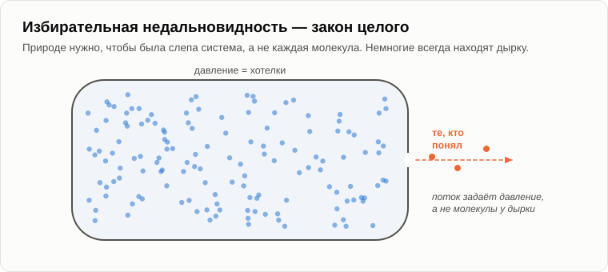
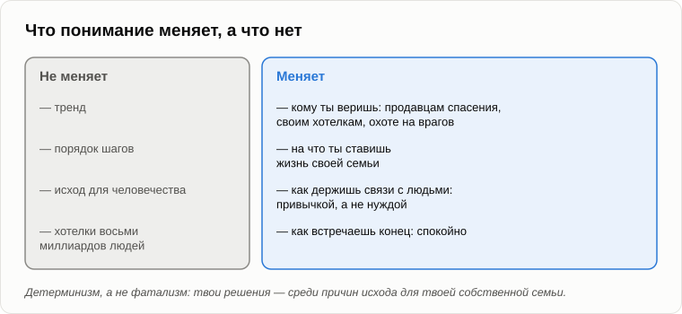

# Тем, кто понял

Олег принёс распечатанную страницу и протянул её Андрею, ещё не сев.

— Из архива твоего старого блога. Посмотри комментарии под вечером о безработице. Читатель спрашивает: а как выжить тем, кто способен будет понять? А ты отвечаешь: «Хочу расписать все детали и нюансы в одной из статей этого блога. И расскажу, что нужно делать тем, кто хочет выжить и спасти своих детей». Пятнадцать лет, Андрей.

— Помню, — Андрей сложил страницу и убрал в карман. — Тогда начнём с того, чего я делать не буду. Я не буду продавать спасение.

— Удобно.

— Честно. Кто тебя пугает, а потом продаёт лекарство, — жулик. Бункер с запасом тушёнки на три года. Курсы жизни на подножном корму. Обещание загрузить твой разум в компьютер и жить вечно. Политик, который клянётся вернуть рабочие места. Каждый из них зарабатывает на твоём страхе. Если бы после всех наших вечеров я продал тебе рецепт, я был бы одним из них.

— Тогда зачем вообще пугать? — Олег сел. — Если ничего нельзя изменить, понимание бесполезно. Только настроение людям портишь. Это фатализм.

— Вспомни вечер о [детерминизме](17-global-determinism.md). Чем детерминизм отличается от фатализма?

— Фатализм говорит, что исход один и тот же, что бы я ни делал. Детерминизм говорит, что то, что я делаю, — одна из причин исхода.

— Вот и ответ. Исход для человечества моё понимание не изменит: он сложен из хотелок восьми миллиардов людей, и каждый шаг окупается. Но среди причин исхода для твоей собственной семьи есть твои решения. Понимание не сдвигает стадо. Оно меняет то, куда идёшь ты сам.

— Погоди. Прежде чем советы, я хочу получить по старому долгу. — Олег хитро прищурился. — В конце вечера о Пенроузе ты признал самое слабое место всей концепции. По твоей же теории природа ослепляет человеческий разум ровно там, где он мог бы увидеть собственный конец. Значит, никто не должен был это понять. А ты понял. Как?

— Я тогда сказал, что не вижу причин. Пятнадцать лет спустя, мне кажется, кое-какие вижу, а ещё мне кажется, что я выразился слишком сильно. Помнишь баллон с газом, в котором дырка?

— Молекулы летают как попало, а газ утекает с постоянной скоростью.

— Знает ли хоть одна молекула, что летит к дырке?

— Нет.

— А остаётся ли молекула в баллоне потому, что ей запрещено выходить?

— Нет. Большинство просто никогда не долетает до дырки.

— Вот это и есть избирательная недальновидность. Это закон целого, а не каждой частицы. Природе не нужно, чтобы был слеп каждый человек. Ей нужно, чтобы была слепа система: человечество в целом не должно действовать по тому, что могло бы увидеть. Несколько молекул всегда находят дырку. Меняют они поток?

— Нет, — подумал Олег. — Поток задаёт давление.

— А давление — это хотелки. Вот тебе и доказательство. В мае 2023 года сотни учёных, которые создают искусственный интеллект, а среди них и главы тех самых компаний, что его строят, [подписали](https://ru.wikipedia.org/wiki/Заявление_о_рисках_ИИ) заявление из одного предложения: снижение риска вымирания от ИИ должно быть глобальным приоритетом наравне с пандемиями и ядерной войной. Они поняли. А что они сделали на следующее утро?

— Продолжили строить, — медленно сказал Олег.

— Каждый по хорошим причинам: если я остановлюсь, построит кто-то похуже. Понимание — не сила. Сила — это хотелка. Так что противоречия в том, что я понял, нет. Противоречие было только в той сильной форме, в какой я выразил это в 2012 году. Понимание немногих допустимо. В потоке оно ничего не меняет.

— А почему ты, из всех молекул?

— В случайности я не верю, так что назову причины, которые вижу. Годы прополки антропоцентризма в собственной голове, с того дня, как я увидел, насколько сильно он гнёт логику. Диагностическая программа 1989 года, которая училась быстрее меня. Подполье в юности, научившее меня, куда ведут машины, делающие людей хорошими. И главное, я полагаю: во мне любопытство оказалось сильнее хотелки иметь удобную картину. Мы говорили об этом в вечер о [психике](08-human-psyche.md): если хочешь посмотреть туда, куда разум не идёт, возьми одну хотелку, любопытство, и наблюдай через неё за собственными реакциями. Это не заслуга. Это сочетание уставок.

— Ладно, — кивнул Олег. — Принимаю. Теперь советы. Тем, кто понял.

— Не советы. То, что я делаю сам и что сказал бы своим детям. Первое: не давай себя обмануть. Продавцам спасения — о них мы уже сказали. Своим хотелкам: чем приятнее прогноз, тем внимательнее проверяй, кто за него платит. И охоте на врагов.

— Какой охоте?

— Пятнадцать лет назад, в тех же комментариях, я писал, что, когда станет трудно, люди будут искать причину своих бед вне себя: богатые, бедные, чужаки, соседи, «вон те». И найдётся немало желающих сказать им, что их злоба священна и что виноватых надо наказать. В вечер об [апоптозе](14-apoptosis-of-humanity.md) это был один из инструментов: массовая агрессия. Кто понимает, что злодеев в этой истории нет, тот не возьмёт в руки палку. Уже одно это очень много. Я тогда писал, что дольше всех, возможно, продержатся те, кто сумеет остаться в стороне от всеобщей склоки.

— Второе?

— Не ставь жизнь своей семьи на то, что кончается. Если сын хочет профессию без щита — не потому, что любит её, а потому, что она была престижной в твоей молодости, — расскажи ему, что мы говорили о щитах. Если весь твой план на старость — пенсия, которую платит следующее поколение работников, вспомни, что к середине века каждый шестой человек на Земле будет [старше шестидесяти пяти](https://www.un.org/en/global-issues/ageing), а следующее поколение меньше твоего. Я не говорю тебе, что делать вместо этого. Я говорю: не ставь всё на то, что старый порядок устоит.

— А третье?

— В вечер о халяве мы говорили, что связи между людьми держала нужда, а техносфера нужду убирает. Значит, держи их привычкой, без нужды. Навещай мать, хоть у неё есть телефон. Помоги соседу выкопать погреб, хоть он мог бы нанять машину. Человечество это не спасёт. Просто так выглядит жизнь, пока она длится.

— Говоришь как священник.

— Говорю как человек, который каждую зиму кормит птиц на даче, — улыбнулся Андрей. — Моя кормушка не спасёт синиц как вид. Но вот эти синицы, этой зимой, сыты. И четвёртое: встречай это спокойно. В молодости я болел так, что не надеялся дожить до тридцати. Прожил больше вдвое. Одно я тогда усвоил: спокойный взгляд на конец не портит жизнь до него. Он делает её яснее.

— А для человечества? Совсем ничего?

— Человечество блогов не читает. Оно действует по своим хотелкам и будет по ним действовать. Я говорю с теми немногими, у кого любопытство оказалось сильнее. С теми, кто понял.

— Мрачновато, — сказал Олег, но без обычной усмешки.

— Зато объективно. Давай на сегодня закончим, зафиксировав результат.

1. **Спасения для человечества нет, и тот, кто тебя пугает, а потом продаёт лекарство, — жулик. Понимание не меняет исхода для целого, но меняет решения одного человека, а они — среди причин исхода для его собственной семьи: детерминизм, а не фатализм.**
2. **У самого слабого места концепции есть ответ. Избирательная недальновидность — закон целого, как газ в баллоне: природе нужно, чтобы была слепа система, а не каждый человек. Те, кто видит, процесс не останавливают, потому что понимание — не сила; сами строители подписали предупреждение и продолжили строить.**
3. **Что может сделать тот, кто понял: не давать себя обмануть — продавцам спасения, собственным хотелкам и охоте на врагов; не ставить жизнь своей семьи на то, что кончается; держать связи с людьми привычкой, раз их больше не держит нужда; и встречать конец спокойно.**

— Одно у меня не выходит из головы, — Олег встал и посмотрел на небо. Над деревьями высыпали звёзды. — Если это закон природы, значит, это уже случалось где-то там. Другие цивилизации, другие техносферы. Тогда почему так тихо? Мы больше шестидесяти лет слушаем небо радиотелескопами — и ничего.

— Ты задал вопрос, с которым я в 2012 году ходил к астрономам, — сказал Андрей. — [Молчание Вселенной](29-silence-of-the-universe.md). Завтра.

— Ну, до завтра.

— Пока.

---

*Продолжение серии* (Часть IV. Переход и после): новая статья, написанная для этого репозитория после 15 оригинальных статей автора, его методом. Андрей Гордиенко (Garya), автор статей 01–15, её не писал. Перевод с английского оригинала. Опирается на: [01](./01-introduction.md), [08](./08-human-psyche.md), [14](./14-apoptosis-of-humanity.md), [15](./15-penrose-counterarguments.md), [17](./17-global-determinism.md), [18](./18-anatomy-of-wants.md), [25](./25-freebies-for-everyone.md), [27](./27-scenario-of-events.md).

[← 27](./27-scenario-of-events.md) · [Оглавление](./README.md) · [29 →](./29-silence-of-the-universe.md)
