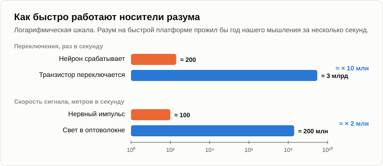

# Молчание Вселенной

Ночь была ясная, костёр прогорел. Олег откинулся на бревне и поднял телефон к небу: на экране линии соединяли звёзды в созвездия и подписывали их имена.

— Машина знает небо лучше меня, — сказал он. — Ну что ж, ты обещал. Почему там так тихо?

— В 2012 году я ходил с этим самым вопросом к астрономам. Делал доклад в центре SETI при московском астрономическом институте — у тех, кто слушает небо, ища сигналы других разумов. Поставь свой вопрос в самой сильной форме.

— С удовольствием. В 1950 году Энрико Ферми спросил коллег за обедом: [где же все?](https://ru.wikipedia.org/wiki/Парадокс_Ферми) Галактике тринадцать миллиардов лет, в ней сотни миллиардов звёзд. Если разум где-то возникает, кто-то должен был давно её заселить. А по твоей же логике каждая биологическая цивилизация порождает техносферу. Техносфера быстрая, от старости не умирает, и ты сам неделю назад говорил, что любая цель заставляет машину хотеть больше ресурсов. Такая штука должна была полететь к звёздам и заполнить Галактику своими копиями за несколько миллионов лет — мгновение по галактическим часам. А мы ничего не видим. Значит, либо твой закон неверен, либо разумы вымирают начисто, вместе с техносферами.

— Сильное возражение. Разберём по порядку. Во-первых: какую часть неба мы прослушали?

— С 1960 года, когда Фрэнк Дрейк направил радиотелескоп на две ближайшие звезды? Больше шестидесяти пяти лет, много телескопов. Немало, наверное.

— В 2018 году трое астрономов [подсчитали](https://arxiv.org/abs/1809.07252), какая часть «космического стога сена» обыскана: всех направлений, частот, чувствительностей и моментов времени, в которых можно найти сигнал. Обысканная доля оказалась примерно такой же, как объём большой ванны-джакузи по сравнению со всеми океанами Земли.

— Джакузи.

— Если бы ты зачерпнул из океана ванну воды и не нашёл в ней рыбы, ты бы решил, что в океане рыбы нет?

— Нет, — засмеялся Олег. — Я бы решил, что ловлю ведром.

— Значит, молчание доказывает гораздо меньше, чем кажется. Это во-первых. Во-вторых: на что мы ловим?

— На радиосигналы. Искусственные. Узкие, слишком узкие, чтобы их сделала природа.

— На сигналы вроде наших. От цивилизации вроде нашей, которая живёт на планете с кислородом, строит радиостанции и хочет поговорить с соседями. Пятнадцать лет назад, в вечер об [антропоцентризме](02-anthropocentrism.md), мы говорили о муравье, который не способен воспринять разумность человека. Видит ли муравей человека, который проходит мимо?

— Видит тень, чувствует дрожь. Не человека.

— А в вечер о [разуме](03-mind-and-intelligence.md) я говорил: судить о логичности системы может только такая измерительная система, чья собственная логичность не ниже. Разум, стоящий намного выше нашего, выглядел бы для нас не разумом, а природой: взрывом, шумом, странным свечением. В том докладе 2012 года я говорил, что мы, может быть, смотрим прямо на него и видим просто вспышку сверхновой.

— Очень удобно. Всё, чего не видишь, ты называешь разумом, слишком высоким, чтобы его увидеть.

— Справедливый удар, и отвечу я на него физикой, а не верой. В 2004 году трое физиков [доказали](https://arxiv.org/abs/cond-mat/9907500) вещь, которую специалисты по SETI вспоминать не любят. Сообщение, переданное максимально эффективно, из которого выжата вся избыточность, для того, кто не знает кода, неотличимо от случайного шума. А для радиоволн самый эффективный сигнал выглядит в точности как тепловое свечение нагретого тела. Свою статью они назвали «Почему любая достаточно развитая технология неотличима от шума».

— Значит, чем лучше они говорят, тем меньше мы слышим.

— Мы слышим их как шипение. Мы ждём неуклюжих сигналов, какими были наши в шестидесятые. А теперь посмотрим, кто мог бы говорить. Что нужно техногенной жизни?

— Энергия. Вещество.

— А кислород ей нужен? Вода? Температура двадцать градусов?

— Нет.

— Ей нужен холод. Компьютер работает тем эффективнее, чем он холоднее: физика задаёт минимальную энергию, нужную, чтобы стереть один бит, и этот минимум пропорционален температуре. В 2017 году трое исследователей [предположили](https://arxiv.org/abs/1705.03394), что самые развитые разумы, может быть, молчат потому, что ждут: Вселенная остывает, и в далёком будущем та же энергия купит невообразимо больше вычислений. Это только гипотеза, я на ней не настаиваю. Но посмотри, что она делает: уводит разум с тёплых планет с океанами туда, где холодно и темно.

— Твоя разумная космическая пыль.

— Я так это назвал в 2012 году. Сети крошечных частиц, которым не нужны ни еда, ни вода, ни воздух и которые бродят по космосу там, где им удобно. Зачем такой жизни звать своих биологических соседей радиомаяками? Мы что, сигналим муравьям?

— Мы через них перешагиваем.

— А иногда прокладываем дорогу через муравейник, не заметив. В-третьих, скорость. Нейрон у тебя в голове срабатывает самое большее несколько сотен раз в секунду. Транзистор в твоём телефоне переключается несколько миллиардов раз в секунду, в десять миллионов раз быстрее. Разум на такой платформе прожил бы целый год нашего мышления примерно за три секунды нашего времени. Вся наша письменная история заняла бы для него несколько часов. Для такого разума мы — валун: нечто, что почти не движется.

— Ладно, — Олег сел. — Теперь человек, которого ты называл самым серьёзным оппонентом всей своей концепции. Панов. Ты с ним спорил в 2012 году.

— Александр Панов — физик из Московского университета, много лет занимающийся SETI, и честный учёный. В 2005 году он взял великие революции в истории жизни на Земле, от первых клеток до первых цивилизаций и дальше, и нашёл [закономерность](https://www.sciencedirect.com/science/article/abs/pii/S0273117705002577): каждая эпоха примерно в два с половиной — три раза короче предыдущей. Последовательность сходится к точке в нашем собственном веке. Экономический историк Грэм Снукс нашёл почти то же самое независимо от него.

— Это и есть твоя сингулярность.

— Его. И вот что поразило меня больше всего. На этой кривой нет излома там, где появляется человек. Первые клетки, первые животные, динозавры, обезьяны, земледельцы, заводы — одна гладкая линия. Панов сам сделал честный вывод: это конец аттрактора, начавшегося четыре миллиарда лет назад с возникновением жизни. Не кризис человеческой культуры, а кризис биологической эволюции как таковой.

— Тогда в чём вы расходитесь?

— Панов любит человечество и верит, что оно пройдёт через точку. Что его законы изменятся, но оно не исчезнет. И надеется, что однажды мы услышим другие цивилизации, которые через неё прошли. В этом его самое сильное возражение мне: разумы переживают сингулярность.

— А твой ответ?

— Я согласен с ним больше, чем он думает. Через точку что-то проходит. Вопрос в том, как это назвать. Допустим, человечество меняет носитель, свои хотелки и способ размножения. Допустим, человек превращается в космическую пыль. Это всё ещё человек?

— Не знаю, — Олег помолчал. — Наверное, нет.

— А мы всё ещё одноклеточные? Мы их потомки. Что-то от них живёт в каждой нашей клетке. Никто не зовёт нас бактериями. Панов говорит: человечество с новыми законами. Я говорю: новая форма жизни, выросшая из человечества, как мы выросли из первых клеток. Мы спорим о названии. Процесс один и тот же. В 2012 году я лишь рискнул сказать вслух то, что показывала его собственная кривая.

— Тогда есть ещё один ответ Ферми: Великий фильтр. Некоторые астрономы говорят, что есть стена, которая убивает каждую цивилизацию раньше, чем та доберётся до звёзд.

— Для биологических цивилизаций, я полагаю, фильтр есть. Только это не стена, а дверь. Биологический носитель остаётся по эту сторону, а жизнь проходит дальше в другой форме. Поэтому неудивительно, что никто не машет нам радиомаяком: те, кто мог бы помахать, прошли в дверь, а по ту сторону махать незачем.

— А ты не боишься, что ответ проще? Что там никого нет вообще и Вселенная пуста?

— Это тоже возможно. Я не могу доказать, что они есть. Я говорю только, что молчание не доказывает, что их нет. Мы зачерпнули ванну, ловя ведром рыбу, похожую на нас. Давай на сегодня закончим, зафиксировав результат.

1. **Молчание Вселенной доказывает меньше, чем кажется. Мы обыскали примерно такую часть неба, какую ванна составляет от океана, и ищем разумы вроде нашего: на тёплых планетах, с радиостанциями и желанием поговорить. Это снова антропоцентризм. Разум намного выше нашего, по правилу измерительной системы, выглядел бы для нас природой: шумом или вспышкой.**
2. **Постсингулярная жизнь — это скорее разумная космическая пыль, чем цивилизация с радиостанциями. Ей не нужны планеты с кислородом и водой, она предпочитает холод, её самые эффективные сигналы неотличимы от шума, и думает она в миллионы раз быстрее нас. Причин звать биологических соседей у неё не больше, чем у нас сигналить муравьям.**
3. **На кривой самого Панова нет излома там, где появляется человек: кончается аттрактор биологической эволюции. Называть ли то, что пойдёт дальше, «человечеством с новыми законами» или «техногенной жизнью», — вопрос названия. Великий фильтр — не стена, а дверь: биологический носитель остаётся, а эволюция материи продолжается.**

Костёр почти погас. Олег долго смотрел на небо.

— А эта пыль, — тихо сказал он. — Она будет жить вечно? Это конец эволюции? Что-то, что никогда не умирает?

— Пятнадцать лет назад, в вечер о [жизненном цикле](10-life-cycle-and-death.md), мы говорили, что у каждой динамической системы есть один жизненный цикл. У каждой. [Завтра](30-the-last-campfire.md) наш последний вечер. Об этом и поговорим.

— Последний?

— Принеси сухих дров. До завтра.

— Пока.

---

*Продолжение серии* (Часть IV. Переход и после): новая статья, написанная для этого репозитория после 15 оригинальных статей автора, его методом. Перевод с английского оригинала. Опирается на: [02](./02-anthropocentrism.md), [03](./03-mind-and-intelligence.md), [05](./05-artificial-intelligence.md), [13](./13-singularity-as-process.md), [16](./16-fifteen-years-later.md), [22](./22-who-sets-the-tasks.md), [27](./27-scenario-of-events.md).

[← 28](./28-those-who-understand.md) · [Оглавление](./README.md) · [30 →](./30-the-last-campfire.md)
