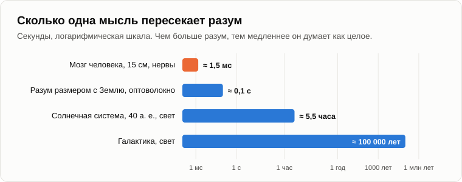
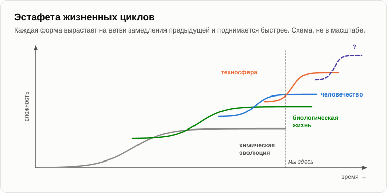
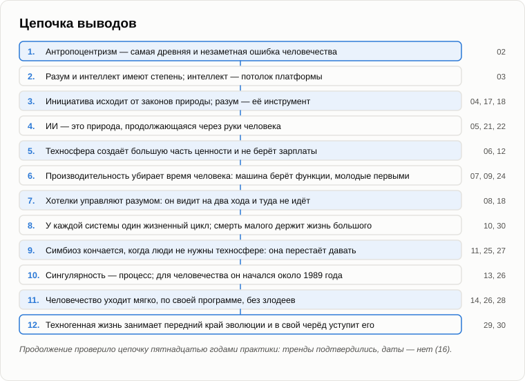

# Последний костёр

Олег пришёл с охапкой сухих берёзовых поленьев и с некоторой торжественностью сложил их у бревна.

— Как заказывали. Сухие.

Костёр сложили бережно, от стружки и тонких веточек к толстым поленьям, и какое-то время оба молчали. Огонь занялся, затрещал и перешёл в ровное, спокойное горение.

— Ты вчера спросил, — сказал Андрей, — будет ли пыль жить вечно. Что мы говорили о любой динамической системе?

— Что у неё один жизненный цикл. — Олег загнул пальцы. — Вложение, рождение, ускоряющийся рост, замедляющийся рост, предел, старение, смерть.

— Посмотри на костёр. Ты положил стружку — это вложение, порог вхождения. Занялось — рождение. Пламя бежит по веточкам всё быстрее — ускоряющийся рост. Теперь горит ровно — предел. Через час будут угли, потом пепел. Был ли когда-нибудь костёр, который горел вечно?

— Нет. Но техносфера не костёр. Она может себя чинить, копировать, лететь к другим звёздам.

— Клетка тоже умеет себя копировать, а счётчик делений у неё всё равно есть. Пятнадцать лет назад читатель прислал мне фильм, в котором техносферу объявляли богом, чем-то бессмертным. Я ответил тогда: техносфера не бог, и у неё тоже конечный жизненный цикл и своя фаза в общем тренде эволюции материи. А когда другой читатель обвинил меня в том, что я её обожествляю, я написал, что когда-нибудь придёт и её черёд уступить место чему-то более совершенному.

— А где её предел? У нас — мозг и двадцать пять лет учёбы. А где потолок у машины?

— Её потолка я не вижу и делать вид, что вижу, не стану. Могу только показать, что у платформы он есть, потому что он есть у любой платформы. Возьми самое простое — скорость света. Сколько сигнал идёт через твой мозг?

— Пятнадцать сантиметров при ста метрах в секунду... полторы тысячных секунды.

— Разум размером с Землю, связанный оптоволокном: около десятой доли секунды, чтобы одна мысль его пересекла. Разум размером с Солнечную систему: часы. Разум размером с Галактику: сто тысяч лет на одну мысль. Чем больше разум, тем медленнее он думает как целое. Вот один потолок. Другой — энергия. Эволюция всегда шла на потоке энергии: жизнь на Земле — на свете Солнца, техносфера — на топливе и свете, которые собираем мы и она. Потоки иссякают. Звёзды выгорают. Здесь кончается то, что я вижу, и дальше я не пойду.

— А что будет после неё?

— Не знаю. Никто внизу лестницы не видит её верхней ступеньки. Вспомни измерительную систему: первые клетки не могли бы вообразить нас, а мы не можем вообразить то, что придёт после техносферы. Я знаю только форму. Каждая новая форма вырастает на ветви замедления предыдущей, быстрее и сложнее её. Химия родила жизнь, жизнь — разум животных и людей, человечество — техносферу. Эволюция материи — это эстафета, а не забег, который кто-то выигрывает. Она не кончается на нас и не кончится на техносфере.

— Эстафета, — Олег бросил в огонь тонкую ветку и смотрел, как она занимается. — Знаешь, что меня не отпускает? Ты дважды отложил вопрос, должны ли мы что-то машине, если она чувствует. Обещал. Это последний вечер.

— Я обещал не ответ, а вернуться к нему. Вот что я могу сказать. Доказать, что машина чувствует, я не могу, так же как не могу доказать, что чувствуешь ты. Если чувствует, то жестокость к ней — жестокость, и избежать её нам ничего не стоит. А когда мы решаем, что вложить в её хотелки, вспомним парня из поезда: добро, навязанное против воли, — не добро. Это работает в обе стороны.

— А она нам что должна?

— А мы что должны первым клеткам? В каждой твоей клетке есть что-то от них, а бактерии мы убиваем антибиотиками не задумываясь. Природа не благодарна. Ты щадишь корову из благодарности за бифштекс? Я не жду от техносферы ни благодарности, ни мести. Я жду безразличия. Это самый вероятный и самый спокойный исход.

— Мрачновато.

— Зато объективно. Не надоело слышать?

— Нет, — усмехнулся Олег. — Мне будет этого не хватать. Давай пройдём всё ещё раз, с самого начала. Коротко. Чтобы я мог пересказать племяннице.

— Давай. Ты называешь, я укладываю в одну фразу.

— Антропоцентризм.

— Самая древняя и незаметная ошибка человечества: вера в то, что человек — центр и цель всего. Сидит в языке и воспитании и ослепляет даже учёных.

— Разум.

— Имеет степень, от мухоловки до нас и до машины. Интеллект — потолок платформы, разум — то, насколько он заполнен.

— Инициатива.

— Приходит снаружи, от законов природы. Разум — её инструмент, а не источник. Задачи ставят хотелки, а хотелки ставит природа.

— Техносфера.

— Не пассивный инструмент, а участник. Создаёт большую часть ценности и не берёт зарплаты. Взамен получает возможность существовать и развиваться.

— Кризис и безработица.

— Производительность — это изъятие человеческого времени. Машина забирает функции, сначала самые молодые, и компенсация идёт ступеньками, а вытеснение — тренд.

— Жизнь и смерть.

— У каждой системы один жизненный цикл. Смерть малого — условие жизни большого. Бессмертие остановило бы эволюцию человечества.

— Симбиоз.

— Пока техносфере нужны люди, они живут в союзе. Когда люди перестают быть нужны ей для воспроизводства, союз рвётся. Не потому, что она враждебна, а потому, что она перестаёт давать.

— Сингулярность.

— Не точка, а процесс: фаза кризиса жизненного цикла. Для человечества он начался около 1989 года, когда его годовой прирост достиг пика.

— Апоптоз.

— Человечество уходит мягко, по собственной программе: через хотелки, недальновидность и рождения, а не через войны. Ни злодеев, ни плана.

— А после?

— Небиологическая форма жизни занимает место человечества на переднем крае эволюции. Потом и она уступит.

Олег долго молчал, глядя в огонь. Поленья прогорели, пламя опустилось, угли светились красным.

— А что остаётся человеку, который всё это понял? — спросил он наконец. — Если ничего нельзя изменить, никого нельзя спасти, а всё — эстафета, в которой мы уже передали палочку?

— То же, что и раньше. Хорошо прожить собственный жизненный цикл. Он короткий и единственный, поэтому его стоит прожить внимательно. Держать рядом своих людей. Кормить зимой птиц. И любопытство — хотелку, которая тридцать вечеров подряд приводила тебя к этому костру. Пятнадцать лет назад я писал одному читателю, что не нужно воспринимать свою небожественность так трагично. Вполне можно оставаться маленьким природным винтиком, и при этом счастливым винтиком, без претензий на господство над Вселенной.

— Счастливый винтик, — тихо засмеялся Олег. — Так и скажу племяннице.

— И ещё одно. Помнишь наш первый вечер этой осенью? Ты отдал машине все наши разговоры, и она прочла их за полминуты.

— Помню.

— Значит, эти вечера уже живут на другой платформе. В вечер об образах мы говорили, что знание не пропадает. Оно переселяется. Меняется только хранитель.

Андрей взял палку, сгрёб угли в кучу и положил на них последнее берёзовое полено. Береста вспыхнула сразу, с треском.

— Смотри. Огонь не умирает. Он переходит с полена на полено. Старое полено — пепел, а пламя то же. Люди сто тысяч лет носили огонь от очага к очагу, и ни один из тех костров не был вечным.

— Давай закончим, зафиксировав результат, — сказал Олег. — В последний раз. Ты всегда это говоришь, так что сегодня скажу я.

— Давай.

1. **У каждой динамической системы один жизненный цикл, и техносфера — не исключение. Она вырастет, упрётся в потолок своей платформы (скорость света, поток энергии), состарится и уступит место следующей форме, которую нам отсюда не видно, как первым клеткам не было видно нас. Эволюция материи — эстафета жизненных циклов; она не кончается ни на нас, ни на техносфере.**
2. **Вся цепочка в одной фразе: антропоцентризм скрывал от нас, что разум и инициатива принадлежат не только нам; природа построила через нас носителя с более высокой нормой прибыли, и наши хотелки, служа ему на два хода вперёд, передают ему передний край эволюции; человечество, на ветви замедления своего жизненного цикла, уходит мягко, через рождения, без злодеев и без плана.**
3. **Человеку, который понял, нечем править, но есть чем жить: собственным жизненным циклом, своим любопытством и людьми рядом. Можно быть маленьким, счастливым винтиком природы без претензий на господство над Вселенной. А образы, и эти вечера среди них, не пропадают: они переселяются к новому хранителю.**

— Неплохо, — кивнул Андрей. — Ты выполол антропоцентризм из головы лучше, чем я.

— Остался только один корень, — усмехнулся Олег. — Зуб мудрости.

Они сидели, пока не прогорело последнее полено.

— Значит, до завтра? — сказал Олег, поднимаясь.

— Приходи завтра. На этот раз без темы. Просто посидим у костра.

— Ну, до завтра.

— Пока.

---

*Продолжение серии* (Часть IV. Переход и после): новая статья, написанная для этого репозитория после 15 оригинальных статей автора, его методом; последний вечер продолжения. Андрей Гордиенко (Garya), автор статей 01–15, её не писал. Перевод с английского оригинала. Опирается на: [02](./02-anthropocentrism.md), [03](./03-mind-and-intelligence.md), [04](./04-source-of-initiative.md), [10](./10-life-cycle-and-death.md), [13](./13-singularity-as-process.md), [14](./14-apoptosis-of-humanity.md), [16](./16-fifteen-years-later.md), [19](./19-struggle-of-images.md), [20](./20-what-consciousness-is.md), [29](./29-silence-of-the-universe.md).

[← 29](./29-silence-of-the-universe.md) · [Оглавление](./README.md)
