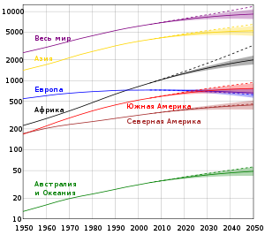

# О жизненном цикле динамических систем и о смысле смерти

Блог «Технологическая сингулярность» на sql.ru (сайт закрыт в 2022 году), запись от 2011-11-09: текст в том виде, в каком он был опубликован, и комментарии под ним. Комментарии автора (Garya) приведены полностью. Реплики читателей сокращены до 300 знаков и оставлены как контекст; полностью их можно прочитать в [архиве](https://web.archive.org/web/20180910062855/http://www.sql.ru/blogs/garya/1077).

Статья серии: [О жизненном цикле динамических систем и о смысле смерти](../../../ru/10-life-cycle-and-death.md)

## Текст записи

— Что ты подразумеваешь под "динамической системой"? — спросил Олег.

— Всё, — Андрей выдержал паузу, с улыбкой наблюдая за тем, как брови Олега медленно поднимаются кверху. — Любые системы, которые каким-нибудь способом проявляют себя в этом мире, демонстрируя способность взаимодействовать с чем-либо и изменяться во времени. То есть, проявлять "динамику". Именно поэтому они "динамические". Системы, которые состоят из чего-то, что можно было бы условно назвать "веществом", которые имеют консервативную внутреннюю структуру, в существенной степени сохраняющуюся на протяжении жизненного цикла. Локализованные в пространстве. В процессе взаимодействия обменивающиеся "веществом" и энергией с прочими динамическими системами.

— Извини за откровенность, но мне ничего не понятно, — Олег улыбнулся. — А существуют НЕ динамические системы?

— Нет, не существуют.

— Тогда, может быть, назвать их просто "системы"?

— Нет. Мне важно подчеркнуть их изменчивость. Про просто "системы" обычно говорят как про нечто статическое. Так вот, все динамические системы имеют жизненный цикл во времени. Иными словами, всё, что мы наблюдаем вокруг, либо живое, либо является "останками" того, что прежде было живым.

— По-моему, это чересчур сильное утверждение, — улыбнулся Олег.

— Когда мы обсуждали [антропоцентризм](../../../ru/02-anthropocentrism.md), мы уже заметили, что люди стали делить природу на "живую" и "неживую", на "разумную" и "неразумную" просто исходя из схожести с собой, определяемой очень поверхностно. Деление на "живое" и "неживое" возникло задолго до возникновения первых зачатков науки. То, что не движется, стали считать "неживым", в отличие от того, что движется. Однако, это слишком упрощенное видение, потому что на самом деле движется абсолютно всё. Только одни системы движутся медленно, а другие быстро. Некоторые системы движутся настолько медленно, что это незаметно нашему глазу, и мы их воспринимаем как неподвижные.

— Ну да, наверное.

— Некоторые системы могут иметь жизненный цикл, превышающий продолжительность жизни человека на многие-многие порядки. Но от этого характер их динамики не изменяется. Все динамические системы имеют жизненный цикл. То есть, жизнь, которая конечна.

— Но наука же различает живое и неживое?

— По причине воздействия на нее антропоцентризма. Живым принято считать то, в чем происходит синтез белка. Но, позвольте, [почему именно белка](http://www.membrana.ru/particle/16743)? Если бы в тот период, когда радиоэлектроника была представлена только лампами, примерно из таких же соображений посчитали радиоэлектронным устройством "то, что исключительно на лампах", то транзисторный радиоприемник уже не смог бы считаться радиоэлектронным устройством. Но ведь это же абсурд. Это один из тех случаев, когда содержание подменяется формой. А содержание — способность к динамике особого рода. И при детальном рассмотрении выясняется, что подобной динамикой обладают вообще все системы. Взгляни на этот рисунок:

— Его можно соотнести с любой динамической системой, — продолжил Андрей. — Но даже при беглом взгляде видно, что этот график очень похож на график жизненного цикла отдельного человека. Можно его также соотнести с жизненным циклом бизнеса, который, по сути, тоже является динамической системой. Можно соотнести с чем-то макроскопическим, либо микроскопическим, но на этих уровнях длительность жизненных циклов слишком сильно отличается от нашей собственной, на многие-многие порядки, поэтому я предлагаю сосредоточиться на том, что проще для восприятия. Например, на "человеке" или "бизнесе".

— Принимается.

— Первая фаза — это когда системы еще нет, но она уже "запланирована".

— "Вначале было слово", — вспомнил Олег.

— Да. Это именно оно, "слово", которое возникает в самом начале графика. "Чистый план" без энергии и "вещества". На первой фазе происходит его заполнение энергией и "веществом". И тогда начинает "материализовываться" структура динамической системы. Сам этот процесс я предлагаю назвать "инвестицией". Количество инвестируемой энергии должно быть не ниже некоторого минимального уровня, которое в экономике для бизнес-систем называют "порогом вхождения". Количество энергии должно быть таким, чтобы система на фазе своего зарождения могла преодолеть воздействие дестабилизирующих факторов, которые воздействуют на всё и всегда. То есть, достаточное для того, чтобы система смогла сама сохранять свою структуру. Поэтому внешняя инвестиция энергии уходит на аккумулирование потенциальной энергии, которая "замораживается" в ее структуре. Когда количество потенциальной энергии, аккумулированной в структуре системы, превысит "порог вхождения", то есть величину дестабилизирующих факторов, структура сможет поддерживать сама себя. Поэтому "инвестиция энергии" должна быть больше некоторой минимальной величины, чтобы система смогла возникнуть. Таким образом, первая фаза жизненного цикла системы возникает еще до того, как возникнет сама система. Это фаза инвестиции.

— Но ведь в бизнесе случаются и неудачные инвестиции, которые не принесли отдачу?

— Совершенно верно. Для зарождения динамической системы должна иметься "возможность" автоматического поддержания циклических потоков энергии и "вещества". Это что-то вроде потенциальной "ямы", заполняя которую потоки энергии могут поддерживать собственное циклическое движение, превращаясь в "вихрь" или "воронку". Представь, что вокруг в пространстве находятся подобные "ямы" разного размера. Каждая яма — это потенциал возникновения вихря. Но для того, чтобы он возник, нужна первоначальная инвестиция, направленная в конкретную "яму". Некоторые инвестиции не достигают порога вхождения, и динамическая система при этом не возникает. Некоторые "ямы", то есть, потенциалы длительное время остаются без инвестиций, и поэтому тоже не порождают динамических систем. Некоторые инвестиции направляются "мимо" "ям", и поэтому тоже не порождают динамических систем. Только когда инвестиция достаточного размера совмещается с потенциалом достаточной величины, возникает динамическая система.

— От чего зависит совмещение инвестиций и потенциалов?

— Мы углубляться в этот вопрос не станем, потому что нас может унести очень далеко от вопросов, связанных с сингулярностью, — улыбнулся Андрей. — Упрощенно просто представим себе семена растений в виде "инвестиций" и участки плодородной почвы, при попадании на которых семена могут дать всходы. Некоторые семена достигнут плодородных участков и дадут всходы, а некоторые не дадут всходов, потому что так и не попадут в благоприятные условия. Сейчас же вернемся к графику. Мы видим, что в конце первой фазы динамическая система появилась, "родилась". И после этого она продолжает существовать и на протяжении всей своей "жизни", и не только "жизни", но и после "смерти". Но сначала, сразу после возникновения системы возникает постоянно ускоряющееся накопление энергии, энтропия динамической системы уменьшается. Наступает активная фаза.

— Откуда же она берет энергию на этой фазе?

— Она берет ее у других динамических систем. Например, у тех, которые уже находятся в пассивной фазе, то есть "уже умерли". Энтропия "мертвых" систем растет, они отдают свою энергию другим динамическим системами. Однако, поступать энергия может не только от "мертвых", но и от других "активных", то есть, "живых" систем в процессах таких взаимодействий как "симбиоз" и "паразитирование".

— Примерно представляю себе, о чем идет речь.

— Первая часть активной фазы динамической системы — это ее лавинообразный переход из неустойчивого состояния в более устойчивое. В процессе такого перехода возникают циклические потоки энергии и "вещества", проходящие сквозь динамическую систему. Иная интерпретация — "вихрь". Каждый цикл пропускания сквозь динамическую систему потоков энергии и вещества приводит к появлению "прибыли с оборота". То есть, часть энергии и вещества, пропущенного сквозь себя, динамическая система "оставляет себе". "Вихрь" набирает силу. Захваченная динамической системой энергия фиксируется в наращиваемой ею собственной структуре в форме потенциальной энергии этой системы. Захваченное динамической системой "вещество" участвует в наращивании "массы" динамической системы. Из чего видно, что *потенциальная энергия и масса динамической системы тесно взаимосвязаны и имеют единообразные тенденции динамики*.

— Примерно ясно.

— Динамическая система имеет "производительность", которая пропорциональна текущей массе накопленного "вещества" и накопленной ею энергии. Поскольку "производительность" растет, соответствующим образом растет и "прибыль с оборота", с каждым оборотом она становится больше. Рост массы и накопленной энергии динамической системы носит характер геометрической прогрессии. Аппроксимирующая ее линия показана на графике тонкой сиреневой кривой. Скорость роста этой прогрессии определяется "нормой прибыли".

— А сама "норма прибыли" может изменяться?

— Да, может. Могут существовать факторы, которые приводят к ее изменению, и тогда рост происходит по более сложной зависимости. Но в большинстве динамических систем "норма прибыли" остается приблизительно на одном уровне продолжительное время и изменяется мало. Чем более постоянна норма прибыли, тем ближе характер процесса к геометрической прогрессии.

— Но на графике мы видим, что такое развитие продолжается не до бесконечности?

— Верно. Динамическая система развивается по закону геометрической прогрессии до тех пор, пока не начнут сказываться ограничивающие и притормаживающие факторы. Они могут наращивать своё влияние на динамическую систему постепенно, а могут повлиять на нее "внезапно", как влияет на ускоряющийся автомобиль бетонная стена, в которую он въехал на полной скорости. Для бизнес-системы таким ограничивающим фактором могут стать границы рынка сбыта. Для земных живых организмов с кровеносной системой — предельная высота, на которую под давлением в одну атмосферу может подниматься жидкая кровь — это высота порядка 10 метров. Это может быть предельное количество пищи, которое окажется возможным добывать, может быть множество других самых разных причин и ограничивающих факторов. Но в общем случае — это фактор "исчерпания возможности". Можно себе представить, что по мере "заполнения ямы" ее глубина уменьшается. По мере его реализации потенциал исчерпывается. И это начинает влиять на "норму прибыли", которая становится всё меньше, пока не достигнет нуля. На графике это участок замедляющегося роста. Он завершается достижением предела развития динамической системы, при этом потенциал оказывается полностью исчерпанным. Однако, циклический поток энергии и "вещества" может еще некоторое время поддерживать свою структуру за счет ранее накопленной энергии, которая при этом расходуется. Можно себе представить, что на этой фазе для организации нового "вихря" возможностей в этой области пространства больше вообще нет, но ранее организованный "вихрь" продолжает существовать "по инерции" за счет ранее накопленной энергии его вращения.

— На графике это фаза "старения".

— Верно. Динамическая система на этой фазе в части взаимодействия с другими динамическими системами продолжает проявлять себя примерно так же, как и прежде, то есть как *активная* система. Поэтому я включил эту фазу в "активную". Хотя уже на этой фазе динамическая система начинает утрачивать энергию и "вещество" и энтропия ее начинает возрастать. Эта фаза может быть очень продолжительной во времени. Для бизнес-систем она может в разы и даже на порядки превышать предшествующую фазу эволюции динамической системы. Однако, ограничения могут подействовать на систему очень резко на любой предшествующей фазе. В любой момент может произойти "смерть", и динамическая система может "не успеть" не только начать "стареть", но даже и дойти до фазы замедляющегося роста.

— Когда же и почему наступает "смерть"?

— "Смерть" наступает когда потенциал исчерпан настолько, что "вихрь" больше не может поддерживать свою структуру. Это точка резкого излома на графике. В этой точке "вихрь" утрачивает устойчивость и очень быстро разрушается.

— Мне почему-то представляется разрушение торнадо, — улыбнулся Олег.

— Очень хорошо, что представляется. Потому что торнадо — это точно такая же динамическая система, поведение которой хорошо вписывается в описанную динамику.

— Что же происходит после "смерти"?

— Динамическая система утрачивает накопленную энергию и "вещество", передавая ее другим динамическим системам, причем сначала она утрачивает энергию и очень быстро, потом всё медленнее, асимптотически приближаясь к нулю. Скорость распада зависит от внутренних свойств системы и от того, насколько активно с ней взаимодействуют на этой фазе другие динамические системы. Некоторые динамические системы достигают нуля почти моментально, другие могут очень значительные периоды времени присутствуовать в пространстве в виде "останков" собственной структуры.

— Мрачновато.

— Зато объективно. В процессе утраты системой энергии и "вещества" она освобождает пространство, которое занимало, что ведет в постепенному порождению новых потенциалов. То есть, возможностей занять это пространство. Однако, пока динамическая система не "разложилась" полностью, она продолжает занимать некоторую часть пространства. Поэтому сразу после "смерти" динамической системы такая возможность близка к нулю. Она начинает увеличиваться по мере "разложения" динамической системы, но только спустя некоторое, возможно, весьма продолжительное время, сможет освободить его настолько, что потенциал вырастет до величины, при которой новая относительно небольшая инвестиция сможет запустить процесс лавинообразного роста, создав новую динамическую систему.

— Вроде бы, понятно, хотя не всё. Ты говорил о "веществе", которое участвует в создании динамической системы. Что под ним подразумевается?

— Это тоже совокупность динамических систем более низкого уровня иерархии. Живая клетка — это динамическая система. Человек состоит из клеток, то есть, из других динамических систем. У человека, как динамической макросистемы, имеется свой жизненный цикл, у клеток, динамических микросистем, свой. На протяжении одного жизненного цикла макросистемы "человек" происходит множество рождений и смертей микросистем — клеток. Пока человек растет, он "эволюционирует", но его эволюция складывается из множества микроэволюций микросистем, из которых он состоит. И его эволюция оказывается возможной во многом благодаря тому, что его клетки обладают способностью не только рождаться и жить, но и умирать. Отмирающие клетки освобождают место для новых клеток, и это является существенным фактором для возможности жить и развиваться всему человеку. Смерть микросистем — необходимое условие жизни макросистемы. Без смены циклов жизни и смерти микросистем макросистема не сможет развиваться, то есть "эволюционировать".

— Ты хочешь сказать, что смерть является необходимым условием жизни?

— Да. Попытки побороть смерть эквивалентны попыткам побороть жизнь и остановить эволюцию.

— Это ты о чем?

— О высказываниях некоторых ученых по поводу того, что в недалеком будущем [люди смогут стать бессмертными](http://www.raykurzweil.narod.ru/immortality.html). Бессмертность людей автоматически приводит к остановке эволюции макросистемы "человечество", которая из этих людей состоит. И, в конечном итоге, к смерти динамической системы "человечество". Человеческий разум велик, но не настолько, чтобы он мог преодолеть законы природы. Остановка динамики микросистем означает достижение предела макросистемой, после которого только одна альтернатива — "старение" и "смерть". "Старение" может быть затяжным, но нужно понимать, что это именно старение, и что за ним никаких альтернатив кроме смерти нет и быть не может.

— Если побеждена смерть отдельных людей, как утверждает Данила Медведев... — хотел было возразить Олег.

— ...значит побеждена жизнь динамической системы "человечество", — перебил Андрей. — И после того, как "человечество" начнет разлагаться, бессмертным человеческим особям врядли захочется жить вечно в условиях общей деградации человечества. Я полагаю, что закон единства и борьбы противоположностей невозможно "обойти сбоку". Он все равно будет действовать на все динамические системы. Точно так же бесполезны попытки остановить эволюцию. Слишком фундаментальны те законы, которые ее определяют, чтобы их можно было обойти. Динамические системы, "замершие в вечности", остановившиеся в своем развитии будут разрушены другими динамическими системами с более активной динамикой. Они будут разрушены "смертными" динамическими системами в рамках взаимодействия типа "война за ресурсы". Те, кто не развивается, рано или поздно проиграет эту войну тем, кто развивается.

— Ну, может быть. Только где они, которые развиваются?

— Под самым носом. Техносфера. Она состоит из смертных подсистем. И она развивается. Эволюционирует.

— Хмм... Значит, "эволюция" — это не что-то бесконечное, в твоем понимании "эволюция" — это только часть жизненного цикла?

— Именно так. Во-первых, эволюция не может быть "вообще", неким абсолютным понятием. Эволюция — это часть динамики вполне конкретной системы, некоторого природного объекта. И когда речь идет об эволюции, было бы правильным уточнять, об эволюции какого именно объекта идет речь. Во-вторых, эволюция любого объекта конечна, поскольку конечен любой жизненный цикл. В третьих, эволюция одних динамических систем сопровождается разложением и разрушением других. И разрушение одних систем является обязательным условием эволюции других — исходя из закона сохранения энергии.

— Эволюция — это S-образная часть кривой?

— Именно так. Но S-образный вид — это ее наиболее общая форма. Не следует забывать, что динамические системы взаимодействуют между собой и могут взаимно влиять друг на друга. Ограничивающим фактором одной динамической системы может быть другая динамическая система, которая также находится в состоянии изменения. В зависимости от того, как эти системы взаимодействуют, на S-образной части графика могут возникать колебательные составляющие и иные искривления.

— Это замечание имеет отношение к эволюции человечества?

— Человечества и техносферы. Посмотри, на следующем рисунке, как развивалась их эволюция.

<!-- TODO image: www.sql.ru/forum/actualfile.aspx?id=11584337 -->

— Я вижу загибание графика эволюции человечества. Оно чем-то подвтерждается?

— Да. График эволюции человечества я соотнес с численностью населения людей на планете. С древних времен до недавнего времени численность населения росла по принципу ускоряющегося роста. Однако, [с 1989 года численность населения Земли перешла в фазу замедляющегося роста](http://ru.wikipedia.org/wiki/%CD%E0%F1%E5%EB%E5%ED%E8%E5_%C7%E5%EC%EB%E8). А в ряде стран, и это как раз технологически развитые страны, она стала уменьшаться. Если в 1970 году было всего 13 стран, в которых население сокращается, то [в 2002 году таких стран стало уже 66](http://ru.wikipedia.org/wiki/%D0%94%D0%B5%D0%BC%D0%BE%D0%B3%D1%80%D0%B0%D1%84%D0%B8%D1%87%D0%B5%D1%81%D0%BA%D0%B8%D0%B9_%D0%BF%D0%B5%D1%80%D0%B5%D1%85%D0%BE%D0%B4). Прогноз, который делают ученые в отношении дальнейшей динамики численности населения, можно увидеть на графике в википедии. Отчетливо видно, что в 40-х годах этого века численность населения расти перестанет. Если соотнести эту информацию с обощенным жизненным циклом динамических систем, то мы увидим, что это очень важный аспект. Он может означать, что динамическая система "человечество" достигнет предела своего развития в ближайшие 20-30 лет. Если это так, то дальше должна наступить фаза "старения".

— Однако, может быть и иначе?

— Мы детально рассмотрим варианты развития динамических систем "человечество" и "техносфера" в следующий раз. Сейчас же пока заметим, что в ускоряющемся росте техносферы, который последует далее, сомнений нет практически ни у кого, и у меня тоже. Техносфера очень далека от исчерпывания потенциала своего развития. Поэтому на графике пунктирная линия прогноза динамики ее развития только одна. А прогноз развития человечества имеет три варианта — скорое завершение жизненного цикла, затяжное пребывание в фазе "старения" и переход к ускоряющемуся развитию. Для того, чтобы прогноз был по возможности точным, нужно выяснить, какие факторы приводят к искривлению этих кривых. Сегодня мы рассмотрим колебания графика эволюции техносферы.

— И чем же они вызваны?

— Они вызваны тем, что техносфера находится в сильной зависимости от человечества. Пока это так, динамика ее сверхбыстрого развития сталкивается с ограничениями, порождаемыми человечеством. Мы уже говорили об этом, когда обсуждали причины [глобального экономического кризиса](../../../ru/07-global-economic-crisis.md) и [историю безработицы](../../../ru/09-unemployment-and-famine.md). Замедление ее роста сначала вызывает "великая депрессия", затем, как только она снова разгоняется, "глобальный экономический кризис". Есть два варианта, которые могут избавить техносферу от подобных колебаний и притормаживаний ее развития. Один вариант — получить полную независимость от человечества. Второй — найти способ человечеству избавиться от кризисов и предоставить возможность неограниченного роста спроса. Оба варианта позволяют техносфере ускориться.

— И какой же вариант наиболее вероятен?

— Это мы обсудим в следующий раз. Сейчас уже пора по домам. Сегодня мы выяснили вот что. **Все динамические системы имеют однотипный жизненный цикл. Эволюция динамической системы — это часть ее жизненного цикла. Жизненный цикл любых динамических систем конечен. Смерть является необходимым условием жизни.**

— Ну, пока.

— До завтра. На ночь перед сном послушай лекцию об ускорении прогресса.

## Комментарии

### 14 ноября 2011, 09:17 · pine

> первые два рисунка не отображаются, при попытке открыть в отдельном окне выдает ошибку: Информация Sorry, you don't have enough rights.

### 14 ноября 2011, 10:01 · **Garya** (автор)

Приношу извинения. Рисунки были загружены в раздел с ограниченными правами доступа. Попробуйте еще раз.
